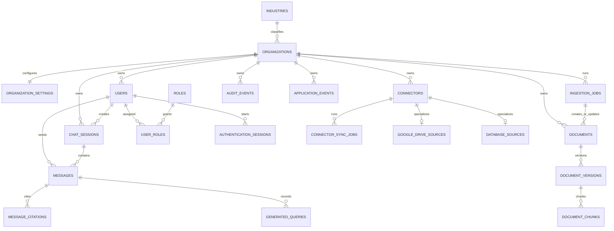
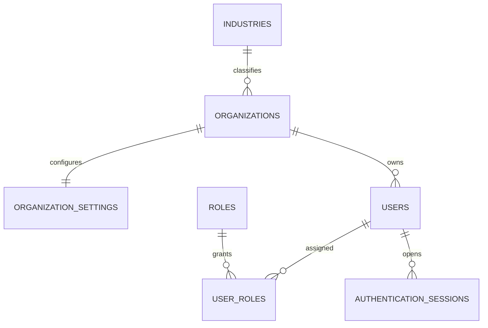

# Database Architecture

## Authoritative generation observations and deletion reconciliation (`20260905_000024`)

Migration `20260905_000024` adds the tenant-qualified
`connector_sync_generation_observations` table and bounded reconciliation
progress to `connector_sync_generations`. New generations use manifest schema
version 2; existing rows remain version 1 and cannot become deletion authority.
Readiness accepts exactly predecessor `20260904_000023` and current
`20260905_000024` during the additive transition.

Every non-tree entry accepted by the pinned traversal is recorded once by
source identity, path, object, commit, profile, entry type, disposition, and
bounded size. `eligible` observations correspond one-to-one with work items;
unsupported formats, oversized blobs, symlinks, and submodules remain explicit
presence evidence without creating processing work. Observation and work
registration share one caller-owned transaction, so a failed batch cannot
partially establish a deletion manifest. An entry whose canonical source
identity cannot fit the persisted identity contract fails discovery before its
cursor can advance; it is never silently omitted. A valid empty repository has
zero observations and zero work only after the pinned traversal positively
exhausts every tree frame and discovery completion is committed with the
legacy cursor transition. Pagination interruption, cancellation, tree/commit
drift, budget exhaustion, or any failed batch leaves the generation
non-authoritative. Migration defaults every historical generation to manifest
schema version 1 and therefore manufactures no deletion authority.

Promotion revalidates the complete schema-v2 observation/work projection. For
ledger-only discovery it then projects required source, exact-scope membership,
document version, indexing-state, and document citation identities from the
already validated staged materialization. Staged vectors remain the activated
retrieval payload; active retained sources keep their legacy current link and
legacy chunks intact, including across explicit shared memberships. This provider-free
projection and activation cutover use one scope-first, savepoint-protected,
caller-owned transaction with no internal commit. Prior retrieval authority
therefore remains valid at every earlier commit and for concurrent readers until
the single cutover commit. Identical versions and indexing states are reused.
Changed active files add a non-current immutable version for ledger citation
without moving the global legacy pointer; new or reappearing files create only
the required state.
The successful active generation becomes reconciliation authority only with
that atomic commit.
`GitHubSyncGenerationReconciliationService` is separately gated, default-off,
and has no automatic caller. Reconciliation locks the exact scope first,
requires its one matching active activation, the successful source job, no
active or newer synchronization and no newer generation, then revalidates the
complete all-success projection with database-side aggregate and bijection
checks rather than loading the complete manifest or chunk set into application
memory. That complete proof is persisted with the first retirement batch;
rollback removes its start marker and forces revalidation, while later batches
recheck scope, job, activation, tenant attribution, and newer-work exclusion
without repeatedly scanning the immutable generation. Each transaction selects at most 500 absent active file memberships in
stable source-ID order; that bound is a membership-candidate bound, not a total
row-mutation bound, because one candidate can also update its source, current
version, document, and tombstone state. Progress counters are updated in the
same transaction as those mutations. Replay after completion is idempotent,
concurrent calls serialize, and caller rollback preserves all lifecycle and
progress state. Job enqueue and legacy GitHub persistence/reconciliation share
the same scope-first lock order, closing the between-batch synchronization race;
source rows are locked only after the scope lock.

Retirement first removes only the exact scope membership. Another active scope
membership preserves the shared source, current version, document, indexing,
and retrieval path. Without one, the source is soft-deleted, the current
available/unavailable version is superseded by a current `deleted` tombstone,
and its linked document is soft-retired. Existing immutable versions,
document/version links, indexing states and attempts, legacy chunks, staged
materializations/chunks, activation history, and citations are not physically
deleted. The active generation already controls retrieval atomically, while
the lifecycle update makes the legacy graph agree with that authority. Physical
cleanup, retention, compaction, restore tooling, and automatic orchestration
remain Slice 6.

The current document model does not support independently shared document
ownership across source items: tenant uniqueness on the document/version link
allows one current source-version materialization per document. Consequently,
the last-membership decision is made for the connector-wide `SourceItem`, and
the linked document can be retired only after that source has no active scope
membership. A second source cannot silently depend on the same document row;
the database rejects such a link. A previously retired path is reactivated by
the existing synchronization contract using the same source/document identity
and a new available immutable version.

Downgrade is schema-only. It removes observation/progress columns and cannot
undo any lifecycle retirement already committed by reconciliation. Operators
must downgrade only before reconciliation is used or follow an independently
validated data-recovery plan; upgrade/downgrade/re-upgrade DDL reversibility is
not a claim that business lifecycle mutations are reversible.

## Organization-fair ledger claims (`20260902_000022`)

The Slice 3 fairness rollout used an explicit compatibility window containing
only `20260831_000021` and `20260902_000022`. That historical window is
superseded by the Slice 4 compatibility policy documented below. Compatibility
is always an exact allowlist: there is no lexical ordering, prefix, timestamp,
minimum-version, or range comparison, and multiple or unknown heads fail
closed.

Migration `20260902_000022` adds only
`connector_sync_organization_claim_schedules` and the monotonic
`connector_sync_org_fair_claim_seq`. One organization-scoped row records the
last committed fair-claim sequence, total committed claims, and safe timestamps.
No row is required before an organization's first claim; absence means never
served and receives priority. A never-served candidate is selected by an
indexed correlated eligibility probe and locked through its `organizations`
row. Served candidates are selected through the schedule ordering index and
the same eligibility probe. This avoids grouping or materializing the complete
claimable file backlog on every claim. The table contains no provider content,
credentials, retrieval data, or paid-tier weighting. The additive partial
`ix_sync_file_work_fair_eligible` index supports profile/organization-specific
existence and item probes over currently pending/retry work; the existing claim
indexes continue to support generation-scoped legacy operations.

The dedicated GitHub ledger host intrinsically uses least-recently-served
organization scheduling. It derives only organizations with currently eligible
GitHub/profile work, orders never-served organizations first and then committed
claim sequence, and uses organization UUID as the deterministic tie-breaker.
It locks a never-served `organizations` row or a previously served schedule row
with `FOR UPDATE SKIP LOCKED`, then locks that organization's existing
deterministic generation/item candidate. If a selected tenant has no unlocked
candidate, the transaction excludes it and probes another tenant, bounded to
500 candidates; a later poll reconsiders every skipped tenant.
Item lease/fence creation and schedule advancement are flushed and committed in
the same caller-owned transaction. A missing candidate, failure, or rollback
does not durably consume the turn. PostgreSQL `nextval` is deliberately not
transactional, so a failed transaction may leave a sequence gap. Gaps are not
claims and are never interpreted as counters: only a schedule value committed
with its item lease is a completed scheduling turn. Sequence values are used
only for ordering and are never reset or rewound by recovery. Separate workers
can lock separate organizations; they cannot claim the same item or concurrently
advance the same schedule row.

The fairness guarantee is scheduling-turn based: for a fixed continuously
eligible population, subject to database transactions making progress and no
organization remaining perpetually locked, every organization eventually gets
a committed claim turn and one large backlog cannot indefinitely bypass a
smaller one. Never-served arrivals are prioritized, so the guarantee assumes
there is not an unbounded stream of newcomers permanently ahead of the fixed
population. This is not a wall-clock latency SLA. It is not an active-processing
cap: after one claim transaction commits, another worker may claim another item
for that organization while its first item is still running. Worker concurrency
and provider processing duration are therefore separate from equal turn order.
Retry-wait work re-enters only at
`next_attempt_at`; cancelled, quarantined, terminal, incomplete-discovery,
incompatible-profile, and otherwise unsupported work earns no turn. Recovery
does not erase a turn already consumed by the original lease, and a replacement
claim receives a new normal fair turn and fencing token.

Schedule rows are retained while their organization exists, including when it
temporarily has no eligible work; later generations resume from the retained
least-recently-served position. Organization deletion cascades only its schedule
row. Ledger and materialization foreign-key lifecycles are unchanged. Any broader
retention or cleanup policy remains a future Slice 6 concern.

Migration `20260902_000022` creates `ix_sync_file_work_fair_eligible` with an
ordinary transactional `CREATE INDEX`. PostgreSQL can hold a table-level lock
that blocks concurrent writes while this index is built. This repository has no
established concurrent-index/Alembic autocommit convention, and the revision also
creates transactional table and sequence state, so the migration does not claim
zero-lock rollout. Operators must preflight ledger size and active writers and
apply it in a bounded migration window; a later dedicated migration may adopt a
tested concurrent-index convention if production volume requires one.

The API does not query the schedule table during startup or readiness, so the
compatible predecessor remains safe during the expand migration. The legacy
synchronization queue and legacy-first optional ledger path retain their
existing ordering. Fairness is limited to the dedicated host. Promotion is an
explicit default-off application transaction; its orchestration, reconciliation,
deletion, and staging cleanup remain future work.

## Atomic generation retrieval activation (`20260904_000023`)

Migration `20260904_000023` adds
`connector_sync_generation_activations`, an activation history with exactly one
partial-unique `active` row per tenant-qualified connector repository scope.
Each row is foreign-key bound to the same organization, connector, scope,
generation, and profile. A successful cutover retires the prior row and inserts
the next active row in the same caller-owned transaction; rollback preserves the
previous authority. Readiness accepts only predecessor `20260902_000022` and
current `20260904_000023` during this additive transition.

That Slice 4 compatibility window is historical. The current Slice 5 window is
the exact `20260904_000023`/`20260905_000024` pair documented above.

`GitHubSyncGenerationPromotionService` requires explicit
`GITHUB_SYNC_LEDGER_PROMOTION_ENABLED=true`. The flag defaults to `false` and
uses exact lowercase Boolean parsing. No current API, scheduler, legacy worker,
or dedicated processing/planning host invokes promotion automatically. Generation
registration and promotion lock the tenant-qualified repository scope first,
so creation of a newer generation cannot cross the stale-generation decision.
Promotion then verifies the exact generation and successful source job,
completed discovery, absence of a newer generation, all registered items
in `succeeded`, one immutable materialization per item, complete ordered chunks,
and matching staged citation/indexing inputs. `project_and_promote` can create
the missing citation projection from immutable staged rows without a provider
call; the original validation-only promotion remains available for an already
projected generation. Pending, retrying,
skipped, quarantined, failed, cancelled, missing, duplicate, stale, mismatched,
and cross-tenant state fails closed.

Permission-aware retrieval still authorizes tenant, active user grant/ACL,
active knowledge space, active connector, active membership, and exact scope
before ranking. Legacy candidates exclude actively ledger-authoritative scopes
before source deduplication and retain their current-version/indexing rules.
Each activated scope instead reads only its single active generation; invalid
active state returns no row rather than silently falling back, while a retired
activation restores ordinary legacy eligibility because no active authority
remains. Stable citations deliberately may identify a historical version, but
the query requires exactly one version bound to the projected source item with
matching GitHub provider, generation commit, staged blob and checksum, profile,
generation-owned materialization, and the organization-unique canonical GitHub
document key. The mutable one-to-one `document_version_documents` pointer is
not ledger citation authority: fabricating it cannot redirect the canonical
document, while replacing it for a later scope cannot invalidate retained
historical authority. Multiple activated scopes sharing one source/document keep
independent authorization paths and exact staged versions/chunks. Connector-
scope uniqueness prevents two scopes for one connector and repository identity;
explicit shared memberships remain permission paths and are never retired by
projection. Deletion reconciliation,
physical legacy retirement, staging cleanup/retention, scheduling, and API/UI
controls remain Slices 5 and 6.

## Retrieval-isolated file-work materialization (`20260831_000021`)

Migration `20260828_000020` adds the feature-gated `connector_sync_generations`
and `connector_sync_file_work_items` control-plane tables. When the optional
planner flag `GITHUB_SYNC_LEDGER_PLANNING_ENABLED=true` is set, the dedicated
GitHub planner records each pinned snapshot and complete observation batches in
bounded transactions without legacy writes or OpenAI configuration. The flag
defaults to false and accepts only lowercase `true` or `false`. Local Folder
synchronization does not consume the ledger. A planner execution defaults to
5,000 committed batches and 20 minutes, with strict hard caps of 100,000 batches
and 3,600 seconds; a limit stop persists only resumable non-authoritative cursor
state. When the same planning flag is true on the legacy host, that host claims
Local Folder jobs only. Because deployment environments are independent, an
operator must update both worker templates consistently or keep the legacy host
idle; a legacy host left at false still has its historical GitHub claim route.
A separate strict worker-only
`GITHUB_SYNC_LEDGER_PROCESSING_ENABLED=true` gate enables one-at-a-time GitHub
file-work claiming only after discovery is complete and only when the legacy
job queue is empty. Its default is false. The processing slice reuses the
existing extraction/chunking/embedding/materialization pipeline. Promotion is a
separate explicit transaction; distributed deletion reconciliation is absent.

`connector_sync_generations` pins one provider repository, branch, commit, root
tree, and complete extraction/chunking/embedding profile to one originating
tenant-qualified connector sync job. Its lifecycle distinguishes `discovering`,
`processing`, `completed`, `completed_with_errors`, `failed`, and `cancelled`.
Discovery completion, reconciliation eligibility, and durable follow-up intent
are separate state pairs. The repository supplied by this slice calculates
eligibility read-only: the barrier opens only after discovery is complete and
every registered item is terminal. It does not set the stored reconciliation
flag or reconcile deletions; promotion applies the stricter all-success barrier.

`connector_sync_file_work_items` stores independently claimable metadata only:
tenant/scope/generation identity, source key and repository path, provider blob
and revision, profile fingerprint, bounded file descriptors, execution state,
attempt/availability data, lease UUID, monotonically increasing fence, heartbeat,
cancellation, redacted failure/quarantine codes, bounded counters, and timestamps.
It never stores provider bytes, extracted text, chunks, embeddings, or vectors.
The logical unique key uses a SHA-256 digest of the exact source key and path plus
the exact blob, revision, and profile. Repository registration validates the
digest result against every original attribute, so an accidental or adversarial
digest collision fails closed rather than aliasing work. It also locks the
generation and checks every source digest already registered in that generation,
so replay is idempotent while the same path with conflicting immutable metadata
fails instead of creating a second work item.

Migration `20260831_000021` adds
`connector_sync_file_materializations` and
`connector_sync_file_materialization_chunks`. These tables own immutable text,
hashes, embedding-model attribution, and `Vector(1536)` output exclusively by
organization, connector, scope, generation, and work item. They deliberately
have no foreign key or materialization link to `source_items`, `documents`,
`document_versions`, `document_indexing_states`, or `document_chunks`, and the
permission-aware retrieval SQL reaches them only through one validated active
generation. Unpromoted output remains retrieval-invisible.

File-work provider preparation occurs without an open database transaction.
The final transaction locks and revalidates the active lease and monotonic
fence, exact tenant/generation/repository/commit/blob/path/profile attribution,
processing/discovery state, and noncancelled job. It inserts or exactly matches
the generation-scoped materialization and completes the work item under the
same fence. Staging and acknowledgement therefore commit or roll back together;
a stale owner fails before any staged or legacy document row is written.
Retryable failures use the established bounded retry jitter; safe permanent
file-level validation/provider failures are quarantined with fixed codes only.

Phase 3 Slice 2 adds no migration. Its dedicated bounded host reuses the same
`FOR UPDATE SKIP LOCKED` claim, lease, heartbeat, monotonic fence, recovery,
retry, quarantine, cancellation, and atomic staging/completion operations.
Each host has independent item and runtime bounds, and a claim is not attempted
without a configured minimum runtime runway. Real PostgreSQL contention tests
prove disjoint claims, one materialization per work item, stale-fence rejection,
expired-lease recovery, independent worker progress, and no generation
promotion. The global ordering is deterministic, but it is not a durable
tenant-fair scheduling mechanism. Slice 3 replaces that ordering only in the
dedicated path with the durable organization-fair transaction above.

Retry timing is database-authoritative. A committed `retry_wait` transition
stores `next_attempt_at`; claim predicates exclude it until that UTC instant.
The dedicated host exits successfully after the durable transition and its
Cloud Run task must have platform retries disabled, preventing immediate
re-entry from bypassing the persisted backoff.

Shadow planning creates or resolves the generation when the legacy cursor first
pins the default branch commit and root tree. Each discovered batch is registered
and committed before download/extraction begins. Cursor replay after a crash
therefore repeats the same manifest safely. The generation is marked discovery
complete only in the same transaction that advances the authoritative legacy
cursor into reconciliation after all tree frames are exhausted. A partial
generation remains `discovering`, never becomes reconciliation eligible, and is
not referenced by permission-aware retrieval.

Claiming uses a tenant- and generation-qualified partial index ordered by
`next_attempt_at, id` with `FOR UPDATE SKIP LOCKED`. Separate partial indexes
support expired-lease recovery and terminal retention, while
`(organization_id, generation_id, status)` supports barrier counts. Every leased
mutation matches tenant, connector, scope, generation, item, worker, lease UUID,
attempt, fence, running state, and unexpired lease. Recovery clears ownership;
the next claim increments both attempt and fence, preventing a stale worker from
committing terminal state.

The pilot tables intentionally remain unpartitioned. If measured row count,
index size, vacuum pressure, or tenant-isolated query latency requires native
partitioning, the planned first partition key for file work is
`HASH (organization_id)`: it preserves tenant pruning and keeps all scope and
retention operations tenant-local. A later migration may add generation-aware
subpartitioning or move expired terminal history to a range-partitioned archive,
but only after benchmark evidence and after redesigning primary/unique keys to
include every PostgreSQL partition key. `connector_sync_generations` should stay
unpartitioned until its much smaller measured cardinality justifies the same
change.

## GitHub repository scopes and reconciliation (`20260828_000019`)

Explicit GitHub repository selection reuses `connector_scopes`. Migration `20260828_000019` adds only the partial index `ix_source_scope_memberships_reconciliation` on `(organization_id, connector_id, connector_scope_id, last_seen_at, id) WHERE status = 'active' AND removed_at IS NULL` for bounded unseen-item keyset scans. A selection uses `scope_type = repository`, `access_mode = platform_managed`, the immutable external identity `github:repository:{positive_repository_id}`, one tenant-qualified knowledge-space foreign key, and a fixed safe metadata allowlist. The existing unique `(organization_id, connector_id, external_scope_key)` constraint permits exactly one durable identity per connector across active and removed states. It therefore prevents concurrent duplicate or different-space rows and enables same-row reactivation without a new selection table.

The selected scope is the authorization boundary. A short read transaction copies validated immutable identifiers and must end before SecretStore, GitHub, extraction, chunking, or embedding access. The synchronization service persists only safe provider identities and platform checksums through the existing source/version/materialization/indexing/chunk schema; tokens, raw bytes, provider responses, and extracted payloads never enter provider metadata or cursor state.

GitHub traversal uses the existing `connector_sync_cursors.safe_cursor` JSONB object with cursor type `github_repository_progress`. Schema version 2 contains a pinned repository ID/default-branch/commit/root-tree snapshot, authorization-binding fingerprint, scan generation, explicit phase, bounded iterative DFS frames and totals, authoritative traversal marker, reconciliation keyset plus item/batch counters/start time, and completion marker. Service validation imposes a fixed field allowlist, maximum depth 64, lowercase SHA-1/SHA-256 object IDs, safe repository-relative paths, finite nonnegative totals, monotonic phase/keyset/counter progression, and a 96 KiB serialized maximum. The cursor is owned by the existing organization/connector/scope/run foreign keys and contains no lease values or secrets.

GitHub `SourceItem.source_item_key` is `github:repository:{repository_id}:path:{exact_repository_path}`; paths that cannot fit the existing 1,024-character identity column fail closed as skipped. `source_version` stores the blob object ID, `source_checksum` stores platform SHA-256 after a successful download, and safe metadata stores repository ID/identity, exact path, blob ID, pinned commit ID, extension, and declared size. `DocumentVersion.provider_version_id` repeats the blob revision, with SHA-256, size, type, and safe commit/blob evidence. Existing unique current-version, version numbering, materialization, indexing-profile, chunk, sync-item, and active-cursor constraints provide idempotency and rollback boundaries.

A path rename is create-plus-delete: the new exact path owns a distinct source/document identity and the authoritative unseen old path is retired. Equal blob IDs or checksums never merge identities, no ownership is transferred, and rename lineage remains future work.

Batch persistence locks and revalidates the complete job lease owner/UUID/fence/attempt/expiry/cancellation state, rebinds the caller snapshot to the durable running run start, revalidates active GitHub authorization, locks the active cursor and canonical source state, and writes source/membership, version/materialization, indexing attempt/state, document/chunks, sync item/counters, and the next cursor in one caller-owned transaction. Preparation occurs before that transaction. Cursor failure therefore rolls back file state and file failure cannot advance the cursor. Only genuine terminal traversal enters reconciliation. Bounded reconciliation pages exact tenant/connector/scope/repository active materializations whose membership and source freshness predate the durable run, rechecks locked freshness, removes unseen memberships, and creates deleted tombstones plus document soft retirement only when no active membership remains. Permission-aware retrieval requires an active membership/source, current available version, indexed materialization, and non-deleted document, so committed retirement is excluded; another active membership preserves retrieval, and explicit reactivation creates a new available version and safely restores the same source/document identity. The run/job completes atomically with the final cursor only after reconciliation exhausts the keyset.

Selection uses two caller-owned transactions separated by provider I/O. The first validates and copies connector, credential, organization installation, and active knowledge-space identities. After a repository-restricted metadata-only GitHub proof completes with no database transaction open, the second locks and revalidates those rows, locks the canonical scope identity, and creates or reactivates it. Connector locking serializes absent-row creates with select/deselect and installation lifecycle changes; the unique constraint remains the database backstop. Repositories only flush and never commit, roll back, retry, or call providers.

Removal is a local `status = removed` transition with `removed_at`; it does not hard-delete the row or claim to alter remote App access. Listing and removal make no provider call. The safe JSON contains only repository ID, name/full name, owner login, privacy/visibility, archived/disabled flags, and default branch. Tokens, App/installation/account IDs, URLs, permissions, provider payloads, and secret references are excluded. No source item, sync job/run, document, chunk, or index row is created by selection.

## Durable GitHub setup correlation (`20260827_000018`)

The public GitHub setup redirect cannot authenticate with a platform bearer token, and GitHub explicitly warns that its browser-supplied `installation_id` is untrusted. Migration `20260827_000018` therefore adds only `provider_candidate_installation_id` and `provider_setup_completed_at` to the existing `oauth_authorization_transactions` row. The positive candidate ID is transaction-, organization-, connector-, initiating-user-, and provider-bound by the existing row and composite foreign keys. No account name, organization name, provider payload, redirect target, token, authorization code, or raw OAuth state is stored.

Setup locks the hashed-state transaction, requires a pending unexpired GitHub transaction, records the candidate exactly once, and commits before the browser follows the `303` authorization redirect. Database checks require the candidate and setup timestamp to appear together, permit them only for GitHub, and require setup completion within the transaction lifetime. A repeated or concurrent setup cannot replace the candidate. Callback locks the same row and cannot proceed before setup correlation exists. Verified binding, connector activation, and state consumption remain one caller-owned transaction; failures roll back without a partial credential, installation binding, connector activation, or consumed state.

## Verified GitHub App installations (`20260826_000017`)

GitHub is the first cloud connector. `github_app_installations` stores one authoritative, tenant-safe organization installation binding per connector. Composite foreign keys bind it to the same organization, connector, and provider-neutral credential row; `(github_app_id, github_installation_id)` is globally unique so one App installation cannot be attached to multiple tenant connectors. Positive external IDs, organization-only account type, repository-selection modes, lifecycle state, and timestamps are database-constrained.

The binding stores only safe installation/account metadata: App and installation IDs, account ID/login/type, `all` or `selected` repository selection, provider creation/update timestamps, and last verification time. It does not store App JWTs, installation access tokens, user tokens, authorization codes, OAuth state, PKCE verifiers, client secrets, private keys, authorization headers, or raw GitHub responses.

`connector_credentials.secret_reference` is nullable only for GitHub `app_installation` credentials. GitHub App installations have no durable per-connector secret: the App private key and OAuth client secret remain behind configured immutable Google Secret Manager references of the form `gcp-secret-manager://projects/{project}/secrets/{prefix}-sm-{random}/versions/{number}`. Short-lived App JWTs are generated on demand and discarded. Live repository discovery also generates one metadata-only installation token for the exact verified installation, uses it for one bounded provider page, and discards it immediately. Neither credential is stored. Other providers and credential schemes still require a nonblank opaque secret reference. This prevents local connector disconnect from deleting shared GitHub App secrets.

The App uses a setup step followed by GitHub's explicit web authorization flow so the platform controls the exact callback, OAuth state, and PKCE challenge. The authenticated initiation response exposes only the installation URL; the authorization URL is generated after durable candidate correlation and is returned only as an exact-host `303` redirect. Completion locks the single-use transaction and connector, exchanges the temporary authorization code once, retrieves the authenticated GitHub user, and requires the stored candidate installation to appear exactly once in bounded `GET /user/installations` results for that temporary user token. It then requires an organization account and cross-checks the full installation identity with an App-JWT `GET /app/installations/{id}` response. Only the user-token operation proves user-to-installation access; the App-JWT lookup is an additional App-identity and metadata check. Binding and state consumption occur atomically. The user token and code are discarded without persistence.

Required runtime configuration is the App ID, distinct client ID, App slug, exact callback and setup URLs, version-pinned private-key and client-secret references, GitHub API/web base URLs, bounded HTTP settings, and the nonsecret GCP Secret Manager project/prefix/environment. Production composition uses the Cloud Run service identity through ADC; there is deliberately no JSON-key, plaintext, or in-memory production fallback.

Minimum installed-App permissions are repository `Metadata: read` and `Contents: read`; discovery and selection proof narrow their request-scoped tokens to `Metadata: read`. Discovery remains live and unpersisted. Explicit selection persists only fixed safe metadata in `connector_scopes` after a repository-ID-restricted proof. Internal staged create/update/deletion reconciliation is implemented; production worker routing, webhooks, and ACL synchronization remain outside this revision. Google Drive follows the GitHub roadmap.

## Purpose

This document defines the recommended Version 1 database architecture for the platform. It is a design-only artifact. No SQL, migrations, ORM models, API code, or dependency installation are part of this document.

## Product Context

The platform is a multi-tenant, Glean-like AI knowledge platform for small and medium-sized businesses. Version 1 includes:

- Organizations
- Users
- Authentication
- Roles
- Document upload
- Document ingestion
- Document chunks and embeddings
- AI chat and conversation history
- Google Drive connector
- Connector synchronization
- One read-only PostgreSQL customer-data connector
- Natural-language SQL
- Usage tracking
- Basic audit logging

## Technology Decisions

- Primary database: PostgreSQL
- Vector support: pgvector
- Primary keys: UUID
- ORM later: SQLAlchemy 2.x
- Migrations later: Alembic

## Core Design Rules

1. organization_id is the primary tenant-isolation boundary.
2. Customer-owned data must be scoped to an organization.
3. industry_id is organization metadata and must not be copied onto every table.
4. Customer business databases remain external.
5. The platform database stores configuration, indexed knowledge, conversations, security metadata, and operational records.
6. Credentials and OAuth tokens must not be stored as unencrypted plain text.
7. Sensitive actions must be auditable.
8. The design must support permission syncing later without a complete redesign.
9. Use soft deletion only where it has a clear business purpose.
10. Avoid premature enterprise complexity.

## Recommended Version 1 Approach

The first working release should use a minimum secure schema rather than a fully expanded platform schema. The goal is to support tenancy, ingestion, retrieval, chat, connector synchronization, and auditability with the fewest tables that still keep future expansion viable.

The key simplification is to keep only the tables required to run the first release safely, while deferring fine-grained authorization, detailed AI telemetry, item-level sync events, invitation workflows, and separate credential rows until those features create real business pressure.

## Simplified Relationship Overview

For non-technical readers:

- An organization is the tenant boundary.
- Users belong to an organization and receive one or more roles.
- An organization can configure a Google Drive source and one PostgreSQL database source.
- Documents belong to an organization and can have multiple versions and searchable chunks.
- Users chat inside their organization, and assistant answers can cite document chunks or record generated SQL.
- Sync jobs, ingestion jobs, audit logs, and application events provide the minimum operational record needed to run the system safely.

## High-Level Entity Relationship Diagram

Deferred capabilities not shown in the first-release diagram: invitations, permissions, role_permissions, connector_sync_events, document_access_rules, ai_requests, model_usage, retrieval_events, and user_feedback. The Google Secret Manager adapter is infrastructure-only and adds no database relation or migration.

## Multi-Tenancy Strategy

- organizations is the tenant root.
- Every organization-scoped table must include organization_id except global reference tables such as industries and roles.
- organization_id must come from authenticated server-side context.
- Clients must not be allowed to choose arbitrary organization_id values.
- Every organization-scoped repository query must filter by organization_id.
- Cross-tenant automated tests are mandatory.
- Unique constraints for tenant-owned identifiers should normally be composite with organization_id.

## Future PostgreSQL Row-Level Security Strategy

Recommended for a later phase:

- Enable Row-Level Security on every organization-scoped table.
- Set app.current_organization_id from authenticated server-side context.
- Apply policies based on organization_id = current_setting('app.current_organization_id')::uuid.
- Keep global reference tables outside tenant RLS.

Version 1 can enforce tenancy at the application layer first, but the schema should be prepared for later RLS adoption.

## pgvector Strategy

- The PostgreSQL `vector` extension is enabled by a dedicated migration before any vector columns or indexes are introduced.
- The extension migration is idempotent and its downgrade intentionally leaves the extension installed because it is shared database infrastructure.
- Store one embedding per document chunk in document_chunks.
- Filter retrieval by organization_id and document state before vector ranking.
- Re-index by creating a new document_version and new document_chunks rows rather than overwriting prior versions.
- Standardize on one embedding model per environment in the first release.

## Embedding-Dimension Considerations

- embedding_dimension must match the chosen embedding model exactly.
- The first release should not support mixed embedding dimensions in the same environment.
- If the embedding model changes later, re-index into new document versions rather than mixing dimensions within one active dataset.

## Connector Credential Security Strategy

`connector_credentials` is the single PostgreSQL source of safe connector credential metadata. It stores one binding per tenant connector: normalized provider/auth-scheme codes, lifecycle state, bounded safe account/scope metadata, timestamps, and an opaque external secret-store reference. The legacy credential columns were removed from `connectors`; migration refuses to discard any populated legacy reference.

PostgreSQL never stores access/refresh tokens, client secrets, PKCE verifier plaintext, authorization codes, API keys, private keys, passwords, cookies, or secret-manager payloads. The production Google Secret Manager adapter stores each new value in a random single-version container and PostgreSQL stores only the opaque immutable reference where required. Tenant isolation remains application/database ownership of references because the provider-neutral `store()` contract has no tenant context; GCP IAM is not presented as per-customer isolation. No plaintext fallback exists.

`oauth_authorization_transactions` stores only a 32-byte SHA-256 state digest, optional opaque PKCE verifier reference, safe callback identifier, tenant/connector/user attribution, bounded lifecycle timestamps, and—for GitHub setup only—a positive untrusted candidate installation ID plus setup-completion timestamp. Pending transactions live at most 20 minutes, are locked before setup correlation and single-use consumption, cannot replace a correlated candidate, and cannot transition back to pending. Raw state and PKCE verifier exist only in process memory during authorization preparation or callback verification.

Credential replacement first flushes the new fail-closed binding and then makes one best-effort deletion attempt for the prior external secret. Revocation/disconnect flushes revoked state before cleanup; deletion failure never reactivates a credential and there is no unbounded retry. A later operator reconciliation process may clean orphaned external references. No operational audit writer exists, so safe credential/OAuth audit emission remains required future integration.

## Document Versioning Strategy

- documents stores the stable logical document identity.
- document_versions stores immutable uploaded or synchronized versions.
- document_chunks belongs to a specific document_version.
- Only one document_version should be current for a document at a time.
- Re-ingestion should create a new version when source content changes.

## Deletion and Re-Indexing Strategy

- Use soft deletion on documents and chat_sessions because recovery and audit visibility are useful.
- Keep document_versions and document_chunks tied to historical versions for traceability.
- When a document is re-indexed, create a new version and new chunk set, then mark the earlier version non-current.
- If a source document disappears from Google Drive or becomes disallowed, mark the document inactive or deleted and keep the operational history.

## Initial-Sync and Incremental-Sync Tracking

connector_sync_jobs is enough for the first release. Each row should temporarily hold:

- status
- started_at
- completed_at
- discovered_count
- processed_count
- failed_count
- last_error
- checkpoint metadata

Checkpoint metadata can be stored as JSON to hold a cursor, sync token, or high-water mark until the sync model becomes more complex.

## Chat, Citation, and SQL Storage Design

- chat_sessions groups a conversation by organization and user.
- messages stores ordered user and assistant messages.
- message_citations stores structured evidence for assistant answers.
- generated_queries stores natural-language SQL prompts, generated SQL, validation results, execution status, row limits, and result counts.
- Basic model and token usage may initially be recorded on messages or generated_queries rather than requiring ai_requests and model_usage tables.

## Minimum Secure Schema for First Implementation

### Immediate Table Set

#### Reference and tenancy

- industries
- organizations
- organization_settings

#### Identity

- users
- roles
- user_roles
- authentication_sessions

#### Connectors

- connectors
- connector_sync_jobs
- google_drive_sources
- database_sources

#### Documents

- documents
- document_versions
- document_chunks
- ingestion_jobs

#### Conversations and SQL

- chat_sessions
- messages
- message_citations
- generated_queries

#### Operations

- audit_events
- application_events

Immediate table count: 21.

### Why This Is the Minimum Secure Set

- It supports tenant ownership and tenant-filtered queries.
- It supports login session tracking without a larger invitation or permission framework.
- It supports both required connector types without premature connector specialization overhead.
- It supports document ingestion, versioning, chunking, retrieval, citations, and natural-language SQL auditing.
- It captures enough operational and audit data to investigate failures and sensitive actions.

## Required Table Designs for the First Working Release

### A. Reference and Tenancy

#### industries

- Purpose: Reference data for organization industry classification.
- Primary key: id UUID.
- Foreign keys: none.
- Important columns: code, name, description, is_active, created_at.
- Required fields: id, code, name, is_active, created_at.
- Optional fields: description.
- Unique constraints: unique(code), unique(name).
- Check constraints: code must be non-empty.
- Suggested indexes: unique(code), btree(is_active).
- Tenant-isolation behavior: global table, no organization_id.
- Data-retention considerations: prefer deactivation over deletion.
- Relationships: organizations.industry_id references industries.id.

#### organizations

- Purpose: Tenant root for all customer-owned data.
- Primary key: id UUID.
- Foreign keys: industry_id -> industries.id.
- Important columns: name, slug, industry_id, status, created_at, updated_at, deleted_at.
- Required fields: id, name, slug, status, created_at, updated_at.
- Optional fields: industry_id, deleted_at.
- Unique constraints: unique(slug).
- Check constraints: status limited to approved lifecycle values.
- Suggested indexes: unique(slug), btree(industry_id), btree(status).
- Tenant-isolation behavior: root tenant table.
- Data-retention considerations: soft deletion is useful for account recovery and auditing.
- Relationships: one-to-one with organization_settings; one-to-many with most first-release tables.

#### organization_settings

- Purpose: Store organization-level configuration separately from the core organization record.
- Primary key: organization_id UUID.
- Foreign keys: organization_id -> organizations.id.
- Important columns: default_language, retention_policy_days, allowed_auth_providers, created_at, updated_at.
- Required fields: organization_id, created_at, updated_at.
- Optional fields: configuration values based on first-release needs.
- Unique constraints: primary key on organization_id.
- Check constraints: retention_policy_days >= 0 when present.
- Suggested indexes: primary key only.
- Tenant-isolation behavior: organization-scoped by organization_id.
- Data-retention considerations: update in place; important changes should be mirrored in audit_events.
- Relationships: exactly one settings row per organization.

### B. Identity and Authentication

This is the next migration slice after the two live reference tables. The recommended design keeps roles simple and global, users scoped to one organization, role assignments explicit for tenant enforcement, and refresh-token state hashed and revocable.

#### organization_settings

- Purpose: Store one organization-wide configuration row for locale, retention, and default AI behavior.
- Columns: organization_id, default_locale, timezone, retention_days, ai_model_name, created_at, updated_at.
- PostgreSQL data types: UUID, VARCHAR(32), VARCHAR(64), INTEGER, VARCHAR(128), TIMESTAMPTZ, TIMESTAMPTZ.
- Required versus nullable fields: organization_id, default_locale, timezone, retention_days, created_at, updated_at are required; ai_model_name is nullable.
- Defaults: default_locale = 'en-US'; timezone = 'UTC'; retention_days = 365; created_at and updated_at default to now(); ai_model_name has no database default because the application can supply a system default.
- Primary keys: organization_id.
- Foreign keys: organization_id -> organizations.id ON DELETE CASCADE.
- Unique constraints: primary key on organization_id.
- Check constraints: retention_days must be within a reasonable positive range, for example 1 through 3650; default_locale and timezone must not be blank; if ai_model_name is present it must not be blank.
- Indexes: primary key only.
- Delete behavior: delete with the organization; no separate lifecycle is needed.
- Tenant-isolation behavior: one row per organization; directly tenant-scoped by organization_id.
- Security considerations: keep only low-entropy configuration here; do not store branding assets, secrets, or arbitrary JSON blobs.
- Fields deferred for later: branding metadata, notification preferences, feature flags, SSO configuration, and arbitrary settings JSON.

#### roles

- Purpose: Define a small fixed set of platform roles for Version 1.
- Columns: id, name, description, is_system_role, created_at, updated_at.
- PostgreSQL data types: UUID, VARCHAR(128), TEXT, BOOLEAN, TIMESTAMPTZ, TIMESTAMPTZ.
- Required versus nullable fields: id, name, is_system_role, created_at, updated_at are required; description is nullable.
- Defaults: is_system_role = true; created_at and updated_at default to now().
- Primary keys: id.
- Foreign keys: none in Version 1 because roles are purely global.
- Unique constraints: unique(name).
- Check constraints: name must not be blank; optionally enforce lower(name) = name if names are stored in a normalized form, but the required rule is simply non-blank names.
- Indexes: unique(name); optional index on is_system_role for admin tooling.
- Delete behavior: roles should be treated as immutable seed/reference rows; if deletion is ever allowed, restrict it when user_roles references exist.
- Tenant-isolation behavior: global reference table in Version 1; not tenant-scoped.
- Security considerations: global fixed roles simplify review and reduce customization risk; platform_admin should not be modeled here and should be handled in the deployment/identity plane separately.
- Fields deferred for later: organization-specific custom roles, permission mappings, role hierarchies, and role-scoped capabilities.

#### users

- Purpose: Store user identities for exactly one organization in Version 1.
- Columns: id, organization_id, email, normalized_email, password_hash, first_name, last_name, display_name, status, email_verified_at, last_login_at, created_at, updated_at.
- PostgreSQL data types: UUID, UUID, VARCHAR(320), VARCHAR(320), TEXT, VARCHAR(100), VARCHAR(100), VARCHAR(200), VARCHAR(32), TIMESTAMPTZ, TIMESTAMPTZ, TIMESTAMPTZ, TIMESTAMPTZ.
- Required versus nullable fields: id, organization_id, email, normalized_email, password_hash, display_name, status, created_at, updated_at are required; first_name, last_name, email_verified_at, and last_login_at are nullable.
- Defaults: status = 'active'; created_at and updated_at default to now().
- Primary keys: id.
- Foreign keys: organization_id -> organizations.id ON DELETE CASCADE.
- Unique constraints: unique(organization_id, normalized_email); unique(organization_id, id).
- Check constraints: normalized_email must equal lower(btrim(email)); status must be one of active, suspended, disabled; password_hash must not be blank.
- Indexes: unique(organization_id, normalized_email); unique(organization_id, id); btree(organization_id, status); btree(organization_id, last_login_at).
- Delete behavior: Version 1 should prefer disabling users by status rather than soft deletion; if hard delete is used for administrative cleanup, dependent sessions and role assignments can cascade.
- Tenant-isolation behavior: directly organization-scoped; every query for users must include organization_id.
- Security considerations: password_hash must never be returned through APIs; email login is case-insensitive because normalized_email is stored and indexed; the hash should be Argon2id or bcrypt, generated outside the database; password_hash must not be nullable for local-password users in Version 1.
- Fields deferred for later: deleted_at, external identity provider columns, MFA state, password reset metadata, lockout counters, authentication_identities for OAuth/SSO, and other auth-provider linkage fields.

#### user_roles

- Purpose: Record which fixed roles are assigned to which users in a specific organization.
- Columns: id, organization_id, user_id, role_id, assigned_at, assigned_by_user_id.
- PostgreSQL data types: UUID, UUID, UUID, UUID, TIMESTAMPTZ, UUID.
- Required versus nullable fields: id, organization_id, user_id, role_id, assigned_at are required; assigned_by_user_id is nullable.
- Defaults: assigned_at defaults to now().
- Primary keys: surrogate UUID id is recommended.
- Foreign keys: organization_id -> organizations.id ON DELETE CASCADE; composite foreign key (organization_id, user_id) -> users(organization_id, id) ON DELETE CASCADE; role_id -> roles.id ON DELETE RESTRICT; assigned_by_user_id is intentionally not a database foreign key in Version 1.
- Unique constraints: unique(organization_id, user_id, role_id).
- Check constraints: organization_id must match the tenant context of the assigned user and the assignment must not be blank; this invariant is enforced by the composite foreign key and should also be checked by application code.
- Indexes: unique(organization_id, user_id, role_id); btree(organization_id, user_id); btree(organization_id, role_id); btree(assigned_by_user_id); btree(user_id); btree(role_id).
- Delete behavior: removing a user or organization cascades assignments; roles are restricted from deletion because they are seed/reference data.
- Tenant-isolation behavior: store organization_id even though it is partially redundant because it is intentionally denormalized for tenant enforcement, future PostgreSQL RLS, auditing, and simpler organization-scoped queries.
- Security considerations: this table is an assignment record rather than a pure join table, so a surrogate UUID avoids changing the primary key later when revocation or history fields are added.
- Service-layer validation rule for assigned_by_user_id in Version 1: assigned_by_user_id is a nullable UUID audit field, and Version 1 intentionally does not add a database foreign key for it. A simple users.id foreign key could allow cross-tenant references because it does not bind organization context. A tenant-aware composite foreign key with ON DELETE SET NULL is awkward here because organization_id must remain required on the row while only assigned_by_user_id is cleared. Version 1 therefore enforces same-organization validation in application logic, and a stronger database-level constraint can be introduced later if the assignment model evolves.
- Fields deferred for later: revoked_at, expires_at, grant_reason, source, granted_via, and assignment history/versioning fields.

#### authentication_sessions

- Purpose: Track secure web sessions using hashed refresh tokens.
- Columns: id, organization_id, user_id, refresh_token_hash, created_at, expires_at, revoked_at, last_used_at, ip_address, user_agent.
- PostgreSQL data types: UUID, UUID, UUID, BYTEA, TIMESTAMPTZ, TIMESTAMPTZ, TIMESTAMPTZ, TIMESTAMPTZ, INET, TEXT.
- Required versus nullable fields: id, organization_id, user_id, refresh_token_hash, created_at, expires_at are required; revoked_at, last_used_at, ip_address, and user_agent are nullable.
- Defaults: created_at defaults to now(); revoked_at and last_used_at are initially null.
- Primary keys: id.
- Foreign keys: composite foreign key (organization_id, user_id) -> users(organization_id, id) ON DELETE CASCADE; organization_id -> organizations.id ON DELETE CASCADE if desired for direct tenant cleanup, though the composite user foreign key is the primary tenant-consistency guard.
- Unique constraints: unique(refresh_token_hash).
- Check constraints: expires_at must be greater than created_at; revoked_at must be null or later than created_at; last_used_at must be null or later than created_at when present.
- Indexes: unique(refresh_token_hash); btree(organization_id, user_id, revoked_at, expires_at DESC); btree(expires_at); btree(organization_id, expires_at); btree(organization_id, user_id, revoked_at); partial index on active sessions where revoked_at IS NULL.
- Delete behavior: delete with the user or organization; operational cleanup can also remove expired revoked rows.
- Tenant-isolation behavior: directly organization-scoped.
- Security considerations: never store raw refresh tokens; store only a keyed hash of the refresh token; include IP and user-agent for anomaly detection and session forensics; keep these fields nullable to avoid breaking API clients that do not supply them; use refresh-token rotation so issuing a new token can revoke the previous session row.
- Fields deferred for later: session family IDs, token lineage/reuse tracking, device labels, MFA challenge state, auth-provider session linkage, and risk-scoring metadata.

#### Design Decisions for This Slice

- Roles should be purely global in Version 1, with no organization_id column.
- organization_settings should use organization_id as both the primary key and foreign key.
- users should include both display_name and first_name/last_name because display_name is convenient for UI rendering while first/last names help with formal communication.
- users should not use deleted_at in Version 1; status-based disablement is simpler and keeps the first release focused.
- user_roles should include organization_id because it is intentionally denormalized for tenant enforcement, future PostgreSQL RLS, auditing, and simpler organization-scoped queries.
- authentication_sessions should store IP address and user-agent as nullable forensic fields.
- platform_admin should be handled outside this schema, either in the deployment identity plane or a separate admin boundary.

#### Seed Data Recommendation

- Seed the global roles table with `organization_admin` and `employee`.
- Keep both rows marked as system roles and non-editable in Version 1.
- Do not seed platform_admin here; it belongs in the operational/admin plane, not the tenant application schema.

#### Upgrade Dependencies

- organizations must already exist before organization_settings and users.
- roles should exist before user_roles.
- users must exist before user_roles and authentication_sessions.
- user_roles depends on organizations, users, and roles.
- authentication_sessions depends on organizations and users.

#### Recommended Table Creation Order for This Slice

1. organization_settings
2. roles
3. users
4. user_roles
5. authentication_sessions

This order assumes industries and organizations already exist, which they do in the live database.

#### Downgrade Order

1. authentication_sessions
2. user_roles
3. users
4. roles
5. organization_settings

This order removes the most dependent table first and preserves dependency safety on rollback.

#### Cross-Tenant Test Cases Required Before Approval

- A user from organization A cannot read or update organization B settings.
- A user from organization A cannot be assigned a role through organization B context.
- The same email value may not be duplicated within one organization, but lookup remains case-insensitive through normalized_email.
- Authentication sessions from organization A cannot be resolved for organization B.
- A user-role assignment cannot target a user from another organization.
- Global roles remain readable as reference data, but they cannot leak tenant-specific state.
- Login/session cleanup jobs must only touch rows for the current organization when operating in tenant-scoped mode.
- The composite foreign key on user_roles must reject a user from organization A being paired with organization_id for organization B.
- The composite foreign key on authentication_sessions must reject a session row whose user_id points to a user from a different organization.
- Users from different organizations may share the same email only if the normalized_email unique constraint is scoped by organization_id.
- Global role rows must remain readable, but they must not acquire tenant-specific foreign keys.

#### Risks and Mitigations

- Risk: global roles could drift into tenant customization later.
  Mitigation: keep the initial role catalog fixed and seed-only, and defer scoped roles until there is a concrete need.
- Risk: normalized email logic could drift between application and database.
  Mitigation: enforce the lowercasing rule in one place and keep a uniqueness constraint on normalized_email.
- Risk: storing IP/user-agent data could create privacy concerns.
  Mitigation: keep those fields nullable, document retention expectations, and avoid collecting them if policy forbids it.
- Risk: session revocation could become hard to reason about.
  Mitigation: use a single-row session model with hashed refresh tokens, explicit revoked_at timestamps, and cleanup by expiry.
- Risk: organization_id redundancy in user_roles could be misused.
  Mitigation: always validate that the assignment context matches the user's organization before insert or update.
- Risk: the composite foreign key could be omitted in implementation and tenant leakage could reappear.
  Mitigation: make the users(organization_id, id) uniqueness rule explicit and require the composite foreign key in the first migration slice.

#### Final Recommended Schema

- organization_settings: one row per organization using organization_id as the primary key and foreign key.
- roles: purely global system roles with unique role names and seed rows organization_admin and employee.
- users: organization-scoped identities with case-insensitive login, tenant-aware uniqueness, and mandatory password_hash for local-password users.
- user_roles: organization-scoped assignment records with a surrogate UUID primary key, organization_id denormalized for enforcement, and a composite foreign key to users.
- authentication_sessions: organization-scoped refresh-token session records with hashed tokens, revocation timestamps, forensic metadata, and composite tenant-consistent foreign keys.

#### Tables Ready for Implementation

- organization_settings
- roles
- users
- user_roles
- authentication_sessions

These are the next tables that can be implemented once the migration slice is approved.

#### Open Questions

- What exact application-level default should populate ai_model_name if the organization row leaves it null?
- Will future OAuth or SSO require a separate identity-link table, or can it be introduced later without affecting this slice?
- Should session cleanup be immediate on revocation or deferred to a scheduled purge job?

### C. Connectors

#### connectors

- Purpose: Store one configured integration instance. Connector type remains an extensible normalized code rather than a provider enum.
- Security: `safe_config` and the capability snapshot contain only non-secret JSON objects. Credentials, tokens, API keys, private keys, and passwords must never be persisted there; `secret_reference` contains only a reference to externally managed secret material. A future connector service must validate provider-specific schemas and reject secret-like configuration keys.
- ACL declaration: `acl_support` is the typed security-relevant declaration (`none`, `partial`, or `complete`). Capability JSON is descriptive and is not authoritative for access security.
- Lifecycle: connectors progress through draft, validation, active/degraded/auth-failed/paused, and archived states. Hard deletion cascades owned scopes, while normal behavior archives connectors.
- Integration status: connector instance/scope repositories and Local Folder/GitHub management services/APIs exist. GitHub repository scopes persist desired boundaries. The legacy worker remains available, and the default-off ledger path provides bounded planning, isolated processing, promotion, and explicit deletion reconciliation; reconciliation has no automatic caller in Slice 5.

#### connector_scopes

- Purpose: Store a selected folder, repository, branch, drive, bucket, or path within one connector.
- Content boundary: every scope has exactly one required knowledge space. `access_mode` exists only on this table and is `platform_managed`, `source_acl`, or `hybrid`; Local Folder and current GitHub repository selection use `platform_managed`.
- Lifecycle: scopes progress through draft, validation, active/invalid/paused, and removed states. Normal behavior removes a scope before hard-deleting its knowledge space; the database rejects deletion of a referenced knowledge space.
- Service invariants: an active scope must reference an active connector and active knowledge space. Current connector services enforce these cross-row rules. `source_acl` and `hybrid` require future connector-specific support with `acl_support = complete`.
- Safe configuration: `safe_config` contains only non-secret scope selection data. Provider-specific service validation must reject secret payloads before persistence.

#### Connector repositories

`ConnectorRepository` and `ConnectorScopeRepository` provide tenant-scoped add, lookup, row-lock, bounded keyset-page, and controlled configuration/lifecycle persistence. Every query and mutation requires `organization_id`; cross-tenant lookups and locks return the same not-found result as absent rows. List operations use stable ascending `(created_at, id)` cursors, `limit + 1`, no offsets, and no total-count query.

Repositories use injected SQLAlchemy sessions and may flush new rows for immediate constraint/default visibility, but they never create sessions, commit, roll back, retry, or call providers. The caller owns transaction completion, allowing connector and scope creation to be atomic. Persistence failures are translated to generic repository errors without exposing SQL, database locations, configuration, paths, or secret references.

Only committed safe JSON configuration and external secret references are persisted. Provider-specific configuration schemas, secret-manager existence, credential validation, connector capability/scope compatibility, active connector/knowledge-space requirements, ACL-support requirements for `source_acl`/`hybrid`, lifecycle transition graphs, audit events, management authorization, and synchronization startup remain application-service responsibilities. Moving a scope between organizations, connectors, or knowledge spaces is intentionally not exposed as a generic repository update.

#### source_items and source_item_scope_memberships

- Canonical identity: a source item is the connector-native object identified case-sensitively by `(organization_id, connector_id, source_item_key)`. It is not yet an indexed document, and scope ID is deliberately excluded from identity.
- Scope discovery: `source_item_scope_memberships` records the current relationship between one canonical item and each scope that discovered it. One item may belong to multiple scopes without duplication; removing one membership does not remove the item or its other memberships.
- Lifecycle: `active` means currently reachable, `deleted` means provider-reported deletion, and `unavailable` means access is currently unavailable without proven deletion. Scope membership removal affects only that relationship. Future service policy determines item state when every membership is removed.
- Provider metadata: stable typed identity, lifecycle, timestamps, size, checksum, and version fields remain columns. JSONB metadata is limited to safe non-security provider data and must never contain credentials, secrets, document content, embeddings, ACLs, or permission data.
- Parent limitation: `parent_source_item_key` stores one primary provider-reported parent without a foreign key. Multi-parent or graph sources may later require a dedicated relationship table.
- Deferred behavior: this slice does not implement incremental comparison, sync outcomes, rename detection, document linkage, extraction, ACL persistence, permission filtering, repositories, services, or APIs. Local Folder rename remains delete-plus-create unless future stable identity proves continuity.

#### External identities, directories, and source ACLs

Platform authorization and content authorization are separate. Global platform roles control application capabilities such as tenant, connector, and user administration; they never grant document visibility. Knowledge-space grants control `platform_managed` content. A `source_acl` scope requires a complete current source ACL, while `hybrid` requires both the applicable platform grant and source ACL to allow access.

`external_principals` stores case-sensitive connector-native users, groups, domains, anyone principals, and service accounts. `user_external_identity_links` stores explicit pending, verified, or revoked mappings to platform users; email similarity never creates a link automatically, and only verified links may later authorize direct-user access. Principal type validation for links remains service-enforced.

`external_directory_states` retains the last completed positive directory generation while a later generation is built or fails. `external_group_memberships` supports direct and nested group edges, but future authorization must read only membership facts from the last atomically completed generation. Parent-group/member type validation, recursive cycle detection, generation promotion, and transitive closure remain service responsibilities.

`source_acl_snapshots` stores immutable versioned ACL captures per source item. Only a complete snapshot with complete inheritance can be current, and promotion must atomically demote the prior current snapshot. Failed, partial, stale, building, or missing ACL data never grants access; a failed refresh leaves the last complete current snapshot intact. `source_acl_entries` stores normalized allow/deny facts against external principals. Deny and unknown permissions cannot grant read, and expiration must be checked at query time.

Permission-aware retrieval is not implemented. Future retrieval must fail closed: deny when a `source_acl` or `hybrid` item lacks a complete current snapshot, deny unmapped external users, ignore incomplete directory generations, and never infer access from unknown principal or permission types. ACL entries reference principals with `RESTRICT`, so administrative purge removes ACL entries before principals; source-item and connector purge cascade their owned ACL/directory data. Optional sync attribution is cleared without deleting ACL history. Audit retention may still block tenant or actor deletion.

Metadata and evidence JSON must contain only sanitized summaries. Credentials, passwords, OAuth/access/refresh tokens, cookies, secret payloads, raw provider responses, source content, chunks, vectors, and stack traces are forbidden. Provider SDKs, directory/ACL synchronization, identity linking automation, ACL inheritance resolution, snapshot promotion, permission evaluation, retrieval filters, repositories, workers, APIs, and UI remain future work.

#### Permission-aware chunk retrieval

`PermissionAwareDocumentChunkSearchRepository` performs connector chunk authorization inside one PostgreSQL statement before cosine-distance ranking and limiting. Platform roles do not grant content. Platform access is the union of valid organization, active department-membership, active team-membership, and direct-user knowledge-space grants.

Scope formulas are exact: `platform_managed = platform grant`; `source_acl = source allow AND NOT source deny`; `hybrid = platform grant AND source allow AND NOT source deny`. Deny is scope-local, so an independent valid platform-managed scope may still authorize the same source item. Duplicate scope, grant, identity, and group paths are collapsed before chunk ranking.

Source ACL matching requires a verified active external-user link for direct-user/domain access. Group access uses a bounded, cycle-safe recursive PostgreSQL CTE and only edges valid for the connector's last completed directory generation. Domain matching uses the verified external principal email, never the platform user's unverified email. Anyone access still requires a current complete snapshot.

Missing, building, partial, failed, stale, or noncurrent snapshots deny. Unknown or expired permissions, `grants_read=false`, removed memberships, inactive resources, stale indexing states, wrong-model or missing embeddings, and matching denies also deny. Failed replacement snapshots do not invalidate a previous complete snapshot that remains current.

The authorized relation joins active source-scope membership through the current available source version, one-to-one document materialization, successfully indexed model profile, and matching embedded chunks before distance is calculated. Existing manual uploads have no connector scope/materialization authorization path and are excluded without changing their current ingestion API behavior. No search/chat API, reranker, LLM integration, or cache is implemented.

Performance follow-up: pgvector is enabled, but the current chunk schema has no vector index. PostgreSQL therefore scans the already-authorized candidate relation for cosine ranking. Future query-plan tuning or a vector index must preserve the same authorization-before-ranking relation.

#### connector_sync_jobs

`connector_sync_jobs` is the durable execution-control record for one logical synchronization request. Existing `connector_sync_runs` remain individual execution attempts and retain their item, error, and cursor history. A job-backed run carries nullable `sync_job_id` and positive `job_attempt_number`; the pair is nullable only for compatibility with committed direct-run orchestration. Attempt numbers are unique per tenant and job, so retries and abandoned-work recovery append new runs instead of rewriting earlier execution history.

The job lifecycle is `queued`, `running`, `retry_wait`, `succeeded`, `failed`, or `cancelled`. Queued and retry-waiting jobs have `next_attempt_at`; running and terminal jobs do not. Successful and failed jobs require at least one allocated attempt, while a queued request may be cancelled before execution. `attempt_count` is nonnegative, cannot exceed positive `max_attempts`, and equals the nonnegative `fencing_token`. Retry waiting requires an allocated attempt below the maximum. Current-time eligibility comparisons remain repository predicates because PostgreSQL checks must not depend on volatile `now()` evaluations.

`trigger_type` records the original safe request provenance: `manual`, `scheduled`, `webhook`, or `system`. Retry and recovery are derived execution events represented by higher job attempt/fencing values and retry runs, not rewritten original trigger provenance. Optional requesting-user attribution is tenant-safe and clears only that column when the user is deleted. Recurring interval schedules enqueue jobs with `trigger_type='scheduled'`; manual API requests remain `manual`.

A running job requires a nonblank operational `lease_owner`, opaque UUID `lease_id`, acquisition time, expiration time, heartbeat time, and positive fencing value. Expiration must be later than acquisition, and heartbeats must be between acquisition and expiration. Every non-running state clears all active lease fields; terminal jobs therefore cannot retain a lease. Future acquisition and recovery operations must use one conditional row update, increment `attempt_count` and `fencing_token` together, and allocate the corresponding run attempt in the same transaction. Two claimers or recoverers are serialized by PostgreSQL row updates and ownership predicates; only one may replace the row's single lease identity.

Lease expiration alone does not fence stale workers. Every future heartbeat, completion, cancellation acknowledgement, retry transition, run mutation, and related business write must predicate on the job identity, current `lease_id`, current `fencing_token`, and a non-expired lease where applicable. Reassignment changes the opaque lease identity and advances the generation, allowing stale mutations to affect zero rows. The schema constrains valid stored generations, but full stale-worker protection depends on those future conditional repository/service mutations.

Cancellation is cooperative. `cancel_requested_at`, optional tenant-safe requester attribution, and a controlled `cancel_reason_code` record intent without claiming that work stopped. A running job remains running and leased while cancellation is pending; `cancelled` plus `completed_at` records completion. Conditional future updates must resolve cancellation racing with success or lease recovery without clearing the recorded request. No free-form cancellation content is stored.

Retryable failures move a lease-cleared job to `retry_wait`, preserve a controlled error category/code and optional bounded safe summary, and set `next_attempt_at` for delayed backoff. Exhausted or non-retryable work becomes terminal `failed`. Job rows contain no JSONB operational metadata. Worker IDs, error summaries, and reason codes must exclude credentials, secret references, absolute paths, file contents, chunks, vectors, prompts, provider payloads, SQL, network/process dumps, and stack traces. Existing run/error/cursor safe-data rules remain unchanged.

A partial unique index permits at most one nonterminal job (`queued`, `running`, or `retry_wait`) per organization and connector scope. Multiple accidental queued follow-ups are therefore rejected rather than implicitly coalesced. The existing partial run index still permits at most one running/cancelling run per scope. Future queue polling is supported by status, priority (lower values run first), eligibility, creation time, and ID; separate indexes support expired leases, pending cancellation requests, tenant/scope history, and tenant/connector history.

Organization, connector, scope, job, run, and user references use tenant-safe composite keys. Organization, connector, and scope deletion cascade operational jobs under existing ownership rules. Job deletion cascades its linked attempts; retained sync cursors can still restrict removal of their creating run and therefore block the cascade until explicitly purged. User deletion clears requester attribution without deleting a job. Audit-event retention and its organization-level `RESTRICT` behavior are unchanged.

`ConnectorSyncJobRepository` and `ConnectorSyncExecutionService` now provide bounded execution control over this persistence model. Enqueue uses the partial unique index and PostgreSQL `ON CONFLICT` to return the existing tenant-and-scope nonterminal job when a concurrent request wins; coalescing never changes the original trigger, requester, priority, or retry limit. Acquisition selects one eligible tenant job with `FOR UPDATE SKIP LOCKED`, rechecks eligibility in the update, allocates a new lease UUID, and increments attempt and fencing values exactly once. Acquisition and its unique run allocation share one caller-owned transaction. Every heartbeat, success, cancellation acknowledgement, and failure transition conditionally matches tenant, job, running status, worker, lease UUID, fencing value, attempt number, and unexpired lease. Expired recovery is caller-bounded, uses indexed locked candidates, does not increment attempts, and leaves the next acquisition to advance the generation.

Queued or retry-waiting cancellation becomes terminal immediately; running cancellation remains a durable request until the current fenced worker acknowledges it. Cancellation prevents heartbeat renewal, successful completion, and retry scheduling. Each job attempt owns exactly one existing `connector_sync_run`; retries and recovery append attempts, while legacy direct Local Folder runs keep nullable job linkage. Tenant job history uses bounded `(created_at, id)` keyset pages and omits worker and lease identities.

Retry limits include the initial execution. The application default is three total attempts, accepts only one through five, and has no unlimited value. Explicit transient provider, rate-limit, network, and replay-safe persistence classifications may retry; authentication, authorization/configuration, validation, unsupported or encrypted content, permanent provider failures, cancellation, stale leases, programming defects, and unknown failures do not. Backoff uses capped exponential full jitter with injected randomness; the first retry uses exponent zero. Valid numeric provider retry delays are accepted only for rate limiting and capped at one hour. No control path sleeps or repeatedly invokes attempts.

Repositories and application services retain caller-owned transactions. `LocalFolderSyncWorker` is the transaction-boundary adapter: it opens and closes short-lived sessions, commits acquisition plus linked-run allocation before folder access, renews heartbeats independently, and executes at most one continuation step by default with a hard limit of ten. Each discovery step uses a short immutable snapshot transaction, closes it, discovers and prepares at most one item outside every SQLAlchemy session, then opens a short fenced persistence transaction. Item metadata snapshots and persistence never expose ORM rows across sessions. Incomplete discovery or reconciliation keeps the same job, run, attempt, lease, and fence without consuming a retry. Immediately before progress commit, a conditional heartbeat update revalidates tenant, worker, lease, fence, attempt, running state, expiry, and cancellation while taking the job-row lock; failure rolls back all database progress from that step. Final Local Folder progress, run completion, and job success commit atomically.

`LocalFolderSyncWorkerHost` is the internal process boundary for continuous execution. One short caller-owned transaction first locks and recovers a bounded page of expired Local Folder jobs, then atomically claims at most one eligible Local Folder job and allocates its run before commit. The internal global claim accepts no organization, connector, scope, or job selector. It correlates each job to a `connectors.connector_type = 'local_folder'` row, uses `FOR UPDATE SKIP LOCKED`, and returns the claimed row's immutable `organization_id` in the lease. Every downstream connector, scope, run, source, version, document, chunk, progress, heartbeat, and outcome operation continues to predicate on that claimed tenant identity. The global claim is not exposed through an API and is not a generic cross-tenant repository query.

The host never retains a session while idle waiting, applying infrastructure backoff, walking a folder, reading/extracting/chunking content, or calling the embedding provider. Host database/composition failures use process-local capped exponential jitter and terminate the process after a configured consecutive-failure limit; they do not create connector attempts before a committed claim and do not enter the connector retry policy. Expired recovery uses the existing bounded job policy, while future eligibility, terminal states, cancellation, attempt limits, lease UUID, owner, fence, and expiry remain database predicates. A process supervisor is still required to restart an exited host and manage deployment health.

Cancellation is checked before folder access, before each bounded step, between steps, at the progress fence barrier, and in the conditional success update. Directory walking, file reads, extraction, deterministic chunking, and embedding-provider calls now occur outside database transactions. A file is checksummed before extraction, checked immediately after extraction before embedding, and checked again after embedding; one unstable file fails once into the existing bounded retry policy. One indivisible provider call cannot be interrupted and cancellation is observed at the next safe boundary. A process can crash after an embedding provider responds but before PostgreSQL commits; without provider idempotency that one bounded external call may repeat after recovery. Committed sync-item/checksum/profile state prevents repeating successful committed work, but provider calls are at-least-once rather than exactly-once.

A directly executable continuous Local Folder host and one-shot mode now invoke the bounded runner and automatic expired recovery. Recurring interval scheduling is implemented separately; worker readiness/health publication, deployment supervision, and a worker API remain absent. Audit event emission also remains a future application responsibility. Organization-wide daily token and embedding-cost budgets, a provider-wide durable circuit breaker, and manual financial approvals require separate tenant usage/budget persistence and are deliberately not simulated with process memory or constants. Regular employees cannot configure Local Folder connectors through this slice.

#### connector_sync_schedules

`connector_sync_schedules` stores at most one recurring interval schedule per tenant connector scope. Its UUID primary key is accompanied by `(organization_id,id)` and unique `(organization_id,connector_id,connector_scope_id)` candidate keys. Composite foreign keys bind the row to its tenant-owned scope, optional creator, and optional last job. Organization/scope deletion cascades the schedule; deleting the creator or last job clears only that attribution. Deleting a schedule does not delete or alter any queued, running, retry-waiting, or historical job.

Schedules are `active` or `paused`, use timezone-aware UTC `next_run_at`, and permit intervals from 900 through 2,592,000 seconds (15 minutes through 30 days). Active rows have no pause metadata. Paused rows require `paused_at` and may carry a controlled machine-readable reason. Absence of a schedule means manual-only synchronization; manual enqueue remains available regardless of schedule lifecycle.

The scheduler selects one active due row ordered by `(next_run_at,id)` using `FOR UPDATE SKIP LOCKED`. In the same short database transaction it revalidates the Local Folder connector/scope, calls existing job enqueue/coalescing, records the due instant and resulting job, advances `next_run_at`, and commits. Invalid, inactive, or unsupported resources create no job and atomically pause with a controlled reason. The scheduler never reads files or calls extractors, embeddings, OpenAI, OAuth, or connector providers.

Misfires collapse to at most one enqueue/coalescing decision. Given prior anchor `a`, interval `i`, and `now >= a`, the next occurrence is `a + (floor((now-a)/i)+1)*i`. This constant-time skip-ahead remains aligned to the original interval and is strictly after `now`; it does not create one job per missed interval. Existing nonterminal scope work is coalesced without changing its attempts, retry eligibility, or state, while the schedule still advances.

`ConnectorSyncSchedulerHost` owns each short scheduler transaction and closes its session before interruptible polling or infrastructure backoff. It supports continuous and one-shot modes, bounded exponential jitter, a consecutive-failure exit limit, and signal-only cooperative shutdown. The Local Folder worker host separately claims and executes jobs. Cron expressions, timezone wall-clock schedules, process-supervisor configuration, and deployment health remain future work.

#### Local Folder synchronization orchestration

`StagedLocalFolderSynchronizationService` persists one caller-committed item or reconciliation page for an active `local_folder` connector and active `platform_managed` folder scope. `LocalFolderPreparationService` performs the corresponding bounded filesystem/provider work without a session. The scope's persisted absolute `external_scope_key` is the only filesystem root; requests cannot override it. Roots must exist as ordinary directories, explicit traversal segments and root symlinks are rejected, discovered symlinks are skipped, and every content path is resolved again through the Local Folder connector's containment checks. Public results, errors, run metadata, source metadata, and indexing summaries contain no absolute paths or source content.

Discovery is lazy and deterministic by case-sensitive root-relative POSIX identity. Persisted sync cursors record the run-owned phase and last durably persisted relative key or membership cursor; unique run/source sync items are the durable per-item seen/completion set. A running sync therefore spans short caller commits. Local Folder performs full checksum discovery rather than provider delta discovery: completed run items and unchanged checksum/profile-complete items skip extraction and embedding; new or changed content prepares at most 500 chunks/vectors in memory, then uses repository-serialized version allocation, indexing attempts, and atomic materialization replacement.

Only an exhausted successful discovery iterator can durably move the cursor to `reconciliation`. Discovery, preparation, embedding, lease loss, or persistence failure leaves reconciliation unreachable, so a partial scan cannot remove unseen items. Reconciliation pages only active memberships in the current scope whose `last_seen_at` predates the run start. Removing one scope membership never removes another; the canonical source becomes unavailable only when no active membership remains. Immutable versions, indexing history, documents, and chunks are retained.

Snapshot and item-metadata reads use short transactions. Prepared persistence revalidates the current lease and active connector/scope, locks canonical source/version/indexing state only while applying the item, rejects stale source identity/checksum, and advances the cursor in the same transaction. The worker owns all commits and rollbacks. A crash before persistence leaves no item state; a crash after one item commit resumes after that key; a crash after provider response may repeat only that item preparation. Retrying resumes from persisted run progress without duplicating completed source items, versions, chunks, indexing attempts, memberships, or counters.

Current limitations: Local Folder rename is delete-plus-create, supported extensions are `.txt`, `.md`, `.markdown`, `.docx`, and `.pdf`, and provider-native incremental deltas, continuous worker hosting, scheduling, APIs, automatic recovery invocation, and secret management remain future work.

#### google_drive_sources

- Purpose: Store Google Drive-specific configuration for approved folders.
- Primary key: id UUID.
- Foreign keys: organization_id -> organizations.id, connector_id -> connectors.id.
- Important columns: approved_folder_ids, drive_account_email, sync_cursor, include_shared_drives, created_at, updated_at.
- Required fields: id, organization_id, connector_id, approved_folder_ids, created_at, updated_at.
- Optional fields: drive_account_email, sync_cursor, include_shared_drives.
- Unique constraints: unique(connector_id).
- Check constraints: approved_folder_ids must not be empty.
- Suggested indexes: unique(connector_id), btree(organization_id).
- Tenant-isolation behavior: directly organization-scoped.
- Data-retention considerations: retain while connector exists.
- Relationships: one specialized row per Google Drive connector.

#### database_sources

- Purpose: Store the read-only PostgreSQL connector configuration.
- Primary key: id UUID.
- Foreign keys: organization_id -> organizations.id, connector_id -> connectors.id.
- Important columns: database_engine, host_reference, database_name, schema_allowlist, table_allowlist, sql_row_limit_default, sql_row_limit_max, metadata_last_synced_at, sql_guardrails_json, created_at, updated_at.
- Required fields: id, organization_id, connector_id, database_engine, database_name, sql_row_limit_default, sql_row_limit_max, created_at, updated_at.
- Optional fields: host_reference, schema_allowlist, table_allowlist, metadata_last_synced_at, sql_guardrails_json.
- Unique constraints: unique(connector_id).
- Check constraints: database_engine = postgresql in the first release; sql_row_limit_default > 0; sql_row_limit_max >= sql_row_limit_default.
- Suggested indexes: unique(connector_id), btree(organization_id), btree(metadata_last_synced_at).
- Tenant-isolation behavior: directly organization-scoped.
- Data-retention considerations: retain while connector exists and minimize sensitive infrastructure detail.
- Relationships: one specialized row per PostgreSQL connector; referenced by generated_queries.

### D. Documents

### Organization Structure Slice

Departments and teams are optional organization structure. Organizations may use neither, either, or both; no artificial default department or team is created. Departments may be hierarchical through a tenant-safe self-reference. Teams are independent flexible groups and do not reference departments in this slice.

Department and team memberships are current relationship records with tenant-safe composite foreign keys to the organization, user, and target structure. Department responsibilities are `member` and `manager`; team responsibilities are `member`, `lead`, `manager`, and `owner`. Membership status, effective/expiry timestamps, and revocation consistency are database-enforced.

Platform roles remain application-capability roles and do not grant document access. These tables do not introduce knowledge-space or document-permission behavior. Knowledge spaces and typed grants are the next planned authorization slice.

### Knowledge Space Slice

Knowledge spaces are organization-owned platform content boundaries. The platform persists current organization-wide, department, team, and direct-user grants in four typed grant tables; there are no polymorphic principals or role grants. Permissions are `viewer`, `contributor`, and `manager`.

Platform roles do not grant document visibility. Grant effectiveness will depend on grant timestamps, active knowledge-space state, and active target state where applicable. This slice does not implement authorization queries or services, and does not assign connectors or documents to knowledge spaces. Immutable audit persistence is required before management APIs expose grant mutations.

#### documents

- Purpose: Store the stable logical identity of uploaded or synchronized documents.
- Primary key: id UUID.
- Foreign keys: organization_id -> organizations.id, connector_id -> connectors.id nullable, source_ingestion_job_id -> ingestion_jobs.id nullable, created_by_user_id -> users.id nullable.
- Important columns: source_type, source_document_key, title, mime_type, current_version_id, status, checksum_latest, created_at, updated_at, deleted_at.
- Required fields: id, organization_id, source_type, title, status, created_at, updated_at.
- Optional fields: connector_id, source_ingestion_job_id, created_by_user_id, source_document_key, mime_type, current_version_id, checksum_latest, deleted_at.
- Unique constraints: unique(organization_id, source_type, source_document_key) when source_document_key is present.
- Check constraints: status limited to approved values.
- Suggested indexes: btree(organization_id, status), btree(organization_id, connector_id), btree(current_version_id), btree(source_document_key).
- Tenant-isolation behavior: directly organization-scoped.
- Data-retention considerations: soft deletion recommended.
- Relationships: one document to many versions; one document to many citations.

The initial documents persistence migration intentionally implements only the fields and organization foreign key that are safe with the currently existing schema. Connector, ingestion-job, and creator-user foreign keys remain deferred until their persistence tables exist; no unvalidated connector UUID is stored in this slice.

#### document_versions

- Purpose: Store immutable observations of one canonical connector `source_item`. Versions retain provider version/checksum, safe content metadata, lifecycle, cause, and discovery time without storing source content.
- Identity: version numbers are positive and unique per source item; future services allocate monotonically increasing values. A partial unique index permits at most one current version without deleting historical rows.
- Lifecycle: available versions may be indexed; unavailable/deleted tombstones cannot claim checksum or size-bearing indexable content. Source-item administrative purge cascades its version and indexing history.
- Existing document mapping: `document_version_documents` is a narrow one-to-one current-materialization association. A version can exist before a document does, and one mutable logical document cannot silently represent multiple versions. Re-indexing moves the association transactionally without mutating immutable version observations. Existing manual-upload documents are not migrated or given mandatory connector fields.
- Repository operations: `DocumentVersionRepository` serializes monotonic version allocation by locking the tenant-owned source item, demotes and flushes the prior current row before inserting its replacement, and exposes bounded keyset history. Materialization replacement locks the source, selected version/document, and conflicting associations; it changes only the association and never deletes version history, documents, or chunks.

#### document_indexing_states and document_indexing_attempts

- Durable state: one mutable state exists per document version and deterministic profile fingerprint. Profile identity records extraction and chunking profile/version plus embedding provider/model/dimensions. Profile or model changes create a distinct state for backfill rather than destroying earlier profile history.
- Generations: desired and successfully indexed generations track whether the materialized document/chunks are current. Status/timestamp/generation checks cover pending, processing, indexed, stale, failed, and cancelled work; retry scheduling is limited to pending or failed state.
- Attempts: append-oriented attempts retain positive attempt numbers, trigger/status, safe worker reference, retryability, and safe summary JSON. Optional sync-run/item attribution is tenant-safe and is cleared when operational sync rows are purged.
- Safety: state and attempt rows contain no source content, extracted text, chunks, vectors, credentials, tokens, provider payloads, or stack traces.
- Repository operations: `DocumentIndexingRepository` provides profile-specific state initialization, bounded work/history pages, explicit controlled state persistence, monotonic generation requests, and append-oriented attempts. State locks serialize generation and attempt allocation; attempt completion accepts only safe terminal fields and summary objects.
- Transactions: both repositories use injected sessions and flush only for immediate constraints, current-row ordering, association replacement, and attempt allocation. They never commit, roll back, retry, create sessions, or claim work. A future service must coordinate source, document, chunk, embedding, indexing, materialization, sync, and cursor changes in one caller-owned transaction.
- Service responsibilities: checksum/content equivalence, profile fingerprint construction, transition and retry policy, extraction, chunking, embeddings, scheduling, workers, and Local Folder orchestration remain outside this slice.

#### document_chunks

- Purpose: Store retrieval chunks and embeddings.
- Primary key: id UUID.
- Foreign keys: organization_id -> organizations.id and document_id -> documents.id. The live chunk schema remains tied to the mutable indexed document and does not yet carry a version FK.
- Important columns: chunk_index, chunk_text, token_count, embedding, embedding_model, embedding_dimension, content_hash, page_number_start, page_number_end, created_at.
- Required fields: id, organization_id, document_id, chunk_index, chunk_text, content_hash, created_at.
- Optional fields: token_count, content_hash, page_number_start, page_number_end.
- Unique constraints: unique(document_version_id, chunk_index).
- Check constraints: chunk_index >= 0; embedding_dimension > 0; token_count >= 0 when present.
- Suggested indexes: btree(organization_id, document_id), btree(document_version_id), vector index on embedding.
- Tenant-isolation behavior: directly organization-scoped.
- Data-retention considerations: tied to version history; purge only if historical versions are intentionally removed.
- Relationships: belongs to one logical document. Version materialization is represented by `document_version_documents`; existing chunk replacement behavior is unchanged.

#### ingestion_jobs

- Purpose: Track upload or indexing work for documents.
- Primary key: id UUID.
- Foreign keys: organization_id -> organizations.id, connector_id -> connectors.id nullable, connector_sync_job_id -> connector_sync_jobs.id nullable, started_by_user_id -> users.id nullable.
- Important columns: ingestion_type, status, started_at, completed_at, document_count, version_count, chunk_count, failure_count, error_summary.
- Required fields: id, organization_id, ingestion_type, status, started_at.
- Optional fields: connector_id, connector_sync_job_id, started_by_user_id, completed_at, document_count, version_count, chunk_count, failure_count, error_summary.
- Unique constraints: none.
- Check constraints: counts >= 0; completed_at null or completed_at >= started_at.
- Suggested indexes: btree(organization_id, started_at desc), btree(connector_id, status), btree(connector_sync_job_id).
- Tenant-isolation behavior: directly organization-scoped.
- Data-retention considerations: operationally valuable; retain for debugging and throughput analysis.
- Relationships: may create or update documents and document_versions.

### E. Conversations and SQL

#### chat_sessions

- Purpose: Group a conversation by user and organization.
- Primary key: id UUID.
- Foreign keys: organization_id -> organizations.id, user_id -> users.id.
- Important columns: title, status, last_message_at, created_at, updated_at, archived_at, deleted_at.
- Required fields: id, organization_id, user_id, status, created_at, updated_at.
- Optional fields: title, last_message_at, archived_at, deleted_at.
- Unique constraints: none.
- Check constraints: archived_at and deleted_at must be later than created_at when present.
- Suggested indexes: btree(organization_id, user_id, last_message_at desc), btree(status), btree(deleted_at).
- Tenant-isolation behavior: directly organization-scoped.
- Data-retention considerations: soft deletion recommended.
- Relationships: one chat session to many messages.

#### messages

- Purpose: Store ordered user and assistant messages.
- Primary key: id UUID.
- Foreign keys: organization_id -> organizations.id, chat_session_id -> chat_sessions.id, user_id -> users.id nullable.
- Important columns: message_role, sequence_number, content_text, status, model_name, prompt_token_count, completion_token_count, total_token_count, created_at.
- Required fields: id, organization_id, chat_session_id, message_role, sequence_number, content_text, created_at.
- Optional fields: user_id, status, model_name, prompt_token_count, completion_token_count, total_token_count.
- Unique constraints: unique(chat_session_id, sequence_number).
- Check constraints: sequence_number > 0; token counts >= 0 when present; message_role limited to approved values.
- Suggested indexes: btree(organization_id, chat_session_id, sequence_number), btree(message_role), btree(created_at).
- Tenant-isolation behavior: directly organization-scoped.
- Data-retention considerations: normally retained with the chat session.
- Relationships: many messages per chat session; one message may have many citations and generated queries.

#### message_citations

- Purpose: Store structured citations for assistant answers.
- Primary key: id UUID.
- Foreign keys: organization_id -> organizations.id, message_id -> messages.id, document_id -> documents.id, document_version_id -> document_versions.id nullable, document_chunk_id -> document_chunks.id nullable.
- Important columns: citation_order, snippet_text, locator_json, score, created_at.
- Required fields: id, organization_id, message_id, document_id, citation_order, created_at.
- Optional fields: document_version_id, document_chunk_id, snippet_text, locator_json, score.
- Unique constraints: unique(message_id, citation_order).
- Check constraints: citation_order > 0; score between 0 and 1 when normalized.
- Suggested indexes: btree(message_id, citation_order), btree(document_id), btree(document_chunk_id).
- Tenant-isolation behavior: directly organization-scoped.
- Data-retention considerations: retain with message history for answer traceability.
- Relationships: many citations per assistant message.

#### generated_queries

- Purpose: Audit natural-language SQL generation and SELECT-only execution outcomes.
- Primary key: id UUID.
- Foreign keys: organization_id -> organizations.id, message_id -> messages.id, connector_id -> connectors.id, database_source_id -> database_sources.id, user_id -> users.id nullable.
- Important columns: natural_language_prompt, generated_sql, validation_status, execution_status, query_fingerprint, row_limit_applied, result_row_count, model_name, prompt_token_count, completion_token_count, total_token_count, generated_at, executed_at, error_summary.
- Required fields: id, organization_id, message_id, connector_id, database_source_id, natural_language_prompt, generated_sql, validation_status, generated_at.
- Optional fields: user_id, execution_status, query_fingerprint, row_limit_applied, result_row_count, model_name, prompt_token_count, completion_token_count, total_token_count, executed_at, error_summary.
- Unique constraints: none.
- Check constraints: row_limit_applied > 0 when present; result_row_count >= 0 when present; token counts >= 0 when present.
- Suggested indexes: btree(organization_id, generated_at desc), btree(database_source_id, generated_at desc), btree(query_fingerprint).
- Tenant-isolation behavior: directly organization-scoped.
- Data-retention considerations: high audit value; retain longer than transient operational data.
- Relationships: tied to one message and one database source.

### F. Operations

#### audit_events

- Purpose: Append-oriented historical evidence for sensitive user, system, and service actions. It is separate from operational application events, provider errors, metrics, and traces.
- Actor model: actor_type is `user`, `system`, or `service`. User actors tenant-safely reference users; system and service actors record a nonblank safe reference.
- Historical targets: resource_type and resource_id deliberately have no polymorphic foreign key, so an event survives independently represented target deletion.
- Retention: organization_settings.retention_days defines ordinary retention and legal hold may override it. A future explicit purge/export workflow must remove eligible audit events before an organization or referenced actor can be hard-deleted.
- Delete behavior: organization and actor-user foreign keys use `RESTRICT`, unlike ordinary organization-owned operational tables. This prevents silent audit-history removal; normal lifecycle disables users and organizations.
- JSON safety: change_summary and context must contain sanitized objects. Future writers must reject or redact passwords, password hashes, API keys, OAuth and refresh tokens, connector secrets, document or chunk content, embeddings, database credentials, and raw exception traces.
- Integration status: audit persistence exists, but audit repository, service, and API integration do not yet exist.

#### application_events

- Purpose: Store operational failures, warnings, and system events.
- Primary key: id UUID.
- Foreign keys: organization_id -> organizations.id nullable, connector_id -> connectors.id nullable, ingestion_job_id -> ingestion_jobs.id nullable, connector_sync_job_id -> connector_sync_jobs.id nullable.
- Important columns: event_type, severity, source_component, correlation_id, message, details_json, occurred_at.
- Required fields: id, event_type, severity, source_component, occurred_at.
- Optional fields: organization_id, connector_id, ingestion_job_id, connector_sync_job_id, correlation_id, message, details_json.
- Unique constraints: none.
- Check constraints: severity limited to approved values.
- Suggested indexes: btree(occurred_at desc), btree(severity, occurred_at desc), btree(organization_id, occurred_at desc), btree(correlation_id).
- Tenant-isolation behavior: organization_id is present for tenant-specific events and null only for truly global operational events.
- Data-retention considerations: can be retained for a shorter period than audit_events or exported externally later.
- Relationships: provides operational traceability for sync, ingestion, and runtime issues.

## Deferred Tables and Trigger Conditions

Deferred table count: 9.

#### invitations

- Why deferred: first-release onboarding can be handled with direct user creation by administrators.
- Add later when: the product needs email-driven self-service invites, invite acceptance tracking, or secure invite expiration workflows.

#### permissions

- Why deferred: first-release access control can rely on a small fixed role set.
- Add later when: roles are no longer enough and resource-level authorization decisions must be modeled explicitly.

#### role_permissions

- Why deferred: it only becomes necessary once permissions exists as a real authorization layer.
- Add later when: permission catalogs are introduced and roles must map to reusable permission sets.

#### connector_sync_events

- Why deferred: summary-level sync tracking is sufficient at first.
- Add later when: item-level diagnostics, replay support, or detailed sync troubleshooting becomes operationally necessary.

#### document_access_rules

- Why deferred: Version 1 does not implement full source permission synchronization.
- Add later when: document-level permission sync or restricted retrieval requires principal-level allow or deny rules.

#### ai_requests

- Why deferred: initial model and latency metrics can be stored on messages and generated_queries.
- Add later when: the platform needs request-level tracing across prompts, retrieval, tool usage, and model execution.

#### model_usage

- Why deferred: first-release usage visibility can stay embedded in messages or generated_queries.
- Add later when: billing, cost attribution, or detailed usage analytics requires a normalized usage ledger.

#### retrieval_events

- Why deferred: retrieval quality can be debugged initially through chat outcomes and citations.
- Add later when: retrieval tuning, ranking experiments, or explainability workflows need structured retrieval telemetry.

#### user_feedback

- Why deferred: first-release feedback can be collected outside the core schema if necessary.
- Add later when: answer-level ratings and feedback loops become part of the product learning cycle.

## Architectural Review and Challenge

### Tables That Were Removed From the Immediate Set

- invitations
- permissions
- role_permissions
- connector_sync_events
- document_access_rules
- ai_requests
- model_usage
- retrieval_events
- user_feedback

These were removed from the immediate set because they add structure without being necessary to launch the first secure working release.

### Tables That Should Stay Combined for Now

- Credential state should stay on connectors for the first release.
- Token and model usage can stay on messages and generated_queries for the first release.
- Application and error telemetry should stay combined in application_events.

### Tables That Must Stay Separate Even in the Minimum Schema

- documents, document_versions, and document_chunks must stay separate.
- connectors must stay separate from google_drive_sources and database_sources.
- chat_sessions, messages, and message_citations must stay separate.
- generated_queries must stay separate from audit_events.

### Areas Still Sensitive to Over-Engineering

- Adding too many connector-specific metadata tables before more connectors exist.
- Building a full permission graph before the product needs it.
- Creating AI telemetry tables that duplicate data already available on messages and generated_queries.

### Areas That Must Not Be Omitted

- organization_id on every organization-scoped table.
- document versioning as a separate layer.
- structured citations.
- generated query auditing.
- sync job checkpoint tracking.
- audit logs for sensitive actions.

## Important Risks and Mitigations

- Risk: cross-tenant data leakage through missing query filters.
  Mitigation: require organization_id in every organization-scoped table, enforce server-side tenant context, and add mandatory cross-tenant automated tests.
- Risk: credential handling becomes unsafe.
  Mitigation: store only encrypted_secret_reference and credential state in the first release, never raw secrets.
- Risk: future permission sync becomes harder.
  Mitigation: keep document ownership and connector source identity clean so document_access_rules can be added later.
- Risk: document re-indexing corrupts retrieval history.
  Mitigation: use immutable document_versions and version-scoped document_chunks.
- Risk: SQL generation becomes difficult to audit.
  Mitigation: keep generated_queries as a first-release table with validation, execution, and token metadata.

## Recommended Table Creation Order for the First Release

1. industries
2. organizations
3. organization_settings
4. roles
5. users
6. user_roles
7. authentication_sessions
8. connectors
9. google_drive_sources
10. database_sources
11. connector_sync_jobs
12. ingestion_jobs
13. documents
14. document_versions
15. document_chunks
16. chat_sessions
17. messages
18. message_citations
19. generated_queries
20. audit_events
21. application_events

## Final Recommendation

The first implementation should start with the 21-table minimum secure schema described here. That set is enough to support tenancy, authentication sessions, role assignment, the two first-release connector types, document ingestion and vector retrieval, chat with citations, generated SQL auditing, and basic operational and security observability.

The deferred tables remain architecturally valid, but they should only be added when concrete business or operational conditions justify them.

## Connector Worker Routing and Leases

The production connector worker atomically claims durable jobs with the existing PostgreSQL `FOR UPDATE SKIP LOCKED` and fencing fields, then reads connector type from the tenant-linked connector row. Dispatch is explicitly allowlisted: `local_folder` uses the existing worker and `github` uses the staged GitHub worker. Other persisted types receive the fixed non-retryable validation classification. Job metadata and cursor JSON never select code.

GitHub provider, extraction, chunking, and embedding work runs outside database transactions. An execution-scoped heartbeat uses a new, committed, and closed session for each renewal and matches owner, lease UUID, fence, attempt, running status, expiry, and cancellation state. Renewal rejection reaches the owner thread and blocks persistence. Existing job/run/lease fields are sufficient, so no schema migration was required.

## Connector Synchronization Operational APIs

The administrator operational API reuses `connector_sync_jobs`, `connector_sync_runs`, and the existing partial unique nonterminal index; it adds no queue, cancellation table, request log, or migration. Manual enqueue locks and validates the tenant connector and scope, active knowledge space, and, for GitHub, the persisted canonical repository scope plus active matching App-installation credential and connected organization installation. The enqueue then uses the same PostgreSQL `ON CONFLICT` coalescing path as schedules. A scheduler/manual race therefore has one effective queued, running, or retry-waiting job, and coalescing never rewrites trigger provenance, attempts, maximum attempts, priority, or backoff.

Connector history reads are qualified by `(organization_id,connector_id)`, ordered newest-first by `(created_at,id)`, and bounded to at most 100 rows per page and 1,000 pages. Detail lookup adds the job ID to the same tenant/connector predicate. Run summaries add the tenant, connector, and job predicates, order by descending attempt and ID, and return at most 20 rows. Only immutable safe DTO fields leave the repository; run metadata, raw error summaries, heartbeat, lease, fence, cursor, provider, content, and vector fields are not selected into the API contract.

Cancellation first row-locks the tenant/connector-qualified job. Queued and retry-waiting rows atomically become `cancelled`, clear future eligibility, and record the controlled `user_requested` reason. Running rows retain their active fenced ownership while recording cancellation intent; existing heartbeat, progress, retry, and completion predicates ensure that intent is observed and cannot be overwritten by a stale worker. Terminal rows are returned idempotently without mutation. All commits and rollbacks remain caller-owned, and no provider or worker operation occurs in these API transactions.

## Controlled sandbox bootstrap persistence

`python -m infrastructure.bootstrap.sandbox` uses the existing `organizations`, `users`, `roles`, `user_roles`, `knowledge_spaces`, and `knowledge_space_user_grants` tables. The user row is the active tenant membership; its `organization_admin` assignment supplies the role. The command creates one active manager-level direct space grant in the same caller-owned transaction. No schema or bootstrap-tracking table was added.

The command runs only for `APP_ENVIRONMENT=sandbox` with `ALLOW_SANDBOX_BOOTSTRAP=true`. It accepts no command-line inputs and receives the initial password only through `SANDBOX_BOOTSTRAP_ADMIN_PASSWORD`. A complete exact state, including password verification, returns success without writes. Partial or conflicting organization, email, role, space, or grant state rolls back and fails closed.
