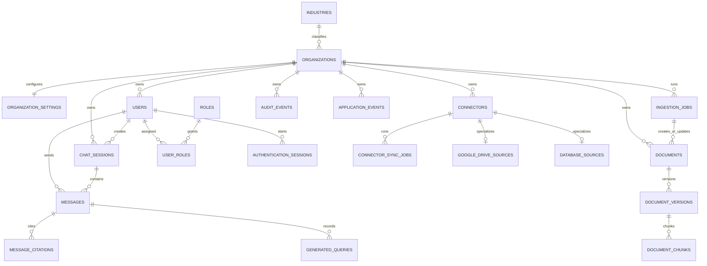
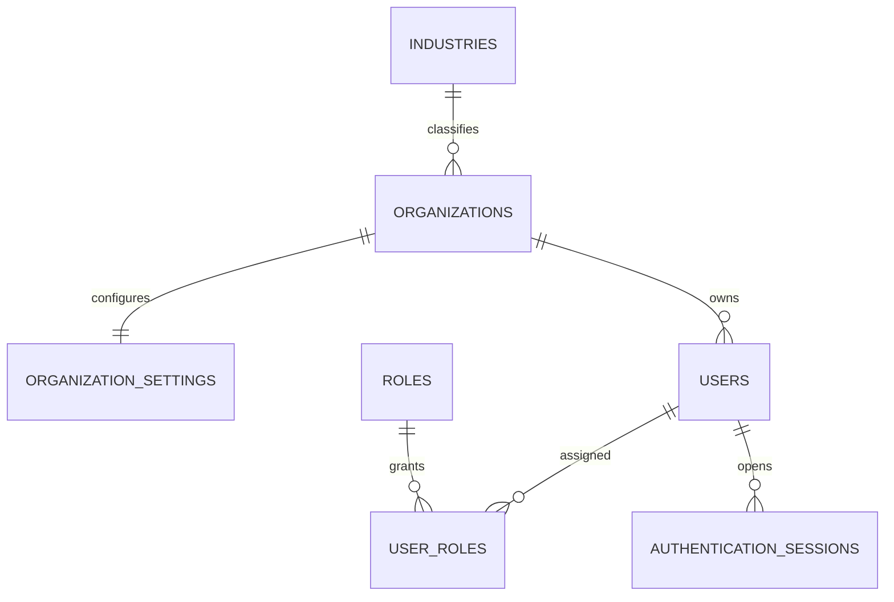

# Database Architecture

## Purpose

This document defines the recommended Version 1 database architecture for the platform. It is a design-only artifact. No SQL, migrations, ORM models, API code, or dependency installation are part of this document.

## Product Context

The platform is a multi-tenant, Glean-like AI knowledge platform for small and medium-sized businesses. Version 1 includes:

- Organizations
- Users
- Authentication
- Roles
- Document upload
- Document ingestion
- Document chunks and embeddings
- AI chat and conversation history
- Google Drive connector
- Connector synchronization
- One read-only PostgreSQL customer-data connector
- Natural-language SQL
- Usage tracking
- Basic audit logging

## Technology Decisions

- Primary database: PostgreSQL
- Vector support: pgvector
- Primary keys: UUID
- ORM later: SQLAlchemy 2.x
- Migrations later: Alembic

## Core Design Rules

1. organization_id is the primary tenant-isolation boundary.
2. Customer-owned data must be scoped to an organization.
3. industry_id is organization metadata and must not be copied onto every table.
4. Customer business databases remain external.
5. The platform database stores configuration, indexed knowledge, conversations, security metadata, and operational records.
6. Credentials and OAuth tokens must not be stored as unencrypted plain text.
7. Sensitive actions must be auditable.
8. The design must support permission syncing later without a complete redesign.
9. Use soft deletion only where it has a clear business purpose.
10. Avoid premature enterprise complexity.

## Recommended Version 1 Approach

The first working release should use a minimum secure schema rather than a fully expanded platform schema. The goal is to support tenancy, ingestion, retrieval, chat, connector synchronization, and auditability with the fewest tables that still keep future expansion viable.

The key simplification is to keep only the tables required to run the first release safely, while deferring fine-grained authorization, detailed AI telemetry, item-level sync events, invitation workflows, and separate credential rows until those features create real business pressure.

## Simplified Relationship Overview

For non-technical readers:

- An organization is the tenant boundary.
- Users belong to an organization and receive one or more roles.
- An organization can configure a Google Drive source and one PostgreSQL database source.
- Documents belong to an organization and can have multiple versions and searchable chunks.
- Users chat inside their organization, and assistant answers can cite document chunks or record generated SQL.
- Sync jobs, ingestion jobs, audit logs, and application events provide the minimum operational record needed to run the system safely.

## High-Level Entity Relationship Diagram

Deferred capabilities not shown in the first-release diagram: invitations, permissions, role_permissions, separate connector_credentials, connector_sync_events, document_access_rules, ai_requests, model_usage, retrieval_events, and user_feedback.

## Multi-Tenancy Strategy

- organizations is the tenant root.
- Every organization-scoped table must include organization_id except global reference tables such as industries and roles.
- organization_id must come from authenticated server-side context.
- Clients must not be allowed to choose arbitrary organization_id values.
- Every organization-scoped repository query must filter by organization_id.
- Cross-tenant automated tests are mandatory.
- Unique constraints for tenant-owned identifiers should normally be composite with organization_id.

## Future PostgreSQL Row-Level Security Strategy

Recommended for a later phase:

- Enable Row-Level Security on every organization-scoped table.
- Set app.current_organization_id from authenticated server-side context.
- Apply policies based on organization_id = current_setting('app.current_organization_id')::uuid.
- Keep global reference tables outside tenant RLS.

Version 1 can enforce tenancy at the application layer first, but the schema should be prepared for later RLS adoption.

## pgvector Strategy

- The PostgreSQL `vector` extension is enabled by a dedicated migration before any vector columns or indexes are introduced.
- The extension migration is idempotent and its downgrade intentionally leaves the extension installed because it is shared database infrastructure.
- Store one embedding per document chunk in document_chunks.
- Filter retrieval by organization_id and document state before vector ranking.
- Re-index by creating a new document_version and new document_chunks rows rather than overwriting prior versions.
- Standardize on one embedding model per environment in the first release.

## Embedding-Dimension Considerations

- embedding_dimension must match the chosen embedding model exactly.
- The first release should not support mixed embedding dimensions in the same environment.
- If the embedding model changes later, re-index into new document versions rather than mixing dimensions within one active dataset.

## Connector Credential Security Strategy

The first release should not create a separate connector_credentials table. Instead, connectors may contain:

- encrypted_secret_reference
- credential_status
- credential_updated_at

These fields must not contain raw OAuth tokens or raw database passwords. The intended meaning is:

- encrypted_secret_reference points to a secret manager record or stores an application-encrypted reference value
- credential_status indicates whether credentials are configured, expired, revoked, or invalid
- credential_updated_at records the most recent credential change time

If credential rotation, multi-secret history, or per-connector secret lifecycle becomes complex later, a dedicated connector_credentials table can be introduced without redesigning the connector ownership model.

## Document Versioning Strategy

- documents stores the stable logical document identity.
- document_versions stores immutable uploaded or synchronized versions.
- document_chunks belongs to a specific document_version.
- Only one document_version should be current for a document at a time.
- Re-ingestion should create a new version when source content changes.

## Deletion and Re-Indexing Strategy

- Use soft deletion on documents and chat_sessions because recovery and audit visibility are useful.
- Keep document_versions and document_chunks tied to historical versions for traceability.
- When a document is re-indexed, create a new version and new chunk set, then mark the earlier version non-current.
- If a source document disappears from Google Drive or becomes disallowed, mark the document inactive or deleted and keep the operational history.

## Initial-Sync and Incremental-Sync Tracking

connector_sync_jobs is enough for the first release. Each row should temporarily hold:

- status
- started_at
- completed_at
- discovered_count
- processed_count
- failed_count
- last_error
- checkpoint metadata

Checkpoint metadata can be stored as JSON to hold a cursor, sync token, or high-water mark until the sync model becomes more complex.

## Chat, Citation, and SQL Storage Design

- chat_sessions groups a conversation by organization and user.
- messages stores ordered user and assistant messages.
- message_citations stores structured evidence for assistant answers.
- generated_queries stores natural-language SQL prompts, generated SQL, validation results, execution status, row limits, and result counts.
- Basic model and token usage may initially be recorded on messages or generated_queries rather than requiring ai_requests and model_usage tables.

## Minimum Secure Schema for First Implementation

### Immediate Table Set

#### Reference and tenancy

- industries
- organizations
- organization_settings

#### Identity

- users
- roles
- user_roles
- authentication_sessions

#### Connectors

- connectors
- connector_sync_jobs
- google_drive_sources
- database_sources

#### Documents

- documents
- document_versions
- document_chunks
- ingestion_jobs

#### Conversations and SQL

- chat_sessions
- messages
- message_citations
- generated_queries

#### Operations

- audit_events
- application_events

Immediate table count: 21.

### Why This Is the Minimum Secure Set

- It supports tenant ownership and tenant-filtered queries.
- It supports login session tracking without a larger invitation or permission framework.
- It supports both required connector types without premature connector specialization overhead.
- It supports document ingestion, versioning, chunking, retrieval, citations, and natural-language SQL auditing.
- It captures enough operational and audit data to investigate failures and sensitive actions.

## Required Table Designs for the First Working Release

### A. Reference and Tenancy

#### industries

- Purpose: Reference data for organization industry classification.
- Primary key: id UUID.
- Foreign keys: none.
- Important columns: code, name, description, is_active, created_at.
- Required fields: id, code, name, is_active, created_at.
- Optional fields: description.
- Unique constraints: unique(code), unique(name).
- Check constraints: code must be non-empty.
- Suggested indexes: unique(code), btree(is_active).
- Tenant-isolation behavior: global table, no organization_id.
- Data-retention considerations: prefer deactivation over deletion.
- Relationships: organizations.industry_id references industries.id.

#### organizations

- Purpose: Tenant root for all customer-owned data.
- Primary key: id UUID.
- Foreign keys: industry_id -> industries.id.
- Important columns: name, slug, industry_id, status, created_at, updated_at, deleted_at.
- Required fields: id, name, slug, status, created_at, updated_at.
- Optional fields: industry_id, deleted_at.
- Unique constraints: unique(slug).
- Check constraints: status limited to approved lifecycle values.
- Suggested indexes: unique(slug), btree(industry_id), btree(status).
- Tenant-isolation behavior: root tenant table.
- Data-retention considerations: soft deletion is useful for account recovery and auditing.
- Relationships: one-to-one with organization_settings; one-to-many with most first-release tables.

#### organization_settings

- Purpose: Store organization-level configuration separately from the core organization record.
- Primary key: organization_id UUID.
- Foreign keys: organization_id -> organizations.id.
- Important columns: default_language, retention_policy_days, allowed_auth_providers, created_at, updated_at.
- Required fields: organization_id, created_at, updated_at.
- Optional fields: configuration values based on first-release needs.
- Unique constraints: primary key on organization_id.
- Check constraints: retention_policy_days >= 0 when present.
- Suggested indexes: primary key only.
- Tenant-isolation behavior: organization-scoped by organization_id.
- Data-retention considerations: update in place; important changes should be mirrored in audit_events.
- Relationships: exactly one settings row per organization.

### B. Identity and Authentication

This is the next migration slice after the two live reference tables. The recommended design keeps roles simple and global, users scoped to one organization, role assignments explicit for tenant enforcement, and refresh-token state hashed and revocable.

#### organization_settings

- Purpose: Store one organization-wide configuration row for locale, retention, and default AI behavior.
- Columns: organization_id, default_locale, timezone, retention_days, ai_model_name, created_at, updated_at.
- PostgreSQL data types: UUID, VARCHAR(32), VARCHAR(64), INTEGER, VARCHAR(128), TIMESTAMPTZ, TIMESTAMPTZ.
- Required versus nullable fields: organization_id, default_locale, timezone, retention_days, created_at, updated_at are required; ai_model_name is nullable.
- Defaults: default_locale = 'en-US'; timezone = 'UTC'; retention_days = 365; created_at and updated_at default to now(); ai_model_name has no database default because the application can supply a system default.
- Primary keys: organization_id.
- Foreign keys: organization_id -> organizations.id ON DELETE CASCADE.
- Unique constraints: primary key on organization_id.
- Check constraints: retention_days must be within a reasonable positive range, for example 1 through 3650; default_locale and timezone must not be blank; if ai_model_name is present it must not be blank.
- Indexes: primary key only.
- Delete behavior: delete with the organization; no separate lifecycle is needed.
- Tenant-isolation behavior: one row per organization; directly tenant-scoped by organization_id.
- Security considerations: keep only low-entropy configuration here; do not store branding assets, secrets, or arbitrary JSON blobs.
- Fields deferred for later: branding metadata, notification preferences, feature flags, SSO configuration, and arbitrary settings JSON.

#### roles

- Purpose: Define a small fixed set of platform roles for Version 1.
- Columns: id, name, description, is_system_role, created_at, updated_at.
- PostgreSQL data types: UUID, VARCHAR(128), TEXT, BOOLEAN, TIMESTAMPTZ, TIMESTAMPTZ.
- Required versus nullable fields: id, name, is_system_role, created_at, updated_at are required; description is nullable.
- Defaults: is_system_role = true; created_at and updated_at default to now().
- Primary keys: id.
- Foreign keys: none in Version 1 because roles are purely global.
- Unique constraints: unique(name).
- Check constraints: name must not be blank; optionally enforce lower(name) = name if names are stored in a normalized form, but the required rule is simply non-blank names.
- Indexes: unique(name); optional index on is_system_role for admin tooling.
- Delete behavior: roles should be treated as immutable seed/reference rows; if deletion is ever allowed, restrict it when user_roles references exist.
- Tenant-isolation behavior: global reference table in Version 1; not tenant-scoped.
- Security considerations: global fixed roles simplify review and reduce customization risk; platform_admin should not be modeled here and should be handled in the deployment/identity plane separately.
- Fields deferred for later: organization-specific custom roles, permission mappings, role hierarchies, and role-scoped capabilities.

#### users

- Purpose: Store user identities for exactly one organization in Version 1.
- Columns: id, organization_id, email, normalized_email, password_hash, first_name, last_name, display_name, status, email_verified_at, last_login_at, created_at, updated_at.
- PostgreSQL data types: UUID, UUID, VARCHAR(320), VARCHAR(320), TEXT, VARCHAR(100), VARCHAR(100), VARCHAR(200), VARCHAR(32), TIMESTAMPTZ, TIMESTAMPTZ, TIMESTAMPTZ, TIMESTAMPTZ.
- Required versus nullable fields: id, organization_id, email, normalized_email, password_hash, display_name, status, created_at, updated_at are required; first_name, last_name, email_verified_at, and last_login_at are nullable.
- Defaults: status = 'active'; created_at and updated_at default to now().
- Primary keys: id.
- Foreign keys: organization_id -> organizations.id ON DELETE CASCADE.
- Unique constraints: unique(organization_id, normalized_email); unique(organization_id, id).
- Check constraints: normalized_email must equal lower(btrim(email)); status must be one of active, suspended, disabled; password_hash must not be blank.
- Indexes: unique(organization_id, normalized_email); unique(organization_id, id); btree(organization_id, status); btree(organization_id, last_login_at).
- Delete behavior: Version 1 should prefer disabling users by status rather than soft deletion; if hard delete is used for administrative cleanup, dependent sessions and role assignments can cascade.
- Tenant-isolation behavior: directly organization-scoped; every query for users must include organization_id.
- Security considerations: password_hash must never be returned through APIs; email login is case-insensitive because normalized_email is stored and indexed; the hash should be Argon2id or bcrypt, generated outside the database; password_hash must not be nullable for local-password users in Version 1.
- Fields deferred for later: deleted_at, external identity provider columns, MFA state, password reset metadata, lockout counters, authentication_identities for OAuth/SSO, and other auth-provider linkage fields.

#### user_roles

- Purpose: Record which fixed roles are assigned to which users in a specific organization.
- Columns: id, organization_id, user_id, role_id, assigned_at, assigned_by_user_id.
- PostgreSQL data types: UUID, UUID, UUID, UUID, TIMESTAMPTZ, UUID.
- Required versus nullable fields: id, organization_id, user_id, role_id, assigned_at are required; assigned_by_user_id is nullable.
- Defaults: assigned_at defaults to now().
- Primary keys: surrogate UUID id is recommended.
- Foreign keys: organization_id -> organizations.id ON DELETE CASCADE; composite foreign key (organization_id, user_id) -> users(organization_id, id) ON DELETE CASCADE; role_id -> roles.id ON DELETE RESTRICT; assigned_by_user_id is intentionally not a database foreign key in Version 1.
- Unique constraints: unique(organization_id, user_id, role_id).
- Check constraints: organization_id must match the tenant context of the assigned user and the assignment must not be blank; this invariant is enforced by the composite foreign key and should also be checked by application code.
- Indexes: unique(organization_id, user_id, role_id); btree(organization_id, user_id); btree(organization_id, role_id); btree(assigned_by_user_id); btree(user_id); btree(role_id).
- Delete behavior: removing a user or organization cascades assignments; roles are restricted from deletion because they are seed/reference data.
- Tenant-isolation behavior: store organization_id even though it is partially redundant because it is intentionally denormalized for tenant enforcement, future PostgreSQL RLS, auditing, and simpler organization-scoped queries.
- Security considerations: this table is an assignment record rather than a pure join table, so a surrogate UUID avoids changing the primary key later when revocation or history fields are added.
- Service-layer validation rule for assigned_by_user_id in Version 1: assigned_by_user_id is a nullable UUID audit field, and Version 1 intentionally does not add a database foreign key for it. A simple users.id foreign key could allow cross-tenant references because it does not bind organization context. A tenant-aware composite foreign key with ON DELETE SET NULL is awkward here because organization_id must remain required on the row while only assigned_by_user_id is cleared. Version 1 therefore enforces same-organization validation in application logic, and a stronger database-level constraint can be introduced later if the assignment model evolves.
- Fields deferred for later: revoked_at, expires_at, grant_reason, source, granted_via, and assignment history/versioning fields.

#### authentication_sessions

- Purpose: Track secure web sessions using hashed refresh tokens.
- Columns: id, organization_id, user_id, refresh_token_hash, created_at, expires_at, revoked_at, last_used_at, ip_address, user_agent.
- PostgreSQL data types: UUID, UUID, UUID, BYTEA, TIMESTAMPTZ, TIMESTAMPTZ, TIMESTAMPTZ, TIMESTAMPTZ, INET, TEXT.
- Required versus nullable fields: id, organization_id, user_id, refresh_token_hash, created_at, expires_at are required; revoked_at, last_used_at, ip_address, and user_agent are nullable.
- Defaults: created_at defaults to now(); revoked_at and last_used_at are initially null.
- Primary keys: id.
- Foreign keys: composite foreign key (organization_id, user_id) -> users(organization_id, id) ON DELETE CASCADE; organization_id -> organizations.id ON DELETE CASCADE if desired for direct tenant cleanup, though the composite user foreign key is the primary tenant-consistency guard.
- Unique constraints: unique(refresh_token_hash).
- Check constraints: expires_at must be greater than created_at; revoked_at must be null or later than created_at; last_used_at must be null or later than created_at when present.
- Indexes: unique(refresh_token_hash); btree(organization_id, user_id, revoked_at, expires_at DESC); btree(expires_at); btree(organization_id, expires_at); btree(organization_id, user_id, revoked_at); partial index on active sessions where revoked_at IS NULL.
- Delete behavior: delete with the user or organization; operational cleanup can also remove expired revoked rows.
- Tenant-isolation behavior: directly organization-scoped.
- Security considerations: never store raw refresh tokens; store only a keyed hash of the refresh token; include IP and user-agent for anomaly detection and session forensics; keep these fields nullable to avoid breaking API clients that do not supply them; use refresh-token rotation so issuing a new token can revoke the previous session row.
- Fields deferred for later: session family IDs, token lineage/reuse tracking, device labels, MFA challenge state, auth-provider session linkage, and risk-scoring metadata.

#### Design Decisions for This Slice

- Roles should be purely global in Version 1, with no organization_id column.
- organization_settings should use organization_id as both the primary key and foreign key.
- users should include both display_name and first_name/last_name because display_name is convenient for UI rendering while first/last names help with formal communication.
- users should not use deleted_at in Version 1; status-based disablement is simpler and keeps the first release focused.
- user_roles should include organization_id because it is intentionally denormalized for tenant enforcement, future PostgreSQL RLS, auditing, and simpler organization-scoped queries.
- authentication_sessions should store IP address and user-agent as nullable forensic fields.
- platform_admin should be handled outside this schema, either in the deployment identity plane or a separate admin boundary.

#### Seed Data Recommendation

- Seed the global roles table with `organization_admin` and `employee`.
- Keep both rows marked as system roles and non-editable in Version 1.
- Do not seed platform_admin here; it belongs in the operational/admin plane, not the tenant application schema.

#### Upgrade Dependencies

- organizations must already exist before organization_settings and users.
- roles should exist before user_roles.
- users must exist before user_roles and authentication_sessions.
- user_roles depends on organizations, users, and roles.
- authentication_sessions depends on organizations and users.

#### Recommended Table Creation Order for This Slice

1. organization_settings
2. roles
3. users
4. user_roles
5. authentication_sessions

This order assumes industries and organizations already exist, which they do in the live database.

#### Downgrade Order

1. authentication_sessions
2. user_roles
3. users
4. roles
5. organization_settings

This order removes the most dependent table first and preserves dependency safety on rollback.

#### Cross-Tenant Test Cases Required Before Approval

- A user from organization A cannot read or update organization B settings.
- A user from organization A cannot be assigned a role through organization B context.
- The same email value may not be duplicated within one organization, but lookup remains case-insensitive through normalized_email.
- Authentication sessions from organization A cannot be resolved for organization B.
- A user-role assignment cannot target a user from another organization.
- Global roles remain readable as reference data, but they cannot leak tenant-specific state.
- Login/session cleanup jobs must only touch rows for the current organization when operating in tenant-scoped mode.
- The composite foreign key on user_roles must reject a user from organization A being paired with organization_id for organization B.
- The composite foreign key on authentication_sessions must reject a session row whose user_id points to a user from a different organization.
- Users from different organizations may share the same email only if the normalized_email unique constraint is scoped by organization_id.
- Global role rows must remain readable, but they must not acquire tenant-specific foreign keys.

#### Risks and Mitigations

- Risk: global roles could drift into tenant customization later.
  Mitigation: keep the initial role catalog fixed and seed-only, and defer scoped roles until there is a concrete need.
- Risk: normalized email logic could drift between application and database.
  Mitigation: enforce the lowercasing rule in one place and keep a uniqueness constraint on normalized_email.
- Risk: storing IP/user-agent data could create privacy concerns.
  Mitigation: keep those fields nullable, document retention expectations, and avoid collecting them if policy forbids it.
- Risk: session revocation could become hard to reason about.
  Mitigation: use a single-row session model with hashed refresh tokens, explicit revoked_at timestamps, and cleanup by expiry.
- Risk: organization_id redundancy in user_roles could be misused.
  Mitigation: always validate that the assignment context matches the user's organization before insert or update.
- Risk: the composite foreign key could be omitted in implementation and tenant leakage could reappear.
  Mitigation: make the users(organization_id, id) uniqueness rule explicit and require the composite foreign key in the first migration slice.

#### Final Recommended Schema

- organization_settings: one row per organization using organization_id as the primary key and foreign key.
- roles: purely global system roles with unique role names and seed rows organization_admin and employee.
- users: organization-scoped identities with case-insensitive login, tenant-aware uniqueness, and mandatory password_hash for local-password users.
- user_roles: organization-scoped assignment records with a surrogate UUID primary key, organization_id denormalized for enforcement, and a composite foreign key to users.
- authentication_sessions: organization-scoped refresh-token session records with hashed tokens, revocation timestamps, forensic metadata, and composite tenant-consistent foreign keys.

#### Tables Ready for Implementation

- organization_settings
- roles
- users
- user_roles
- authentication_sessions

These are the next tables that can be implemented once the migration slice is approved.

#### Open Questions

- What exact application-level default should populate ai_model_name if the organization row leaves it null?
- Will future OAuth or SSO require a separate identity-link table, or can it be introduced later without affecting this slice?
- Should session cleanup be immediate on revocation or deferred to a scheduled purge job?

### C. Connectors

#### connectors

- Purpose: Store one configured integration instance. Connector type remains an extensible normalized code rather than a provider enum.
- Security: `safe_config` and the capability snapshot contain only non-secret JSON objects. Credentials, tokens, API keys, private keys, and passwords must never be persisted there; `secret_reference` contains only a reference to externally managed secret material. A future connector service must validate provider-specific schemas and reject secret-like configuration keys.
- ACL declaration: `acl_support` is the typed security-relevant declaration (`none`, `partial`, or `complete`). Capability JSON is descriptive and is not authoritative for access security.
- Lifecycle: connectors progress through draft, validation, active/degraded/auth-failed/paused, and archived states. Hard deletion cascades owned scopes, while normal behavior archives connectors.
- Integration status: connector instance and scope persistence exist, but repositories, services, APIs, synchronization, source items, and document relationships are not implemented by this slice.

#### connector_scopes

- Purpose: Store a selected folder, repository, branch, drive, bucket, or path within one connector.
- Content boundary: every scope has exactly one required knowledge space. `access_mode` exists only on this table and is `platform_managed`, `source_acl`, or `hybrid`; Local Folder uses `platform_managed`.
- Lifecycle: scopes progress through draft, validation, active/invalid/paused, and removed states. Normal behavior removes a scope before hard-deleting its knowledge space; the database rejects deletion of a referenced knowledge space.
- Service invariants: an active scope must reference an active connector and active knowledge space. `source_acl` and `hybrid` require connector `acl_support = complete`. These cross-row rules cannot be safely expressed as ordinary checks and must be enforced by a future connector service.
- Safe configuration: `safe_config` contains only non-secret scope selection data. Provider-specific service validation must reject secret payloads before persistence.

#### connector_sync_jobs

- Purpose: Track initial and incremental sync runs at a summary level.
- Primary key: id UUID.
- Foreign keys: organization_id -> organizations.id, connector_id -> connectors.id, started_by_user_id -> users.id nullable.
- Important columns: sync_mode, status, started_at, completed_at, discovered_count, processed_count, failed_count, last_error, checkpoint_metadata, created_at.
- Required fields: id, organization_id, connector_id, sync_mode, status, started_at, created_at.
- Optional fields: started_by_user_id, completed_at, discovered_count, processed_count, failed_count, last_error, checkpoint_metadata.
- Unique constraints: none.
- Check constraints: counts >= 0; completed_at null or completed_at >= started_at; sync_mode limited to initial or incremental.
- Suggested indexes: btree(organization_id, connector_id, started_at desc), btree(status), btree(sync_mode).
- Tenant-isolation behavior: directly organization-scoped.
- Data-retention considerations: retain for operational history and support.
- Relationships: one connector to many sync jobs; ingestion_jobs may optionally reference a sync job.

#### google_drive_sources

- Purpose: Store Google Drive-specific configuration for approved folders.
- Primary key: id UUID.
- Foreign keys: organization_id -> organizations.id, connector_id -> connectors.id.
- Important columns: approved_folder_ids, drive_account_email, sync_cursor, include_shared_drives, created_at, updated_at.
- Required fields: id, organization_id, connector_id, approved_folder_ids, created_at, updated_at.
- Optional fields: drive_account_email, sync_cursor, include_shared_drives.
- Unique constraints: unique(connector_id).
- Check constraints: approved_folder_ids must not be empty.
- Suggested indexes: unique(connector_id), btree(organization_id).
- Tenant-isolation behavior: directly organization-scoped.
- Data-retention considerations: retain while connector exists.
- Relationships: one specialized row per Google Drive connector.

#### database_sources

- Purpose: Store the read-only PostgreSQL connector configuration.
- Primary key: id UUID.
- Foreign keys: organization_id -> organizations.id, connector_id -> connectors.id.
- Important columns: database_engine, host_reference, database_name, schema_allowlist, table_allowlist, sql_row_limit_default, sql_row_limit_max, metadata_last_synced_at, sql_guardrails_json, created_at, updated_at.
- Required fields: id, organization_id, connector_id, database_engine, database_name, sql_row_limit_default, sql_row_limit_max, created_at, updated_at.
- Optional fields: host_reference, schema_allowlist, table_allowlist, metadata_last_synced_at, sql_guardrails_json.
- Unique constraints: unique(connector_id).
- Check constraints: database_engine = postgresql in the first release; sql_row_limit_default > 0; sql_row_limit_max >= sql_row_limit_default.
- Suggested indexes: unique(connector_id), btree(organization_id), btree(metadata_last_synced_at).
- Tenant-isolation behavior: directly organization-scoped.
- Data-retention considerations: retain while connector exists and minimize sensitive infrastructure detail.
- Relationships: one specialized row per PostgreSQL connector; referenced by generated_queries.

### D. Documents

### Organization Structure Slice

Departments and teams are optional organization structure. Organizations may use neither, either, or both; no artificial default department or team is created. Departments may be hierarchical through a tenant-safe self-reference. Teams are independent flexible groups and do not reference departments in this slice.

Department and team memberships are current relationship records with tenant-safe composite foreign keys to the organization, user, and target structure. Department responsibilities are `member` and `manager`; team responsibilities are `member`, `lead`, `manager`, and `owner`. Membership status, effective/expiry timestamps, and revocation consistency are database-enforced.

Platform roles remain application-capability roles and do not grant document access. These tables do not introduce knowledge-space or document-permission behavior. Knowledge spaces and typed grants are the next planned authorization slice.

### Knowledge Space Slice

Knowledge spaces are organization-owned platform content boundaries. The platform persists current organization-wide, department, team, and direct-user grants in four typed grant tables; there are no polymorphic principals or role grants. Permissions are `viewer`, `contributor`, and `manager`.

Platform roles do not grant document visibility. Grant effectiveness will depend on grant timestamps, active knowledge-space state, and active target state where applicable. This slice does not implement authorization queries or services, and does not assign connectors or documents to knowledge spaces. Immutable audit persistence is required before management APIs expose grant mutations.

#### documents

- Purpose: Store the stable logical identity of uploaded or synchronized documents.
- Primary key: id UUID.
- Foreign keys: organization_id -> organizations.id, connector_id -> connectors.id nullable, source_ingestion_job_id -> ingestion_jobs.id nullable, created_by_user_id -> users.id nullable.
- Important columns: source_type, source_document_key, title, mime_type, current_version_id, status, checksum_latest, created_at, updated_at, deleted_at.
- Required fields: id, organization_id, source_type, title, status, created_at, updated_at.
- Optional fields: connector_id, source_ingestion_job_id, created_by_user_id, source_document_key, mime_type, current_version_id, checksum_latest, deleted_at.
- Unique constraints: unique(organization_id, source_type, source_document_key) when source_document_key is present.
- Check constraints: status limited to approved values.
- Suggested indexes: btree(organization_id, status), btree(organization_id, connector_id), btree(current_version_id), btree(source_document_key).
- Tenant-isolation behavior: directly organization-scoped.
- Data-retention considerations: soft deletion recommended.
- Relationships: one document to many versions; one document to many citations.

The initial documents persistence migration intentionally implements only the fields and organization foreign key that are safe with the currently existing schema. Connector, ingestion-job, and creator-user foreign keys remain deferred until their persistence tables exist; no unvalidated connector UUID is stored in this slice.

#### document_versions

- Purpose: Store immutable document versions produced by upload or synchronization.
- Primary key: id UUID.
- Foreign keys: organization_id -> organizations.id, document_id -> documents.id, ingestion_job_id -> ingestion_jobs.id nullable.
- Important columns: version_number, content_checksum, storage_uri, extracted_text_uri or extracted_text, extraction_status, chunk_count, token_count, is_current, created_at.
- Required fields: id, organization_id, document_id, version_number, content_checksum, extraction_status, is_current, created_at.
- Optional fields: ingestion_job_id, storage_uri, extracted_text_uri, extracted_text, chunk_count, token_count.
- Unique constraints: unique(document_id, version_number); only one current version per document.
- Check constraints: version_number > 0; chunk_count and token_count >= 0 when present.
- Suggested indexes: btree(organization_id, document_id), btree(document_id, is_current), btree(content_checksum).
- Tenant-isolation behavior: directly organization-scoped.
- Data-retention considerations: keep version history for auditability and re-indexing.
- Relationships: one version to many chunks.

#### document_chunks

- Purpose: Store retrieval chunks and embeddings.
- Primary key: id UUID.
- Foreign keys: organization_id -> organizations.id, document_id -> documents.id, document_version_id -> document_versions.id.
- Important columns: chunk_index, chunk_text, token_count, embedding, embedding_model, embedding_dimension, content_hash, page_number_start, page_number_end, created_at.
- Required fields: id, organization_id, document_id, document_version_id, chunk_index, chunk_text, embedding, embedding_model, embedding_dimension, created_at.
- Optional fields: token_count, content_hash, page_number_start, page_number_end.
- Unique constraints: unique(document_version_id, chunk_index).
- Check constraints: chunk_index >= 0; embedding_dimension > 0; token_count >= 0 when present.
- Suggested indexes: btree(organization_id, document_id), btree(document_version_id), vector index on embedding.
- Tenant-isolation behavior: directly organization-scoped.
- Data-retention considerations: tied to version history; purge only if historical versions are intentionally removed.
- Relationships: belongs to one document version; referenced by message_citations.

#### ingestion_jobs

- Purpose: Track upload or indexing work for documents.
- Primary key: id UUID.
- Foreign keys: organization_id -> organizations.id, connector_id -> connectors.id nullable, connector_sync_job_id -> connector_sync_jobs.id nullable, started_by_user_id -> users.id nullable.
- Important columns: ingestion_type, status, started_at, completed_at, document_count, version_count, chunk_count, failure_count, error_summary.
- Required fields: id, organization_id, ingestion_type, status, started_at.
- Optional fields: connector_id, connector_sync_job_id, started_by_user_id, completed_at, document_count, version_count, chunk_count, failure_count, error_summary.
- Unique constraints: none.
- Check constraints: counts >= 0; completed_at null or completed_at >= started_at.
- Suggested indexes: btree(organization_id, started_at desc), btree(connector_id, status), btree(connector_sync_job_id).
- Tenant-isolation behavior: directly organization-scoped.
- Data-retention considerations: operationally valuable; retain for debugging and throughput analysis.
- Relationships: may create or update documents and document_versions.

### E. Conversations and SQL

#### chat_sessions

- Purpose: Group a conversation by user and organization.
- Primary key: id UUID.
- Foreign keys: organization_id -> organizations.id, user_id -> users.id.
- Important columns: title, status, last_message_at, created_at, updated_at, archived_at, deleted_at.
- Required fields: id, organization_id, user_id, status, created_at, updated_at.
- Optional fields: title, last_message_at, archived_at, deleted_at.
- Unique constraints: none.
- Check constraints: archived_at and deleted_at must be later than created_at when present.
- Suggested indexes: btree(organization_id, user_id, last_message_at desc), btree(status), btree(deleted_at).
- Tenant-isolation behavior: directly organization-scoped.
- Data-retention considerations: soft deletion recommended.
- Relationships: one chat session to many messages.

#### messages

- Purpose: Store ordered user and assistant messages.
- Primary key: id UUID.
- Foreign keys: organization_id -> organizations.id, chat_session_id -> chat_sessions.id, user_id -> users.id nullable.
- Important columns: message_role, sequence_number, content_text, status, model_name, prompt_token_count, completion_token_count, total_token_count, created_at.
- Required fields: id, organization_id, chat_session_id, message_role, sequence_number, content_text, created_at.
- Optional fields: user_id, status, model_name, prompt_token_count, completion_token_count, total_token_count.
- Unique constraints: unique(chat_session_id, sequence_number).
- Check constraints: sequence_number > 0; token counts >= 0 when present; message_role limited to approved values.
- Suggested indexes: btree(organization_id, chat_session_id, sequence_number), btree(message_role), btree(created_at).
- Tenant-isolation behavior: directly organization-scoped.
- Data-retention considerations: normally retained with the chat session.
- Relationships: many messages per chat session; one message may have many citations and generated queries.

#### message_citations

- Purpose: Store structured citations for assistant answers.
- Primary key: id UUID.
- Foreign keys: organization_id -> organizations.id, message_id -> messages.id, document_id -> documents.id, document_version_id -> document_versions.id nullable, document_chunk_id -> document_chunks.id nullable.
- Important columns: citation_order, snippet_text, locator_json, score, created_at.
- Required fields: id, organization_id, message_id, document_id, citation_order, created_at.
- Optional fields: document_version_id, document_chunk_id, snippet_text, locator_json, score.
- Unique constraints: unique(message_id, citation_order).
- Check constraints: citation_order > 0; score between 0 and 1 when normalized.
- Suggested indexes: btree(message_id, citation_order), btree(document_id), btree(document_chunk_id).
- Tenant-isolation behavior: directly organization-scoped.
- Data-retention considerations: retain with message history for answer traceability.
- Relationships: many citations per assistant message.

#### generated_queries

- Purpose: Audit natural-language SQL generation and SELECT-only execution outcomes.
- Primary key: id UUID.
- Foreign keys: organization_id -> organizations.id, message_id -> messages.id, connector_id -> connectors.id, database_source_id -> database_sources.id, user_id -> users.id nullable.
- Important columns: natural_language_prompt, generated_sql, validation_status, execution_status, query_fingerprint, row_limit_applied, result_row_count, model_name, prompt_token_count, completion_token_count, total_token_count, generated_at, executed_at, error_summary.
- Required fields: id, organization_id, message_id, connector_id, database_source_id, natural_language_prompt, generated_sql, validation_status, generated_at.
- Optional fields: user_id, execution_status, query_fingerprint, row_limit_applied, result_row_count, model_name, prompt_token_count, completion_token_count, total_token_count, executed_at, error_summary.
- Unique constraints: none.
- Check constraints: row_limit_applied > 0 when present; result_row_count >= 0 when present; token counts >= 0 when present.
- Suggested indexes: btree(organization_id, generated_at desc), btree(database_source_id, generated_at desc), btree(query_fingerprint).
- Tenant-isolation behavior: directly organization-scoped.
- Data-retention considerations: high audit value; retain longer than transient operational data.
- Relationships: tied to one message and one database source.

### F. Operations

#### audit_events

- Purpose: Append-oriented historical evidence for sensitive user, system, and service actions. It is separate from operational application events, provider errors, metrics, and traces.
- Actor model: actor_type is `user`, `system`, or `service`. User actors tenant-safely reference users; system and service actors record a nonblank safe reference.
- Historical targets: resource_type and resource_id deliberately have no polymorphic foreign key, so an event survives independently represented target deletion.
- Retention: organization_settings.retention_days defines ordinary retention and legal hold may override it. A future explicit purge/export workflow must remove eligible audit events before an organization or referenced actor can be hard-deleted.
- Delete behavior: organization and actor-user foreign keys use `RESTRICT`, unlike ordinary organization-owned operational tables. This prevents silent audit-history removal; normal lifecycle disables users and organizations.
- JSON safety: change_summary and context must contain sanitized objects. Future writers must reject or redact passwords, password hashes, API keys, OAuth and refresh tokens, connector secrets, document or chunk content, embeddings, database credentials, and raw exception traces.
- Integration status: audit persistence exists, but audit repository, service, and API integration do not yet exist.

#### application_events

- Purpose: Store operational failures, warnings, and system events.
- Primary key: id UUID.
- Foreign keys: organization_id -> organizations.id nullable, connector_id -> connectors.id nullable, ingestion_job_id -> ingestion_jobs.id nullable, connector_sync_job_id -> connector_sync_jobs.id nullable.
- Important columns: event_type, severity, source_component, correlation_id, message, details_json, occurred_at.
- Required fields: id, event_type, severity, source_component, occurred_at.
- Optional fields: organization_id, connector_id, ingestion_job_id, connector_sync_job_id, correlation_id, message, details_json.
- Unique constraints: none.
- Check constraints: severity limited to approved values.
- Suggested indexes: btree(occurred_at desc), btree(severity, occurred_at desc), btree(organization_id, occurred_at desc), btree(correlation_id).
- Tenant-isolation behavior: organization_id is present for tenant-specific events and null only for truly global operational events.
- Data-retention considerations: can be retained for a shorter period than audit_events or exported externally later.
- Relationships: provides operational traceability for sync, ingestion, and runtime issues.

## Deferred Tables and Trigger Conditions

Deferred table count: 10.

#### invitations

- Why deferred: first-release onboarding can be handled with direct user creation by administrators.
- Add later when: the product needs email-driven self-service invites, invite acceptance tracking, or secure invite expiration workflows.

#### permissions

- Why deferred: first-release access control can rely on a small fixed role set.
- Add later when: roles are no longer enough and resource-level authorization decisions must be modeled explicitly.

#### role_permissions

- Why deferred: it only becomes necessary once permissions exists as a real authorization layer.
- Add later when: permission catalogs are introduced and roles must map to reusable permission sets.

#### connector_credentials as a separate table

- Why deferred: the first release can keep a minimal encrypted_secret_reference and credential state directly on connectors.
- Add later when: secret rotation history, multiple credential versions, or connector-specific secret lifecycle tracking becomes necessary.

#### connector_sync_events

- Why deferred: summary-level sync tracking is sufficient at first.
- Add later when: item-level diagnostics, replay support, or detailed sync troubleshooting becomes operationally necessary.

#### document_access_rules

- Why deferred: Version 1 does not implement full source permission synchronization.
- Add later when: document-level permission sync or restricted retrieval requires principal-level allow or deny rules.

#### ai_requests

- Why deferred: initial model and latency metrics can be stored on messages and generated_queries.
- Add later when: the platform needs request-level tracing across prompts, retrieval, tool usage, and model execution.

#### model_usage

- Why deferred: first-release usage visibility can stay embedded in messages or generated_queries.
- Add later when: billing, cost attribution, or detailed usage analytics requires a normalized usage ledger.

#### retrieval_events

- Why deferred: retrieval quality can be debugged initially through chat outcomes and citations.
- Add later when: retrieval tuning, ranking experiments, or explainability workflows need structured retrieval telemetry.

#### user_feedback

- Why deferred: first-release feedback can be collected outside the core schema if necessary.
- Add later when: answer-level ratings and feedback loops become part of the product learning cycle.

## Architectural Review and Challenge

### Tables That Were Removed From the Immediate Set

- invitations
- permissions
- role_permissions
- connector_credentials as a separate table
- connector_sync_events
- document_access_rules
- ai_requests
- model_usage
- retrieval_events
- user_feedback

These were removed from the immediate set because they add structure without being necessary to launch the first secure working release.

### Tables That Should Stay Combined for Now

- Credential state should stay on connectors for the first release.
- Token and model usage can stay on messages and generated_queries for the first release.
- Application and error telemetry should stay combined in application_events.

### Tables That Must Stay Separate Even in the Minimum Schema

- documents, document_versions, and document_chunks must stay separate.
- connectors must stay separate from google_drive_sources and database_sources.
- chat_sessions, messages, and message_citations must stay separate.
- generated_queries must stay separate from audit_events.

### Areas Still Sensitive to Over-Engineering

- Adding too many connector-specific metadata tables before more connectors exist.
- Building a full permission graph before the product needs it.
- Creating AI telemetry tables that duplicate data already available on messages and generated_queries.

### Areas That Must Not Be Omitted

- organization_id on every organization-scoped table.
- document versioning as a separate layer.
- structured citations.
- generated query auditing.
- sync job checkpoint tracking.
- audit logs for sensitive actions.

## Important Risks and Mitigations

- Risk: cross-tenant data leakage through missing query filters.
  Mitigation: require organization_id in every organization-scoped table, enforce server-side tenant context, and add mandatory cross-tenant automated tests.
- Risk: credential handling becomes unsafe.
  Mitigation: store only encrypted_secret_reference and credential state in the first release, never raw secrets.
- Risk: future permission sync becomes harder.
  Mitigation: keep document ownership and connector source identity clean so document_access_rules can be added later.
- Risk: document re-indexing corrupts retrieval history.
  Mitigation: use immutable document_versions and version-scoped document_chunks.
- Risk: SQL generation becomes difficult to audit.
  Mitigation: keep generated_queries as a first-release table with validation, execution, and token metadata.

## Recommended Table Creation Order for the First Release

1. industries
2. organizations
3. organization_settings
4. roles
5. users
6. user_roles
7. authentication_sessions
8. connectors
9. google_drive_sources
10. database_sources
11. connector_sync_jobs
12. ingestion_jobs
13. documents
14. document_versions
15. document_chunks
16. chat_sessions
17. messages
18. message_citations
19. generated_queries
20. audit_events
21. application_events

## Final Recommendation

The first implementation should start with the 21-table minimum secure schema described here. That set is enough to support tenancy, authentication sessions, role assignment, the two first-release connector types, document ingestion and vector retrieval, chat with citations, generated SQL auditing, and basic operational and security observability.

The deferred tables remain architecturally valid, but they should only be added when concrete business or operational conditions justify them.