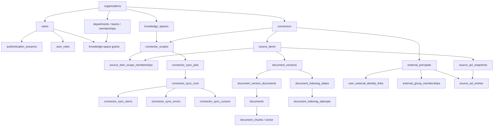
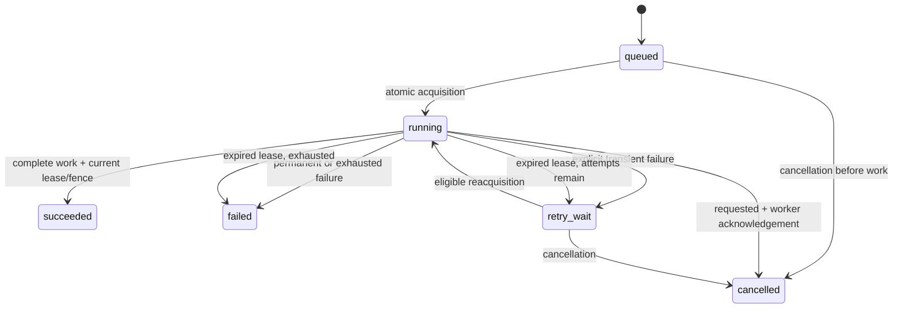
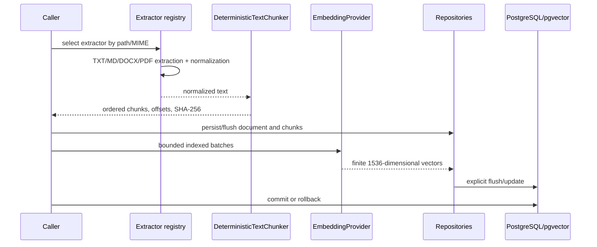

# Enterprise AI Platform Implementation Status

## 1. Document control

| Field | Value |
|---|---|
| Repository | `enterprise-ai-platform` |
| Snapshot branch | `main` |
| Snapshot commit | `a4481e09e606d4377c0b960de77b9492b8f6e62f` (clean implementation baseline) |
| Snapshot date | 2026-08-20 |
| Alembic head | `20260827_000018` |
| Purpose | Authoritative, code-evidenced inventory of implemented, exposed, partial, planned, deferred, and excluded capabilities |
| Audiences | Product owners, backend/data/security/connector/operations/UI/QA engineers, and future repository agents |

This document treats executable code, migrations, runtime route registration, and tests as stronger evidence than older plans or commit messages.

| Status | Meaning |
|---|---|
| **Complete** | Implemented and covered by executable tests |
| **Backend complete** | Backend implementation exists, but no final API, continuously running host, or UI exposes it |
| **Partial** | Some required layers exist; material work remains |
| **Planned** | Described in repository documentation but no executable implementation exists |
| **Deferred** | Deliberately postponed pending another architecture slice or business decision |
| **Not in scope** | Explicitly excluded from the current product boundary |

## 2. Executive summary

The repository is building a multi-tenant enterprise knowledge platform. Organizations will eventually configure controlled data connectors, ingest and index documents, retrieve only content a user is authorized to see, and use a future answer/agent layer to produce grounded responses with citations.

Operationally today, the FastAPI backend supports authentication and authenticated manual upload of TXT, Markdown, DOCX, and PDF files through a fully tested extraction, deterministic chunking, embedding, and PostgreSQL/pgvector persistence pipeline. The backend also contains secure Local Folder connector-management APIs, recurring interval schedules, a database-only scheduler host, a complete synchronization engine, durable job control, a continuous and one-shot worker host, immutable source versioning, and a permission-aware vector retrieval repository. GitHub is the first cloud connector: organization administrators can create a draft GitHub connector, complete its browser GitHub App installation lifecycle, and retrieve one bounded live page of repositories authorized to the verified organization installation. A production Google Cloud Secret Manager adapter supplies immutable GitHub configuration references, ephemeral PKCE storage, and on-demand private-key access through ADC-based, fail-closed composition. No GCP resource or Cloud Run deployment has been provisioned. Repository selection and synchronization are not implemented. Retrieval is not exposed by an API.

The product is therefore a **tested backend foundation and vertical-slice implementation, not a finished user-facing product**. Its strongest capability is the tenant-safe scheduled content ingestion/synchronization/indexing data plane with bounded leases, fencing, retries, rollback, continuous Local Folder execution, and authorization-before-ranking retrieval. Its primary gaps are cron/timezone scheduling, broader connector lifecycle operations, search APIs, answer generation, deployment supervision, and a frontend.

### Documentation precedence and known stale statements

This document supersedes implementation-status statements in older planning files; it does not supersede their product intent or historical decisions.

| Older source | Stale or potentially misleading statement | Current evidence |
|---|---|---|
| `README.md` | Says document/chunk persistence, PDF/DOCX extraction, chunking, embeddings, pgvector retrieval, audit logging, and workflow automation are not implemented | Persistence, extraction, chunking, embeddings, audit schema, Local Folder synchronization/worker, and permission-aware retrieval repository now exist and pass tests; search/chat APIs remain absent |
| `README.md` | Lists Redis as the caching/queue stack | Redis is not a dependency and no cache/queue implementation exists |
| `docs/PROJECT_CONTEXT.md` | Says document persistence, PDF/DOCX, chunking, embeddings, pgvector storage, retrieval, and audit are unimplemented | Those backend layers and the first Local Folder management APIs now exist; chat, cloud connectors, broader management APIs, and full audit emission remain missing |
| `docs/VISION.md` | Lists LangGraph in the intended technical foundation | This is aspirational: no LangGraph dependency, import, or runtime exists |
| Earlier per-migration sections of `docs/DATABASE.md` | Some sections state that repositories/services/retrieval were not implemented “by this slice” | Those statements describe the historical boundary of that migration slice; later code and later sections implement repositories, retrieval, execution control, and the bounded worker |

## 3. Platform objective and product boundary

The intended boundary is an organization-scoped knowledge and search platform with:

- organization-controlled connectors and scopes;
- authenticated manual uploads;
- canonical source identities and immutable document versions;
- extraction, deterministic chunking, and vector embeddings;
- platform-grant and source-ACL-aware retrieval;
- a future AI answer/agent layer, citations, and workflow features.

Manual upload is a request-time API workflow that creates a `manual_upload` document directly. Connector synchronization is a durable operational workflow: a configured connector scope creates source items, versions, indexing attempts, and synchronization history.

The current Local Folder connector reads a directory accessible to the **connector/backend host**. It does not silently access employee laptops. Regular employees cannot configure folders: the first connector-management API requires the committed `organization_admin` role in the authenticated user's active organization. No on-premises or desktop connector agent, employee-device enrollment, or agent packaging exists.

## 4. Current end-to-end architecture

Solid nodes are callable today through an API or concrete runtime class. Dashed nodes are implemented backend components without a public API or continuously running host.

```mermaid
flowchart LR
    U[Authenticated user] -->|JWT bearer token| API[FastAPI auth and upload APIs]
    API --> TENANT[Current user and organization context]
    TENANT --> ORG[Organization, users, roles, departments, teams]
    TENANT --> UPLOAD[Manual upload]
    UPLOAD --> EXTRACT[TXT / Markdown / DOCX / PDF extraction]
    EXTRACT --> CHUNK[Deterministic chunking]
    CHUNK --> EMBED[Embedding provider abstraction]
    EMBED --> PG[(PostgreSQL + pgvector)]

    ADMIN[Future administrator API] -.-> CONN[Connector and scope]
    CONN -.-> LF[Local Folder discovery]
    LF -.-> JOB[Sync job]
    JOB --> HOST[Continuous / one-shot Local Folder host]
    HOST --> WORKER[Bounded staged worker: lease + fencing]
    WORKER -.-> SOURCE[Source items and memberships]
    SOURCE -.-> VERSION[Immutable document versions]
    VERSION -.-> EXTRACT

    ORG -.-> GRANTS[Knowledge-space grants]
    CONN -.-> ACL[External identities and source ACLs]
    GRANTS -.-> RETRIEVE[Permission-aware retrieval repository]
    ACL -.-> RETRIEVE
    PG -.-> RETRIEVE
    RETRIEVE -.-> FUTURE[Future search / answer API]
```



Implemented runtime exposure includes connector/scope creation and reads, interval schedule create/read/pause/resume/delete, job enqueue/status, continuous/one-shot scheduling, continuous/one-shot Local Folder hosting, and expired-lease recovery. Cancellation APIs, cron/timezone schedules, ACL synchronization, retrieval APIs, LangGraph, LangChain, UI, cloud connectors, and answer generation remain absent.

## 5. Technology stack

Evidence: `backend/pyproject.toml`, `infra/docker/docker-compose.postgres.yml`, and current source imports.

| Technology | Declared version | Purpose and current usage | Status |
|---|---:|---|---|
| Python | `>=3.12` | Backend, services, repositories, worker, tests | Complete |
| FastAPI | `>=0.112,<1.0` | Authentication, health, manual ingestion APIs; automatic OpenAPI/docs | Complete |
| Pydantic | FastAPI dependency; v2 APIs used | Strict request/response validation | Complete |
| SQLAlchemy | `>=2.0,<3.0` | ORM, typed models, repositories, transaction-bound sessions | Complete |
| Alembic | `>=1.13,<2.0` | 18-revision migration chain | Complete |
| PostgreSQL | pg16 container | Primary durable store and authorization query engine | Complete for local development |
| pgvector | `>=0.3,<1.0` | `Vector(1536)` chunk embeddings and cosine distance | Complete; no ANN vector index |
| psycopg | `>=3.2,<4.0` | PostgreSQL driver | Complete |
| Argon2 | `argon2-cffi>=23.1,<24.0` | Password hashing | Complete |
| PyJWT | `>=2.9,<3.0` | Access tokens | Complete |
| OpenAI SDK | `>=1.0,<2.0` | Synchronous embedding adapter | Backend complete; live key/runtime required |
| python-docx | `>=1.1,<2.0` | DOCX extraction | Complete |
| pypdf | `>=5.0,<6.0` | PDF extraction | Complete |
| python-multipart | `>=0.0.9,<1.0` | Upload parsing | Complete |
| pytest/httpx/reportlab | pytest 8, httpx 0.27+, reportlab 4 | Unit/API/integration/PDF fixture tests | Complete |
| Docker | pgvector PostgreSQL only | Local database with health check and named volume | Partial |
| Next.js/React/TypeScript | Mentioned in plans only | Empty frontend directory skeleton; no package manifest or code | Planned |
| Redis | Mentioned by old README only | No dependency or implementation | Planned/stale claim |
| LangGraph | Mentioned aspirationally in `VISION.md` | No dependency/import/runtime | Planned, not used |
| LangChain | Not declared | No dependency/import/runtime | Not used |
| LangSmith | Not declared | No dependency/import/runtime | Not used |
| Model Context Protocol (MCP) | Not declared | No server or tools in repository | Not implemented |

## 6. Database architecture

SQLAlchemy metadata contains **42 live tables**. Alembic head is `20260827_000018`; migrations are forward-ordered, tested against real PostgreSQL, and generally provide narrow downgrades. The pgvector extension downgrade is intentionally conservative because extensions can be shared infrastructure.

### Organizations, users, authentication, and structure

| Table | Purpose; tenant ownership | Keys and important relationships | Lifecycle/feature |
|---|---|---|---|
| `industries` | Global industry reference | UUID PK; unique `code`, `name` | Active flag; organization metadata |
| `organizations` | Tenant root | UUID PK; unique `slug`; optional industry RESTRICT FK | `active/inactive/suspended`, nullable `deleted_at` |
| `organization_settings` | One-to-one tenant defaults | `organization_id` PK/FK, CASCADE | Locale/timezone/retention/model settings; no management API |
| `roles` | Global platform roles | UUID PK; unique `name` | Seeded `organization_admin`, `employee` |
| `users` | Tenant user account | UUID PK; unique `(organization_id, normalized_email)` and tenant candidate key | `active/suspended/disabled` |
| `user_roles` | Tenant-safe role assignment | UUID PK; unique `(organization_id,user_id,role_id)` | Platform capability assignment |
| `authentication_sessions` | Refresh-session record | UUID PK; globally unique hashed refresh token; tenant user FK | Expiry, revocation, rotation |
| `departments` | Optional tenant department tree | UUID PK; unique tenant slug; tenant self-parent RESTRICT FK | `active/inactive/archived`; one parent maximum |
| `teams` | Optional flat tenant team | UUID PK; unique tenant slug | `active/inactive/archived` |
| `department_memberships` | User/department membership | UUID PK; unique tenant department/user; creator SET NULL | Responsibility `member/manager`; temporal status |
| `team_memberships` | User/team membership | UUID PK; unique tenant team/user; creator SET NULL | `member/lead/manager/owner`; temporal status |

### Knowledge spaces and platform grants

| Table | Purpose; tenant ownership | Keys and important relationships | Lifecycle/feature |
|---|---|---|---|
| `knowledge_spaces` | Tenant content/authorization boundary | UUID PK; unique tenant slug | `active/inactive/archived` |
| `knowledge_space_organization_grants` | Whole-organization space grant | UUID PK; one per tenant space | Viewer/contributor/manager; expiry/revocation |
| `knowledge_space_department_grants` | Department space grant | UUID PK; unique tenant space/department | Temporal grant; creator SET NULL |
| `knowledge_space_team_grants` | Team space grant | UUID PK; unique tenant space/team | Temporal grant; creator SET NULL |
| `knowledge_space_user_grants` | Direct user space grant | UUID PK; unique tenant space/user | Temporal grant; user deletion cascades |

### Manual documents and chunks

| Table | Purpose; tenant ownership | Keys and important relationships | Lifecycle/feature |
|---|---|---|---|
| `documents` | Tenant logical materialization | UUID PK; tenant candidate key; unique tenant source identity | `pending/processing/ready/failed`, nullable soft deletion |
| `document_chunks` | Ordered text chunks and embeddings | UUID PK; unique `(organization_id,document_id,chunk_index)`; document CASCADE FK | Text/hash/offset identity; nullable `Vector(1536)` with model pairing |

### Connectors, source identity, and synchronization

| Table | Purpose; tenant ownership | Keys and important relationships | Lifecycle/feature |
|---|---|---|---|
| `connectors` | Tenant connector instance | UUID PK; unique tenant ID and slug; creator SET NULL | Config/credential/status/capability snapshot |
| `connector_scopes` | Connector subset mapped to one knowledge space | UUID PK; unique tenant connector slug and external key | Access mode; `draft/.../removed`; connector CASCADE, space RESTRICT |
| `source_items` | Canonical connector-wide source identity | UUID PK; unique `(organization_id,connector_id,source_item_key)` | `active/deleted/unavailable`; metadata/checksum/version |
| `source_item_scope_memberships` | Source item presence in a scope | UUID PK; unique tenant item/scope | `active/removed`; discovery/reconciliation timestamps |
| `connector_sync_jobs` | Logical durable request and execution control | UUID PK; tenant candidate keys; unique lease; connector/scope/user FKs | Queue, lease, fence, cancellation, attempts, terminal outcome |
| `connector_sync_schedules` | One recurring interval per tenant scope | UUID PK; unique tenant connector/scope; optional creator/last-job FKs | Active/paused; UTC due time; 15-minute to 30-day interval |
| `connector_sync_runs` | One execution attempt/history record | UUID PK; unique tenant job/attempt; nullable legacy job link | Run mode/trigger/status/counters/timestamps |
| `connector_sync_items` | Per-source work in a run | UUID PK; unique tenant run/source key | `pending/processing/succeeded/skipped/failed` |
| `connector_sync_errors` | Append-oriented safe run/item errors | UUID PK; run CASCADE, optional item SET NULL | Controlled category/code, retry metadata |
| `connector_sync_cursors` | Versioned scope continuation | UUID PK; unique scope/version and one active cursor | Active/superseded/invalid; safe JSON or secret reference |

### Immutable versions and indexing

| Table | Purpose; tenant ownership | Keys and important relationships | Lifecycle/feature |
|---|---|---|---|
| `document_versions` | Immutable source observation | UUID PK; unique source/version and one current partial index | Cause/lifecycle/checksum/profile metadata; historical retention |
| `document_version_documents` | One-to-one version/materialized document mapping | UUID PK; unique version and unique document | Repointed only after successful materialization |
| `document_indexing_states` | Desired/current indexing profile state | UUID PK; unique version/profile fingerprint | Generation, status, attempts, bounded error data |
| `document_indexing_attempts` | Historical indexing execution | UUID PK; unique state/attempt; optional run/item attribution | Running then succeeded/failed/cancelled |

### External identities and source ACLs

| Table | Purpose; tenant ownership | Keys and important relationships | Lifecycle/feature |
|---|---|---|---|
| `external_principals` | Connector-native user/group/domain/anyone/service identity | UUID PK; unique connector principal key | `active/disabled/deleted/unknown` |
| `user_external_identity_links` | Explicit platform-user/principal link | UUID PK; unique user/principal; one verified principal link | Pending/verified/revoked; no email-only auto-link |
| `external_directory_states` | Connector directory generation | UUID PK; unique tenant connector | Not started/syncing/complete/stale/failed |
| `external_group_memberships` | Generation-scoped group edge | UUID PK; unique connector group/member | Active/removed, direct/nested evidence |
| `source_acl_snapshots` | Versioned source ACL snapshot | UUID PK; unique source/version and one current | Building/complete/failed/stale; fail-closed completeness |
| `source_acl_entries` | Allow/deny principal permission | UUID PK; normalized logical unique index | Read grant, level, inheritance, expiry |

### Audit

| Table | Purpose; tenant ownership | Keys and important relationships | Lifecycle/feature |
|---|---|---|---|
| `audit_events` | Append-oriented tenant audit evidence | UUID PK; organization and user actor RESTRICT FKs; target stored as UUID, not FK | User/system/service actor; success/failure/denied; emission mostly deferred |

### Major logical relationships



### Integrity, retention, vectors, and JSON

- Customer-owned relationships use tenant-safe composite foreign keys where cross-tenant combinations are possible. Application queries still include `organization_id`; PostgreSQL Row-Level Security is not enabled.
- CASCADE is used for operational ownership; optional creator/attribution references commonly use column-specific `SET NULL`; retained cursors and audit events deliberately use RESTRICT where history must block deletion.
- Soft lifecycle fields exist for organizations, connectors, scopes, source items, memberships, documents, principals, spaces, departments, teams, jobs, and runs. Hard deletion is still possible only where referential actions permit it.
- `document_chunks.embedding` is `Vector(1536)`. Inputs must be finite and exactly 1,536 dimensions. Current retrieval uses pgvector cosine distance (`<=>`) after authorization filtering. No approximate-nearest-neighbor vector index exists.
- JSONB columns are constrained to objects where applicable. They store safe configuration, summaries, evidence, cursors, and provider-neutral metadata. Credentials, raw tokens, file content, chunks, vectors, provider payloads, prompts, SQL, and stack traces are forbidden; secret references use dedicated string fields.

## 7. Authentication, users, and platform authorization

**Complete:** organizations, users, global roles, user-role assignments, Argon2 password hashing, JWT access tokens, hashed rotating refresh tokens, session expiry/revocation, login/refresh/logout/logout-all, and authenticated current-user resolution.

`get_current_user` parses a Bearer token, validates the JWT, tenant-scopes the user lookup, and requires an active user. The resulting `CurrentUser` carries `user_id`, `organization_id`, email, and display name. API tenant identity comes from this server-derived context for protected endpoints, not a query/body organization override.

Platform roles (`organization_admin`, `employee`) represent application capabilities. They are different from department responsibilities (`member`, `manager`) and team responsibilities (`member`, `lead`, `manager`, `owner`). Knowledge-space grants and source ACLs decide content visibility; a platform role does not automatically grant document access.

The connector-management routes additionally require an active organization and an active user assigned the committed `organization_admin` role in that organization. `employee`, department manager, team owner/lead/manager, and knowledge-space grant levels do not confer connector administration. There is no owner alias or cross-tenant platform administrator. Other route families do not yet have a general role/capability layer, and user/role/organization management APIs remain absent.

## 8. Organization structure

Departments are optional and may have one parent within the same tenant. The database prevents self-parenting and restricts parent deletion while referenced; it does not implement arbitrary graph hierarchy, multiple parents, or automatic cycle detection beyond self-reference. Teams are flat tenant entities.

Memberships are temporal and status-controlled. Organizations can operate with:

- organization-only structure;
- organization plus teams;
- organization plus departments and teams;
- direct user-specific grants.

Composite keys/FKs prevent cross-tenant memberships. User deletion cascades membership rows; department/team deletion is restricted while membership references remain; organization deletion cascades operational structure unless retained audit records block the organization deletion. There are no department, team, or membership repositories/services/APIs for management.

## 9. Knowledge spaces and platform-managed grants

A knowledge space is the platform content authorization boundary associated with connector scopes. Four typed grant tables support organization, department, team, and direct-user grants. Grants have viewer/contributor/manager levels, start timestamps, optional expiry, optional revocation, and safe creator attribution.

The permission-aware retrieval repository evaluates effective active grants together with active memberships. There is no knowledge-space management repository, service, or API. A future UI should present knowledge spaces as content destinations and grant targets, with explicit access mode on each connector scope.

Knowledge-space grants and source ACLs are complementary:

- `platform_managed`: a valid platform grant is sufficient;
- `source_acl`: a complete current source ACL must allow and not deny;
- `hybrid`: both platform grant and source ACL must permit access.

## 10. Audit persistence

`audit_events` provides append-oriented tenant audit evidence with actor types `user`, `system`, and `service`; outcomes `success`, `failure`, and `denied`; resource identity; request/correlation references; and versioned JSONB `change_summary`/`context` objects. Actor consistency and safe JSON shape are database-enforced.

Organization and actor FKs use RESTRICT, preserving audit evidence across attempted hard deletion. Resource targets are historical identifiers rather than cascading FKs. `organization_settings.retention_days` is persisted, but no retention executor or legal-hold workflow exists.

**Status: Backend complete infrastructure; operational emission deferred.** No general audit repository/service/API emits or reads all sensitive events yet.

## 11. Document ingestion foundation

Supported extensions are `.txt`, `.md`, `.markdown`, `.docx`, and `.pdf`.

- Upload maximum: 25 MiB, streamed in 1 MiB chunks.
- DOCX maximum input default: 25 MiB.
- PDF defaults: 25 MiB input, 500 pages, and 5,000,000 extracted characters.
- Upload filenames are Unicode NFKC-normalized and reject empty/dot names, separators, NUL, and control characters.
- Uploads use `TemporaryDirectory`; cleanup occurs on success and failure.
- Extractors normalize text into domain `ExtractedContent` and emit controlled errors/warnings.
- Default deterministic chunking is character-based: maximum 2,000 characters, 200-character overlap, minimum preferred boundary size 200. Chunk identity includes index, offsets, character count, and lowercase SHA-256 content hash. Token count remains `None` until an approved tokenizer exists.
- Embedding uses a provider contract. The OpenAI adapter uses configured provider/model identity and validates results; tests use deterministic fake 1,536-dimensional vectors and no live network.
- Repositories/services flush only; the API or worker owns commit/rollback.

Unsupported extensions return HTTP 415 at upload. Oversize content returns 413. Encrypted, unreadable, malformed, or invalid content returns a controlled 422/415 as mapped by the route. Exact extractor behavior is covered by format-specific tests.

## 12. Manual authenticated upload API

### Contract

| Item | Current contract |
|---|---|
| Method/path | `POST /api/v1/documents/ingest` |
| Authentication | Bearer access token required |
| Content type | `multipart/form-data` |
| Multipart field | `file` (`UploadFile`, required) |
| Other request fields | None |
| Tenant | Derived from authenticated `CurrentUser.organization_id` |
| Extensions | `.txt`, `.md`, `.markdown`, `.docx`, `.pdf` |
| Maximum | 25 MiB |
| Success response | `document_id`, `source_type`, `source_document_key`, `ingestion_outcome`, `chunks_seen`, `chunks_embedded`, `chunks_skipped`, `provider_batches` |
| Transactions | Commit after complete indexing; rollback on every mapped/unexpected failure |
| Temporary storage | Request-scoped temporary directory, always cleaned |
| Deliberately excluded | Raw content, checksum, chunks, vectors, provider payloads, filesystem path, credentials |

### Error mapping

| Status | Conditions |
|---|---|
| 401 | Missing/invalid/expired bearer token |
| 413 | Upload or extracted content exceeds limits |
| 415 | Unsupported document type |
| 422 | Invalid filename, parse/read/encryption/request/indexing validation failure |
| 502 | Permanent embedding-provider rejection |
| 503 | Embedding authentication or retryable provider failure |
| 500 | Persistence/non-progressing/unexpected internal failure, with generic response |

There is no API for document listing, viewing, deletion, reprocessing, version history, or chunk inspection.

## 13. Connector core

`Connector` stores tenant/type identity, display/slug, lifecycle, ACL-support declaration, a capability snapshot, safe configuration, schema version, and optional creator. `connector_credentials` separately stores one provider-neutral binding per connector with only opaque secret references and safe metadata. `oauth_authorization_transactions` stores short-lived hashed, single-use authorization state. `ConnectorScope` stores a connector-owned external scope key, one required knowledge space, access mode, lifecycle, safe configuration, and creator.

`ConnectorRepository` and `ConnectorScopeRepository` implement tenant-scoped reads, row locks, bounded `(created_at,id)` keyset pages, and controlled status/configuration updates with caller-owned transactions. They do not expose generic patches.

Operational connector implementation:

| Connector type | Status |
|---|---|
| `local_folder` | Complete backend connector, synchronization service, execution control, bounded runner |
| GitHub | Verified GitHub App installation lifecycle and live read-only repository discovery implemented; selection/sync not operational |
| Google Drive | Placeholder directory only; follows GitHub |
| SharePoint | Placeholder directory only; not operational |
| PostgreSQL connector | Placeholder directory only; not operational |
| SQL Server | Placeholder directory only; not operational |
| Other domain enum values (OneDrive, Slack, Jira, Confluence, GitHub, Gmail, Outlook, Dropbox, Box, S3, Azure Blob) | Contract vocabulary only |

`ConnectorManagementService` and authenticated APIs support Local Folder and GitHub connector creation/list/get; Local Folder additionally supports scope creation/list, asynchronous job enqueue, and job list/get. GitHub connectors are created in `draft`; `supports_repository_discovery` is true while content download/synchronization, ACL, folder, deletion, history, and webhook capabilities remain false. Organization-admin-only operations initiate App installation, return safe installation status, perform idempotent local disconnect, and discover a bounded live repository page after activation. Public GitHub browser redirects use single-use state instead of a platform bearer token. Responses omit `safe_config`, filesystem roots, secret references, tokens, provider payloads, lease/worker data, and ORM state. Connector update/delete/archive, cancellation, repository selection/scope persistence, synchronization, and UI remain absent. Audit persistence exists, but no reusable audit writer exists, so connector-management audit emission remains deferred rather than implemented ad hoc.

### Google Cloud Secret Manager foundation

The production `SecretStore` adapter uses the official Google client and Cloud Run ADC identity, creates one random non-identifying single-version secret container per stored value, returns only canonical numeric-version references, enforces the 64 KiB provider payload limit before calls, and sends and verifies CRC32C integrity data. The parser rejects cross-project, cross-prefix, alias, escaping, query, fragment, and path-injection inputs before provider access. Delete verifies exact managed labels, destroys only the referenced version, and will not delete a container when the numeric version does not exist. Provider errors map to fixed redacted application exceptions.

Reads have at most three attempts within 12 seconds, with per-call timeouts no greater than 5 seconds and jittered 0.1/0.2-second backoff bounds. Google automatic retries are disabled on every call. Mutating version/destroy/delete calls have one attempt; create uses at most three different random names only for collisions. Partial store cleanup is one exact-container best-effort call. The adapter never lists or bulk-deletes secrets or versions.

Runtime requires `GCP_SECRET_MANAGER_PROJECT_ID`, `GCP_SECRET_MANAGER_SECRET_PREFIX`, and `GCP_SECRET_MANAGER_ENVIRONMENT` plus complete GitHub settings containing version-pinned references. Missing configuration, ADC, or adapter initialization leaves GitHub routes fail-closed while unrelated APIs remain importable. There is no service-account JSON-key, plaintext, `.env`, or in-memory production fallback. Tenant isolation is the existing tenant-safe application/database ownership of opaque references, not per-customer GCP IAM. See `docs/GCP_SECRET_MANAGER.md` for exact IAM and operator guidance.

### GitHub App installation lifecycle

GitHub is integrated as a GitHub App rather than a classic OAuth App or personal access token. The chosen documented sequence is an installation setup step followed by an explicit GitHub App web authorization step. This preserves platform-generated state, exact setup/callback URLs, and PKCE. The authenticated initiation response exposes only the installation URL. `GET /api/v1/connectors/github/setup` records GitHub's browser-supplied `installation_id` once as an untrusted candidate on the existing transaction, then redirects with `303` only to the configured GitHub authorization origin. `GET /api/v1/connectors/github/callback` resolves the exact tenant, connector, and initiating user from state and does not accept a platform bearer token, connector path ID, installation ID, or client-selected redirect.

Completion exchanges GitHub's temporary authorization code exactly once, retrieves the authenticated GitHub user with `GET /user`, and requires the candidate installation to appear in bounded, paginated `GET /user/installations` results authenticated by that user's temporary token. The installation must belong to the configured App and an `Organization`. An App-JWT `GET /app/installations/{id}` lookup then provides an additional App-identity and metadata consistency check; it is not the user-association proof. Database uniqueness prevents one App installation from being concurrently attached to two platform connectors.

Persisted data is limited to the untrusted positive candidate installation ID and setup timestamp on the OAuth transaction, followed after verification by the GitHub App/installation IDs, safe external organization ID/login/type, repository-selection mode, provider timestamps, credential lifecycle metadata, and last verification time. OAuth state is stored only as a SHA-256 digest; the PKCE verifier, App private key, and OAuth client secret are available only through opaque `SecretStore` references. Temporary user tokens, callback codes, App JWTs, and discovery installation tokens are discarded after their immediate use. Repository discovery results are live and not persisted. No token, code, raw state, secret, private key, raw provider response, authorization header, browser account name, or arbitrary redirect is persisted or returned.

Required GitHub App registration/runtime settings are the App ID, distinct client ID, App slug, exact callback URL, setup URL, version-pinned private-key secret reference, version-pinned client-secret reference, GitHub API/web base URLs, and bounded timeout/retry controls. The App should not enable automatic OAuth-on-install for this sequence; the platform explicitly starts the documented web authorization flow with PKCE after installation. The production Secret Manager adapter is implemented, but GCP resources, IAM, runtime identity, and secrets remain operator prerequisites; no insecure fallback is provided.

The installed App requests only `Metadata: read` and `Contents: read`, which cover discovery and a future read-only content synchronization slice. Discovery further restricts each generated installation token to `Metadata: read`. It requests no write, organization-member, administration, issues, pull-request, workflow, or actions permission. Remote uninstall remains an explicit GitHub-side administrator action; local disconnect does not uninstall the App.

### GitHub repository discovery

`GET /api/v1/connectors/{connector_id}/github/repositories` requires an authenticated organization administrator and accepts only `page` (1–1,000, default 1) and `page_size` (1–100, default 50). Tenant-scoped connector, credential, and installation reads require an active GitHub connector and the exact connected organization binding. The service copies the verified installation/account primitives and the route ends the read transaction before SecretStore or provider I/O. No repository row, scope, token, response payload, or discovery timestamp is written.

For each request the adapter retrieves the App key through `SecretStore`, creates an in-memory App JWT, performs one non-retried metadata-only installation-token POST for the stored installation, and uses that request-scoped token for exactly one `GET /installation/repositories` page. The pinned GitHub API version is `2022-11-28`. Repository GETs have at most three total attempts under the configured 0.1–60 second deadline, bounded exponential jitter, and at most 30 seconds of provider-required rate-limit delay when it still fits the deadline. Authentication, authorization, validation, and token-creation failures are not retried.

Every page is fail-closed: repository IDs must be positive and unique; names, owner identity, full name, booleans, visibility, branch, timestamp, and URL are validated; owner account ID and login must agree with the verified organization; and HTML/Link URLs must use the exact trusted HTTPS host and expected path without credentials or extra controls. Link URLs are metadata only and are never followed. The response exposes only the platform repository/page contract. See `docs/GITHUB_CONNECTOR.md`.

### GitHub App operator configuration

- Register a **GitHub App**, not an OAuth App, and permit organization installations only.
- Request only repository **Metadata: read** and **Contents: read**.
- Configure setup URL `https://<platform-api-domain>/api/v1/connectors/github/setup`.
- Configure callback URL `https://<platform-api-domain>/api/v1/connectors/github/callback`.
- Provision the App private key and OAuth client secret in Google Secret Manager using the safe process in `docs/GCP_SECRET_MANAGER.md`. The application receives only canonical numeric-version references through `GITHUB_APP_PRIVATE_KEY_REFERENCE` and `GITHUB_APP_CLIENT_SECRET_REFERENCE`.
- Configure the App ID, distinct client ID, App slug, exact HTTPS setup/callback URLs, explicitly trusted GitHub API/web base origins, and bounded timeout/retry settings. Do not enable automatic OAuth-on-install for this explicit setup sequence.
- User authorization and installation tokens are temporary, minted only on demand, and discarded without persistence.
- Leave webhooks disabled/not configured for this slice. Repository selection/scope persistence is the next GitHub implementation slice; content retrieval, synchronization, ACLs, version history, deletions, folders, and webhooks are not operational.

## 14. Local Folder connector

The Local Folder implementation is for administrator-managed deployment where the backend/worker host can access the configured directory.

Implemented behavior:

- root comes only from persisted scope `external_scope_key`; runtime callers cannot override it;
- root must resolve to an ordinary directory;
- traversal segments and paths escaping the root are rejected;
- root and discovered symlinks are rejected/skipped, including links escaping the root;
- recursive lazy discovery is deterministic and case-sensitive;
- source identity is root-relative POSIX path, stable across runs;
- nested folders and five supported extensions are handled;
- SHA-256 checksums drive unchanged/changed decisions;
- persisted run-owned cursor resumes discovery and reconciliation;
- complete discovery precedes missing-membership reconciliation;
- multi-scope source identity is connector-wide, with per-scope memberships;
- unchanged files reuse the current version and skip embedding;
- changed files create immutable versions and replace materialization only after success;
- restored files reactivate source/membership state;
- missing files remove only the stale scope membership; canonical availability considers other active memberships;
- tenant, connector, and scope identity are validated.

**Current operational status:** synchronization engine, interval scheduler and host, bounded worker runner, continuous/one-shot worker host, automatic bounded expired recovery, and secure Local Folder create/read/enqueue/status/schedule APIs are implemented and tested. Scheduler and HTTP operations never scan the root or invoke extraction, embedding, or indexing. Cron/timezone schedules, process-supervisor/deployment configuration, connector update/delete/cancellation/credential APIs, employee device enrollment, and on-prem agent packaging are not implemented.

Current limitations include delete-plus-create rename semantics, no provider-native delta feed, no native source ACLs (`acl_support='none'`), and bounded cancellation observation rather than interruption inside one extractor/provider call.

## 15. Canonical source-item model

A source item is identified by case-sensitive `(organization_id, connector_id, source_item_key)`. Identity is connector-wide, not scope-local. `source_item_scope_memberships` records presence in each scope, enabling multi-scope deduplication without conflating authorization paths.

Source lifecycle is `active`, `deleted`, or `unavailable`; membership lifecycle is `active` or `removed`. Metadata is safe provider-neutral JSON, not file content or credentials. `SourceItemRepository` provides tenant/connector-safe locking, bounded pages, provider-state updates, membership creation/reactivation/removal, and reconciliation paging. Complete Local Folder discovery uses `last_seen_at` relative to run start to identify missing memberships.

## 16. Connector synchronization persistence

| Component | Responsibility |
|---|---|
| Logical job (`connector_sync_jobs`) | Durable request, trigger provenance, queue eligibility, lease/fence, attempts, cancellation, terminal result |
| Execution run (`connector_sync_runs`) | One historical execution attempt; counters, timestamps, mode/trigger, optional parent and job attempt linkage |
| Sync item (`connector_sync_items`) | Per-source key change and processing outcome |
| Error (`connector_sync_errors`) | Controlled category/code/message, retryability, occurrence/resolution, optional item |
| Cursor (`connector_sync_cursors`) | Versioned discovery/reconciliation continuation or protected secret reference |

Job triggers are `manual`, `scheduled`, `webhook`, or `system`; retry/recovery are derived attempt events. Run trigger vocabulary additionally includes `retry`. Optional requester/initiator attribution is tenant-safe and clears on user deletion.

Job lifecycle:



A retry never rewrites prior run/item/error history. Run/item counters are nonnegative summaries; services own legal transitions and exact accounting.

## 17. Execution control, leasing, and retries

- One nonterminal job (`queued`, `running`, `retry_wait`) is allowed per organization/scope by partial unique index.
- `enqueue_or_coalesce` uses PostgreSQL `ON CONFLICT`; a duplicate returns the existing nonterminal job without changing original provenance/configuration.
- Acquisition uses an eligible ordered candidate with `FOR UPDATE SKIP LOCKED` and a conditional `UPDATE ... RETURNING`.
- The host-only global claim accepts no tenant or resource selector, correlates jobs to `connector_type='local_folder'`, returns tenant identity from the claimed lease, and is not exposed through an API.
- A successful acquisition creates a new UUID lease, records owner/acquired/expiry/heartbeat, and increments `attempt_count` and `fencing_token` together exactly once.
- Every worker mutation predicates on tenant, job, running lifecycle, worker ID, lease UUID, fence, attempt, and unexpired lease. Heartbeat/success/failure additionally respect cancellation policy.
- Expired recovery locks bounded candidates, clears the old lease, finalizes the old run, and schedules retry or terminal failure/cancellation. The next acquisition increments generation.
- Cancellation request is separate from worker acknowledgement. Queued/retry work cancels immediately; running work remains running until the current fenced worker acknowledges.
- Job and linked run outcome finalize in one transaction; same terminal run outcome is idempotently accepted.

Retry policy:

| Rule | Value |
|---|---|
| `max_attempts` meaning | Includes initial attempt |
| Default | 3 total attempts |
| Minimum | 1 |
| Hard maximum | 5 |
| Unlimited/zero/negative/`None` | Rejected |
| Standard backoff | Exponential from 30 seconds, multiplier 2, capped at 15 minutes |
| Jitter | Injected full jitter for deterministic testing |
| Rate-limit delay | Numeric only, nonnegative, capped at 1 hour |
| Retryable | Explicit temporary provider, rate-limit, timeout/connection, and PostgreSQL serialization/deadlock classifications |
| Non-retryable | Authentication, authorization, configuration, validation, unsupported/encrypted content, permanent provider, cancellation, stale/lost lease, programming/invariant, and unknown failure |

There is no `sleep()`, immediate retry loop, forever poll, or unlimited retry configuration. Organization financial budgets and durable provider circuit breakers do not exist.

## 18. Local Folder worker runner and host

`LocalFolderSyncWorker` is a bounded staged transaction adapter, not a daemon.

1. Open acquisition session.
2. Acquire at most one eligible job and allocate exactly one linked run.
3. Commit acquisition before folder access; close session.
4. Open a short heartbeat session; conditionally renew; commit/close.
5. Open a short snapshot session; validate tenant/job/run/worker/lease/fence/attempt/expiry and Local Folder connector/scope state; return immutable scalar/path/profile data; commit/close.
6. Discover one manifest entry, read/check the file, extract, chunk, and embed outside every SQLAlchemy session. Completed run items and checksum/profile-complete items skip provider work. File identity is checked before and after extraction and after embedding.
7. Open a short item persistence session; revalidate the fence and active context, lock canonical source/version/indexing rows, reject stale prepared work, atomically persist the item and cursor, then apply a conditional heartbeat as the pre-commit barrier.
8. After an exhausted complete scan, run bounded reconciliation transactions. Only then atomically commit completed cursor, run completion, and job success.
9. On failure, roll back and close the continuation session before opening a separate safe outcome session. Schedule retry or fail; never execute the retry in the same invocation.
10. On cancellation, acknowledge in a separate current-lease transaction. On lease loss, return `lost_lease` without mutating outcome.
11. Close every session in `finally`, including no-work, cancellation, commit-failure, rollback, and stale-worker paths.

Defaults: 5-minute lease, 60-second heartbeat target, one step per invocation, hard maximum 10 steps. Normal continuation does not consume a retry.

Cancellation is checked before folder access, before/between steps, at the pre-commit barrier, and in success finalization. One indivisible filesystem/extractor/embedding call is not interrupted; cancellation is observed at the next boundary.

A provider call may repeat if the worker crashes after the provider responds but before the short item-persistence transaction commits. Database materialization and per-run item progress remain idempotent and retries are bounded, but exactly-once external provider execution is not claimed. One prepared item is capped at 500 chunks/vectors; the full manifest is never retained in memory.

`LocalFolderSyncWorkerHost` continuously performs the same bounded cycle used by one-shot mode: check shutdown, recover expired Local Folder leases and claim at most one eligible Local Folder job in one short transaction, close the session, execute the staged worker to a durable outcome, and poll again. Empty queues wait interruptibly. Host-level database/composition failures use capped exponential jitter, reset after a successful database cycle, and exit nonzero at the configured consecutive-failure limit so an external supervisor can restart the process. Host failures do not become provider retries.

Invocation from `backend`:

```powershell
.\.venv\Scripts\python.exe -m infrastructure.workers.local_folder_sync_worker_host
.\.venv\Scripts\python.exe -m infrastructure.workers.local_folder_sync_worker_host --once
```

One-shot uses the same recovery, claim, lease, fencing, staged worker, and outcome path. It makes one claim attempt, executes at most one job, and returns deterministic exit codes: success `0`, host failure `1`, no work `2`, retry scheduled `3`, terminal failure `4`, cancellation `5`, lost lease `6`, and pre-work shutdown `130`.

Host defaults are: generated `local-folder-<uuid>` worker ID, 5-second idle interval, 15-minute lease, 60-second heartbeat target, 5 maximum consecutive host failures, 1-to-60-second host backoff with 20% jitter, 5-minute graceful shutdown limit, and expired recovery limit 10. Environment names are `LOCAL_FOLDER_WORKER_ID`, `LOCAL_FOLDER_WORKER_IDLE_SECONDS`, `LOCAL_FOLDER_WORKER_LEASE_SECONDS`, `LOCAL_FOLDER_WORKER_HEARTBEAT_SECONDS`, `LOCAL_FOLDER_WORKER_MAX_FAILURES`, `LOCAL_FOLDER_WORKER_BACKOFF_MIN_SECONDS`, `LOCAL_FOLDER_WORKER_BACKOFF_MAX_SECONDS`, `LOCAL_FOLDER_WORKER_BACKOFF_JITTER`, `LOCAL_FOLDER_WORKER_SHUTDOWN_TIMEOUT_SECONDS`, and `LOCAL_FOLDER_WORKER_RECOVERY_LIMIT`. Durations are positive and hard-bounded, heartbeat is strictly shorter than lease, backoff maximum is at least its minimum, and malformed values fail startup. No organization, connector, scope, job, path, database URL, or secret selector is accepted.

`SIGINT` and supported `SIGTERM` handlers only set a shutdown event. Idle/backoff waits stop promptly; a claimed job stops at the next committed staged boundary without being marked successful. One extraction or embedding call cannot be interrupted or renewed by a shared-session heartbeat thread. The default 15-minute lease is therefore a conservative single-step operational limit; operators must choose a lease longer than the maximum expected indivisible provider step. If such a step returns after the graceful limit, the host exits nonzero after reaching the safe boundary. A production process supervisor, readiness endpoint, service manifest, and restart policy remain deployment work.

## 19. Immutable document versions and indexing state

`source_items` represent canonical provider identity. `document_versions` represent immutable source observations with monotonic per-source version numbers, checksums, causes, lifecycle, and one current partial index. `document_version_documents` maps the successfully materialized current version to a logical `documents` row.

`document_indexing_states` keys a version to an extraction/chunking/embedding profile fingerprint, desired generation, indexed generation, reason, status, and error/retry state. Generation requests support profile/model change, repair, and manual backfill semantics. `document_indexing_attempts` preserves each run with optional connector run/item attribution.

`DocumentVersionRepository` and `DocumentIndexingRepository` use tenant predicates and row locks to serialize version allocation, current replacement, state creation, generation requests, and attempt allocation. Failure rollback preserves the previous current version, document, chunks, and mapping; historical versions/attempts remain.

## 20. Extraction, chunking, and embedding pipeline



The extractor registry dispatches TXT, Markdown, DOCX, and PDF implementations. Chunk boundaries are deterministic and carry index/start/end/hash. `LocalDocumentIndexingService` pages chunks with a default/hard maximum page size of 500, so documents with more than 500 chunks continue without an unbounded load. `DocumentChunkEmbeddingService` respects provider batch size, validates indexed result correspondence, finite vectors, model identity, and 1,536 dimensions. Explicit flushes make newly inserted chunks visible before paging/embedding.

Any extraction, embedding, persistence, or non-progressing-page failure rolls back under the caller transaction. Tests use deterministic fake providers; no live OpenAI call is made.

## 21. External identities and source ACLs

The backend schema supports connector-native principals (`user`, `group`, `domain`, `anyone`, `service_account`), explicit user identity links, generation-aware group memberships, versioned ACL snapshots, and normalized allow/deny entries.

Only verified, non-revoked identity links can authorize direct-user/domain access. Email similarity alone never grants access. Group resolution uses current complete directory generation, recursive closure with cycle protection, and maximum depth 16. ACL snapshots authorize only when current, complete, and inheritance-complete; unknown/partial/failed/stale snapshots fail closed. Valid denies override allows.

Local Folder declares no provider-native ACL support and uses `platform_managed`. Google Drive, GitHub, SharePoint, OneDrive, and other ACL synchronization implementations do not exist. ACL persistence and retrieval evaluation are complete backend infrastructure; no connector currently populates this data operationally, and there are no identity/ACL management repositories/services/APIs.

## 22. Permission-aware retrieval

`PermissionAwareDocumentChunkSearchRepository` performs one PostgreSQL authorization-before-ranking query:

1. require active tenant user;
2. resolve active organization/department/team/user knowledge-space grants;
3. resolve verified external user principals, current nested groups, matching domain, and explicit anyone principals;
4. require active connector, scope, membership, source, version, materialized document, and current indexing generation/model;
5. apply access-mode formula and fail-closed source ACL allow/deny checks;
6. calculate pgvector cosine distance;
7. order by distance then chunk UUID and limit results.

Inputs require a finite 1,536-dimensional query embedding, nonblank embedding model, limit 1–100, and tenant-owned optional knowledge-space/connector filters. Results are frozen safe DTOs with chunk text and source/document identifiers but no vector, ACL row, principal, or credential.

Tests cover platform grants, direct/nested groups, domains, anyone, expired/revoked/inactive data, denies, cross-tenant filters, dimensions, safe DTOs, and query-plan/index availability. The repository has stable tie ordering but **limit-only retrieval, not cursor pagination**. It is not exposed through a search API or answer-generation service. BM25, lexical/vector hybrid ranking, reranking, and final answer generation are absent.

## 23. Current APIs

Generated OpenAPI verifies **26 application operations across 18 paths**. FastAPI also exposes 4 framework routes: `/openapi.json`, `/docs`, `/docs/oauth2-redirect`, and `/redoc`.

| Method | Route | Authentication | Purpose | Request | Response | Status |
|---|---|---|---|---|---|---|
| GET | `/health` | Public | Process health | None | `{"status":"healthy"}` | Complete |
| GET | `/api/v1/health` | Public | Database health without raw diagnostics | None | status + database healthy/message | Complete |
| POST | `/api/v1/auth/login` | Public | Login and create refresh session | JSON organization UUID, email, password | user + access/refresh tokens | Complete |
| POST | `/api/v1/auth/refresh` | Public | Rotate refresh/access tokens | JSON refresh token | token pair | Complete |
| GET | `/api/v1/auth/me` | Bearer | Resolve current active user | None | user/org/email/display name | Complete |
| POST | `/api/v1/auth/logout` | Bearer | Revoke one owned session | JSON session UUID | safe message | Complete |
| POST | `/api/v1/auth/logout-all` | Bearer | Revoke all current-user sessions | None | safe message | Complete |
| POST | `/api/v1/documents/ingest` | Bearer | Manual upload and full indexing | multipart `file` | safe indexing summary | Complete |
| POST | `/api/v1/connectors` | Bearer + `organization_admin` | Register active Local Folder connector | strict type/name/slug; no tenant/creator/config/credentials | redacted connector | Complete |
| GET | `/api/v1/connectors` | Bearer + `organization_admin` | Tenant connector keyset page | limit/cursor/status | redacted page | Complete |
| GET | `/api/v1/connectors/{connector_id}` | Bearer + `organization_admin` | Tenant-safe connector detail | UUID path | redacted connector or concealed 404 | Complete |
| POST | `/api/v1/connectors/{connector_id}/github/installation` | Bearer + `organization_admin` | Begin GitHub App browser installation | UUID path | exact GitHub installation URL + expiry | Complete |
| GET | `/api/v1/connectors/github/setup` | Public single-use state | Correlate GitHub setup candidate then redirect to OAuth | state, positive installation ID, fixed action | exact-host HTTP 303 | Complete |
| GET | `/api/v1/connectors/github/callback` | Public single-use state + PKCE | Verify installer/App/organization and bind installation | state + temporary code | fixed connected status | Complete |
| GET | `/api/v1/connectors/{connector_id}/github/installation` | Bearer + `organization_admin` | Read safe installation status | UUID path | safe account/lifecycle metadata | Complete |
| DELETE | `/api/v1/connectors/{connector_id}/github/installation` | Bearer + `organization_admin` | Idempotent local disconnect | UUID path | disconnected safe status | Complete |
| GET | `/api/v1/connectors/{connector_id}/github/repositories` | Bearer + `organization_admin` | One live verified-installation repository page | UUID path; page 1–1,000; page size 1–100 | validated platform repository page | Complete |
| POST | `/api/v1/connectors/{connector_id}/scopes` | Bearer + `organization_admin` | Create active platform-managed Local Folder scope | space/name/slug + strict Local Folder config | redacted scope | Complete |
| GET | `/api/v1/connectors/{connector_id}/scopes` | Bearer + `organization_admin` | Connector scope keyset page | limit/cursor/status | redacted page | Complete |
| POST | `/api/v1/connectors/{connector_id}/scopes/{scope_id}/sync-jobs` | Bearer + `organization_admin` | Enqueue/coalesce durable asynchronous work | empty optional body; execution controls forbidden | safe job + `coalesced`, HTTP 202 | Complete |
| GET | `/api/v1/connectors/{connector_id}/scopes/{scope_id}/sync-jobs` | Bearer + `organization_admin` | Scope job-history keyset page | limit/cursor/status | redacted job page | Complete |
| GET | `/api/v1/connectors/{connector_id}/scopes/{scope_id}/sync-jobs/{job_id}` | Bearer + `organization_admin` | Tenant-safe job detail | UUID paths | redacted job or concealed 404 | Complete |
| PUT | `/api/v1/connectors/{connector_id}/scopes/{scope_id}/schedule` | Bearer + `organization_admin` | Create or replace interval schedule | interval + optional aware first run | safe schedule | Complete |
| GET | `/api/v1/connectors/{connector_id}/scopes/{scope_id}/schedule` | Bearer + `organization_admin` | Read current schedule | UUID paths | safe schedule or concealed 404 | Complete |
| PATCH | `/api/v1/connectors/{connector_id}/scopes/{scope_id}/schedule` | Bearer + `organization_admin` | Pause or resume | controlled action | safe schedule | Complete |
| DELETE | `/api/v1/connectors/{connector_id}/scopes/{scope_id}/schedule` | Bearer + `organization_admin` | Return scope to manual-only | UUID paths | HTTP 204 | Complete |

Source modules: `backend/src/app/main.py`, `backend/src/app/api/router.py`, `backend/src/app/api/v1/auth/router.py`, `backend/src/app/api/v1/connectors/router.py`, and `backend/src/app/api/v1/documents/router.py`.

### Required APIs not yet implemented

| Area | Product gap |
|---|---|
| Connector management | Update/archive connectors; validation and credentials |
| Scope management | Update/remove scopes or move content through an explicit safe workflow |
| Synchronization | Cancellation and manual/automatic recovery invocation |
| Cancellation | Request job cancellation |
| Job/run operations | Current status, history, safe errors, counters |
| Documents | List/view/delete/reprocess/version history |
| Search | Authenticated permission-aware retrieval endpoint |
| Chat/answers | Grounded answers and citations |
| Knowledge spaces | CRUD and grant management |
| Departments/teams/users | Structure, memberships, roles, lifecycle administration |
| External identities/ACLs | Identity verification and ACL operational administration |
| Audit | Tenant audit query/export |

## 24. Current repositories and services

All repositories and application services use caller-owned transactions unless noted. The worker is the explicit session/transaction adapter.

| Name | Layer | Responsibility | Transaction owner | Main consumers/tests |
|---|---|---|---|---|
| `UserRepository` | Infrastructure | Tenant user lookup/status/login timestamp | API | Authentication/current user; unit/integration |
| `AuthenticationSessionRepository` | Infrastructure | Refresh session add/rotate/revoke/cleanup | API | Authentication; unit/integration |
| `DocumentRepository` | Infrastructure | Tenant documents/source identity/status | API/service | Ingestion/indexing tests |
| `DocumentChunkRepository` | Infrastructure | Chunk batch persistence/paging/embedding updates | API/worker | Indexing and retrieval tests |
| `ConnectorRepository` | Infrastructure | Connector reads/locks/pages/config/status | Future admin/worker | Unit/PostgreSQL tests |
| `ConnectorScopeRepository` | Infrastructure | Scope reads/locks/pages/config/status | Future admin/worker | Unit/PostgreSQL tests |
| `SourceItemRepository` | Infrastructure | Canonical items and scope membership reconciliation | Worker caller | Unit/PostgreSQL tests |
| `ConnectorSyncRepository` | Infrastructure | Runs/items/errors/cursors/counters | Worker caller | Unit/PostgreSQL tests |
| `ConnectorSyncJobRepository` | Infrastructure | Queue, coalescing, leases/fencing, cancellation, recovery, history | Runner caller | Concurrency/PostgreSQL tests |
| `DocumentVersionRepository` | Infrastructure | Immutable versions/current/materialization | Worker caller | Unit/PostgreSQL tests |
| `DocumentIndexingRepository` | Infrastructure | Profile state, generations, attempts | Worker caller | Unit/PostgreSQL tests |
| `PermissionAwareDocumentChunkSearchRepository` | Infrastructure | Authorization-before-vector ranking | Future search service/API | Unit/PostgreSQL/query-plan tests |
| `AuthenticationService` | Application | Login/refresh/logout flows | API | Unit/API tests |
| `ConnectorManagementService` | Application | Admin-only Local Folder connector/scope creation, reads, enqueue, and job history | Connector API | Pure/API/PostgreSQL/concurrency tests |
| `LocalDocumentIngestionService` | Application | Extract/chunk/document persistence | API/worker | Unit/integration tests |
| `DocumentChunkEmbeddingService` | Application | Batch embedding and controlled persistence | API/worker | Unit/integration tests |
| `LocalDocumentIndexingService` | Application | End-to-end local indexing coordinator | API/worker | Unit/integration tests |
| `ConnectorSyncRetryPolicy` | Application/pure | Failure taxonomy and bounded backoff | None | Pure tests |
| `ConnectorSyncExecutionService` | Application | Enqueue/acquire/heartbeat/outcome/recovery composition | Runner/future host | Pure/PostgreSQL tests |
| `LocalFolderPreparationService` / `StagedLocalFolderSynchronizationService` | Application | Session-free discovery/extraction/chunking/embedding plus short fenced item/reconciliation persistence | Runner | Pure/filesystem/PostgreSQL tests |
| `LocalFolderSyncWorker` | Infrastructure runtime | Session phases and one bounded job invocation | Self by explicit design | Pure/filesystem/PostgreSQL/concurrency tests |

There are no management repositories for organization structure, knowledge spaces/grants, audit events, or external identities/ACL mutation.

## 25. Complete implemented workflows

### Manual upload workflow

Bearer authentication → tenant from current user → filename/extension/size validation → temporary file → extractor registry → normalization → deterministic chunks → fake/OpenAI embedding provider → document/chunk persistence → commit → safe response. **Initiating API exists.**

### Local Folder initial synchronization

Persisted active scope → optional UTC interval schedule → scheduler host due lock/enqueue/advance → durable job → continuous worker host recovery/claim → bounded runner acquisition/run → deterministic discovery → canonical source/membership → immutable version → extraction/chunking/embedding → complete discovery → missing-membership reconciliation → atomic run/job success.

### Local Folder unchanged rerun

New logical job requested through the API → host claim → checksum comparison → completed prior source/version reused → sync item skipped → no new version or embedding call.

### Local Folder changed file

Changed checksum → new immutable version/indexing state/attempt → extraction/embedding → materialization moves only after success; previous successful state survives rollback. **Missing initiating API/host.**

### Missing file

Only after complete discovery → stale scope memberships paged → membership removed → canonical source becomes unavailable only when no active memberships remain → historical versions/documents/chunks retained. **Missing initiating API/host.**

### Transient failure and retry

Continuation rollback → controlled cause classification → current fenced outcome transaction → `retry_wait` and delayed eligibility → later host acquisition creates new lease/fence/run → bounded continuation. Retry is not executed in the same invocation.

### Permanent failure

Authentication/configuration/validation/unsupported/permanent/unknown classification → rollback → safe terminal run/job failure → no eligibility. **Missing operational host/API.**

### Cancellation

Durable request → observed before/between steps or terminal barrier → current fenced acknowledgement → atomic run/job cancellation and lease clearing. **Missing cancellation API.**

### Stale worker

Lease expires → bounded recovery → retry wait → later acquisition increments fence and lease → old worker heartbeat/progress/outcome predicates affect zero rows and returns `lost_lease`. **Missing automatic recovery host.**

### Permission-aware retrieval

Authenticated tenant/user input → effective platform grants/external principals → eligible active source/materialization/indexing relation → source ACL formula → vector ranking → safe DTO. **Missing search service/API and query-embedding request layer.**

## 26. Security and guardrails

### Implemented controls

| Control | Evidence/status |
|---|---|
| Tenant-safe composite FKs | Database-enforced across customer-owned relationships |
| Authentication | Argon2, signed short-lived access token, hashed rotating refresh sessions |
| Tenant derivation | Protected routes use current user organization |
| Path traversal/symlink protection | Upload filename validation and Local Folder root containment/symlink checks |
| File size/type limits | Extension-first allowlist, 25 MiB upload/extractor defaults |
| Temporary cleanup | Request-scoped `TemporaryDirectory` |
| Safe metadata/secret boundaries | Object-shaped JSONB; external secret references; no payload/content/vector storage in operational metadata |
| Vector validation | Finite numbers, exact dimension/model/result correspondence |
| Caller-owned transactions | Repositories/services flush; API/runner commits/rolls back |
| Worker short phases | Acquisition, heartbeat, continuation, outcome sessions close independently |
| Lease fencing | Lease UUID + owner + attempt + monotonic fence + expiry in predicates |
| Bounded retry | Total attempts 1–5, fail-closed taxonomy, capped jitter/backoff |
| ACL-aware retrieval | Authorization before ranking; incomplete ACL denies |
| Audit persistence | Constrained append-oriented table and retention barriers |
| Safe API errors | Generic internal/provider responses; no SQL/paths/content/tokens |
| Test provider isolation | Deterministic fake vectors; no live provider/network calls |

### Security and operational gaps

- connector update/delete/cancellation/credential authorization and APIs beyond the implemented create/read/enqueue slice;
- full audit emission and audit-access authorization;
- production provisioning of the implemented Secret Manager adapter, IAM, secrets, and key rotation operations;
- gateway/API rate limiting;
- malware scanning;
- Data Loss Prevention (DLP) and Personally Identifiable Information (PII) classification;
- organization token/spend budgets and usage metering;
- durable provider circuit breakers;
- formal penetration testing;
- SOC 2/compliance operations, legal hold, and evidence procedures;
- Transport Layer Security and production network policy;
- on-prem agent trust, enrollment, signing, and revocation.

## 27. Cost controls

Implemented:

- unchanged checksums avoid new versions and re-embedding;
- successful committed indexing/materialization is reused;
- total attempts default to 3 and cannot exceed 5;
- explicit transient-only retry taxonomy;
- capped exponential full jitter and bounded numeric rate-limit delays;
- no immediate retry loop, `sleep`, or forever polling;
- cancellation and attempt exhaustion prevent retry;
- deterministic fake providers prevent test spend.

Not implemented:

- per-organization token or monetary budgets;
- durable provider circuit breaker;
- usage metering/billing;
- tiered/hot-cold vector storage;
- summary-only cold embeddings or on-demand cold-tier chunk embedding;
- vector quantization evaluation;
- semantic duplicate detection across different source identities/documents.

No tiered-retrieval optimization should be inferred from current code.

## 28. Testing and quality evidence

Required command executed at this snapshot:

```powershell
python -m pytest --import-mode=importlib -q
```

Result: **1154 passed, 1 skipped, 55 warnings; exit code 0**.

Coverage categories include pure domain/unit tests, API tests, real PostgreSQL repositories, migration downgrade/re-upgrade tests, filesystem/extractor integration, deterministic fake embeddings, concurrent enqueue/acquisition/recovery/version allocation, rollback/pre-commit failure, tenant isolation, ACL authorization, permission-aware retrieval, query-plan/index availability, worker session cleanup, GitHub setup/callback concurrency and rollback, GitHub discovery tenant/transaction isolation, request-scoped token creation, hostile repository/Link payload validation, retry/rate-limit bounds, and Google Secret Manager parser/integrity/retry/cleanup/composition attacks. GitHub and Google tests use injected deterministic fakes and make no live provider calls.

PostgreSQL tests require `TEST_DATABASE_URL`, reject reuse of `DATABASE_URL`, recreate the public schema, upgrade through Alembic, and clean dependent tables between tests. No live provider calls occur.

`--import-mode=importlib` is retained because sibling test directories contain repeated basenames; package markers and `backend/conftest.py` reduce import ambiguity. The current suite passes with this mode.

Known output at snapshot:

- 1 environment-dependent skipped test (symlink capability can be unavailable on Windows);
- Starlette/FastAPI deprecations for TestClient and old HTTP status aliases;
- Python `datetime.utcnow()` deprecations in three connector-domain tests;
- Alembic warning that `path_separator` is absent and legacy `prepend_sys_path` splitting is used.

`configure_mappers()` passed during the immediately preceding worker slice validation; migration tests also reflect ORM/schema parity.

## 29. Deployment and operations status

| Area | Current status |
|---|---|
| Local PostgreSQL | Docker Compose uses `pgvector/pgvector:pg16`, localhost port, health check, named volume; development credentials only |
| pgvector | Extension migration and vector column complete |
| Local configuration | Environment-driven database/JWT/OpenAI settings; no secrets are documented here |
| Migrations | 18 revisions, head `20260827_000018`, real PostgreSQL lifecycle tests |
| Worker runner | Bounded staged callable class implemented |
| Continuous worker host | Direct module with continuous and one-shot modes implemented |
| Scheduler/automatic recovery | Continuous/one-shot interval scheduler and worker expired recovery implemented |
| Worker health/readiness | Not implemented |
| Backend/frontend containers | Not implemented |
| Deployment manifests | Environment directories exist but contain no manifests |
| CI/CD | No executable GitHub Actions workflow found |
| Secret manager | Google Cloud adapter implemented with ADC, strict version references, CRC32C, bounded retries, and narrow cleanup; GCP resources/IAM/secrets not provisioned |
| Monitoring/logging/tracing | No production metrics/traces/central logging stack |
| Backups/disaster recovery | No automated backup/restore plan |
| Horizontal scaling | Database lease primitives support multiple claimers; no deployed autoscaling/host |
| Production cloud | Not configured |

Docker availability does not imply production readiness.

## 30. UI developer handoff

There is currently no frontend implementation or package manifest. Future UI code should consume generated OpenAPI types once management/search APIs exist; it must never connect directly to PostgreSQL. Backend source access is optional for a UI team only after OpenAPI and domain UI contracts fully represent authorization, validation, and status semantics.

Authentication uses bearer access tokens and rotating refresh tokens. Tenant identity comes from the authenticated session except login, which requires organization UUID. The existing manual-upload form needs only a required file field and accepts the five supported extensions up to 25 MiB. Its safe response fields are listed in section 12.

Never display or request: password hashes, refresh-token hashes, connector secret references, raw lease UUIDs, worker IDs, fencing internals, absolute Local Folder paths in general employee views, file content in logs, vectors, provider payloads, SQL errors, or stack traces.

| Screen | Status | Notes |
|---|---|---|
| Sign in | Supported by existing API | Login, refresh, current user, logout APIs exist |
| Manual upload | Supported by existing API | Upload and response only; no library navigation |
| Organization/admin overview | Backend data exists; API missing | Role authorization also missing |
| Connector list/add | Supported by existing API | Active Local Folder only; responses redact config/root/secrets |
| Connector edit/delete/credentials | Not implemented | Requires explicit lifecycle and secret-management design |
| Connector scope create/list | Supported by existing API | Active `platform_managed` Local Folder scope; root is write-only |
| Synchronization history/status | Supported by existing API | Job-level safe status/history; run/item/error APIs remain missing |
| Synchronization cancellation | Backend operation exists; API missing | Must preserve cooperative cancellation semantics |
| Knowledge spaces/grants | Schema/retrieval exists; management API missing | Platform grants complement source ACLs |
| Departments/teams/users | Schema/auth user exists; management API missing | Responsibilities are not platform roles |
| Document library | Backend data exists; API missing | Upload alone exists |
| Search | Retrieval repository exists; API/service missing | Query embedding must remain server-side/provider-controlled |
| Chat/answer experience | Not implemented | Requires retrieval API and grounded answer layer |
| Audit/operations | Audit schema exists; emission/query APIs missing | Never expose unsafe context |

## 31. Explicitly not implemented

| Capability | Classification |
|---|---|
| Cron/timezone synchronization scheduling | Interval scheduling exists; wall-clock recurrence remains deferred |
| Scheduler and automatic expired-job recovery invocation | Deferred |
| Connector administration API breadth | Create/read/enqueue/status implemented; update/delete/cancel/credentials/audit remain gaps |
| Connector UI / any functional frontend | Not implemented |
| Search API | Backend repository exists; API absent |
| Chat/answer generation and citation rendering API | Not implemented |
| BM25, lexical/vector hybrid search, reranking | Not implemented |
| LangGraph, LangChain, LangSmith | Not dependencies; not used |
| Tool calling and MCP server/tools | Not implemented |
| Google Drive connector | Placeholder only |
| GitHub selection/content sync/webhooks/ACL sync | Live repository discovery exists; selection/scope persistence and all data-plane slices remain future work |
| SharePoint/OneDrive connector | Placeholder/contract vocabulary only |
| Slack/Teams connectors | Not implemented (Teams structure is organizational data, not Microsoft Teams connector) |
| PostgreSQL/SQL Server connectors | Placeholder directories only |
| On-prem/desktop agent and employee-device enrollment | Not implemented |
| Organization cost budgets, durable circuit breaker, usage metering/billing | Deferred pending persistence design |
| Malware scanning, DLP/PII classification | Not implemented |
| Tiered vector storage/quantization/cold embedding | Not implemented |
| Production deployment, monitoring, backup/DR, security operations | Not implemented |
| Full audit emission | Audit persistence only |
| Redis queue/cache | Old plan only; not implemented |
| Kubernetes/multi-region | Deferred/out of current scope |

## 32. Recommended roadmap

The current architecture supports this order because the data plane is stronger than its management and runtime exposure.

| # | Item | Purpose, dependencies, deliverable | Recommended model | Manual credentials/business decisions |
|---:|---|---|---|---|
| 1 | Cron/timezone scheduling | Add wall-clock recurrence only after timezone and DST policy is approved | GPT-5.6 Sol, high | Timezone, DST, and missed-run policy required |
| 2 | Complete connector lifecycle APIs | Add update/archive/remove/cancel with narrow state transitions and audit emission | GPT-5.6 Sol, high | Retention and delegation decisions required |
| 3 | Credential and validation services | Secret Manager foundation is implemented; provider-neutral connector validation remains | GPT-5.6 Sol, high | Provision GCP IAM/secrets and approve Local Folder deployment policy |
| 4 | End-to-end admin workflow | Bootstrap/configure/sync/observe/cancel/recover acceptance flow | GPT-5.6 Sol, high | Operator runbook decisions |
| 5 | Job/run/item/error operation APIs | Add safe detailed operational views and recovery controls | GPT-5.6 Sol, high | Error retention and operator authorization decisions |
| 6 | Minimal admin UI | Sign-in, connectors, scopes, sync history, upload | GPT-5.6 Luna, medium | Product design/branding required |
| 7 | Search service and API | Server-side query embedding + existing authorized repository | GPT-5.6 Sol, high | Provider credentials and result contract |
| 8 | Grounded answers/citations | Answer generation, citation evidence, refusal/guardrails | GPT-5.6 Sol, high | Model/provider, safety, prompt policy decisions |
| 9 | GitHub repository selection | Persist an explicit product-approved repository choice as a tenant-safe connector scope; discovery is complete | GPT-5.6 Sol, high | Repository scope/product policy required |
| 10 | GitHub read-only synchronization | Content identity/download, incremental sync, then webhooks and ACL synchronization in later slices | GPT-5.6 Sol, high | GitHub App permission review required |
| 11 | Google Drive + OAuth + ACL sync | Follows GitHub; provider adapter, secrets, directory/ACL generation, tests | GPT-5.6 Sol, high | Google credentials/admin consent required |
| 12 | SharePoint/OneDrive connector | Microsoft OAuth, sites/drives, groups/ACLs | GPT-5.6 Sol, high | Microsoft tenant consent/credentials required |
| 13 | Usage metering, budgets, circuit breakers | Tenant usage persistence and fail-safe provider controls | GPT-5.6 Sol, high | Pricing/budget policies required |
| 14 | Audit emission and observability | Emit sensitive lifecycle events; metrics/traces/log correlation | GPT-5.6 Sol, high | Retention/compliance/SIEM decisions required |
| 15 | Production security/deployment hardening | Secrets, TLS, images, CI/CD, backups, scaling, pen test | GPT-5.6 Sol, high | Cloud, compliance, SLO/RTO/RPO decisions required |

## 33. Final current-state checklist

### Ready now

- [x] PostgreSQL/pgvector schema and migrations
- [x] Authentication/session APIs
- [x] Authenticated manual upload and complete indexing pipeline
- [x] TXT/Markdown/DOCX/PDF extraction
- [x] Deterministic chunking and 1,536-dimensional embeddings
- [x] Local Folder connector, synchronization service, execution control, bounded runner, and continuous/one-shot host
- [x] Canonical source identity, immutable versions, indexing states/attempts
- [x] Permission-aware retrieval repository
- [x] Comprehensive fake-provider, PostgreSQL, filesystem, concurrency, rollback, and migration tests

### Built but not exposed

- [x] Connector/scope repositories and lifecycle persistence
- [x] Durable jobs, run/item/error/cursor history, cancellation/recovery operations
- [x] Continuous Local Folder host with internal global claim and expired recovery
- [x] Knowledge-space grants and organization structure
- [x] External identity/ACL persistence and authorization query
- [x] Audit table
- [x] Permission-aware vector retrieval

### Next blockers

- [x] Recurring UTC interval scheduler and database-only scheduler host
- [ ] Cron/timezone wall-clock scheduling
- [ ] Administrator authorization policy
- [x] First Local Folder connector/scope/job create/read/enqueue APIs
- [ ] Connector update/delete/cancel/credential and detailed run/item/error APIs
- [ ] Minimal administrator UI
- [ ] Search service/API with server-side query embedding
- [ ] Audit emission and operational observability
- [ ] Provision implemented production secrets foundation, deployment, backups, and security hardening
